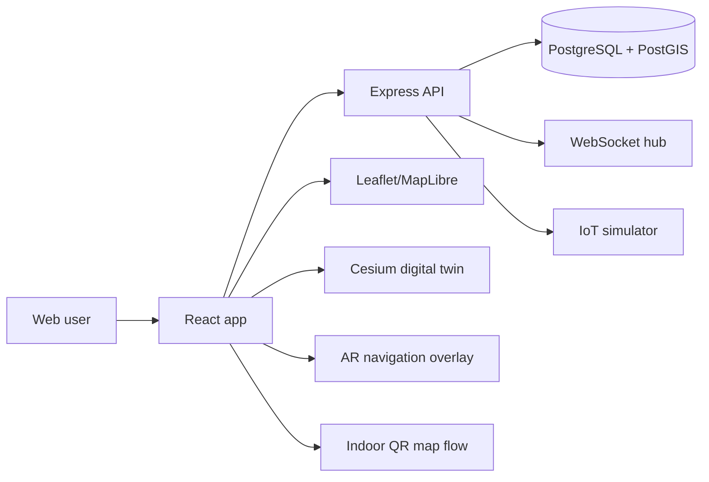

# CampusAR Full Project Analysis

## Verification note

This report is based on the actual repo contents and a fresh validation run of the workspace type-check:

```bash
cd "c:/SAMUDRA/OTHERS/CampusAR"
npm run typecheck --workspaces --if-present
```

Result: the command completed successfully with exit code 0 for the API, web, and shared workspaces.

---

## A. Project Overview

### Project name
CampusAR

### Project purpose
CampusAR is a smart-campus navigation platform designed for large facilities such as universities, hospitals, corporate campuses, and factories. The system helps users find rooms, buildings, and destinations, while also offering operational tools for admins, live safety insight, and map-management workflows.

### Real-world problem it solves
The project addresses the common problem of navigating large physical campuses with complex indoor and outdoor layouts. Users often need to find a room, building entrance, meeting location, or emergency route without asking staff or struggling with fragmented signage.

### Why it was developed
The implementation shows that the platform was designed to provide a reusable campus navigation layer with:
- outdoor map routing
- indoor map navigation
- safety awareness
- admin publishing/versioning
- digital twin monitoring
- web AR guidance

### Intended users
- Visitors / guests
- Students or staff using campus navigation
- Campus administrators
- Safety and operations teams
- Map editors / organization admins

### Main objectives
- map campus assets and routes
- compute wayfinding routes outdoors and indoors
- provide a live safety and hazard context
- support map publishing and versioning
- support digital twin visualization for facility operations
- provide browser-based AR guidance for walking navigation

### What makes CampusAR useful
It combines multiple navigation and operational layers:
- graph-based route planning
- live crowd simulation and hazard awareness
- indoor QR localization
- digital twin visualization
- admin editing and publishing flow

### Complete application workflow
From the code and UI flow, the user journey is:
1. Landing page and sign-in or guest mode
2. Select or search a destination
3. System resolves source and destination
4. Route is computed using campus graph data
5. Navigation displays route on map and guidance
6. In indoor spaces, QR anchor provides localization
7. Safety/crowd information is incorporated into route evaluation
8. Admins can edit map data and publish new versions

### User interaction model
Users interact through a web app and browser-based guidance. Outdoor and indoor navigation are both supported. Admin users can manage map data, publish drafts, validate versions, and view analytics.

### Final deliverable
The product delivers a working web application with navigation, safety, indoor localization, map editing, and digital twin features, all backed by a PostGIS database and TypeScript monorepo architecture.

---

## B. Complete Technology Stack

| Category | Technology | Version evidence | Purpose | Evidence |
|---|---|---:|---|---|
| Monorepo | npm workspaces | root package.json | multi-app structure | [package.json](package.json) |
| Frontend | React + TypeScript | React 18.3.1, Vite 6 | client UI | [apps/web/package.json](apps/web/package.json) |
| Frontend routing | react-router-dom | v7.1.1 | route wiring | [apps/web/src/App.tsx](apps/web/src/App.tsx) |
| Outdoor map | Leaflet + react-leaflet | 1.9.4 | campus map | [apps/web/src/features/map/MapPage.tsx](apps/web/src/features/map/MapPage.tsx) |
| Digital twin | CesiumJS | 1.144.0 | 3D campus visualization | [apps/web/package.json](apps/web/package.json) |
| 3D / scene | Three.js + react-three-fiber | 0.170.0 | scene overlays | [apps/web/package.json](apps/web/package.json) |
| Styling | Tailwind CSS | 3.4.17 | UI styling | [apps/web/package.json](apps/web/package.json) |
| Backend | Node.js + Express | Express 4.21.2 | REST API server | [apps/api/package.json](apps/api/package.json) |
| Validation | Zod | 3.24.1 | schema validation | [apps/api/src/interfaces/http/routes/navigationRoutes.ts](apps/api/src/interfaces/http/routes/navigationRoutes.ts) |
| Auth | JWT + bcryptjs | JWT 9.0.2, bcrypt 2.4.3 | login & secure hashing | [apps/api/src/application/authService.ts](apps/api/src/application/authService.ts) |
| Realtime | WebSocket | ws 8.21.1 | live updates | [apps/api/src/infrastructure/realtime/wsHub.ts](apps/api/src/infrastructure/realtime/wsHub.ts) |
| Database | PostgreSQL + PostGIS | schema uses PostGIS | geospatial data model | [apps/api/src/infrastructure/db/schema.sql](apps/api/src/infrastructure/db/schema.sql) |
| Docs | Swagger UI | 5.0.1 | API docs | [apps/api/src/interfaces/http/app.ts](apps/api/src/interfaces/http/app.ts) |
| Testing | Vitest | 2.1.8 | unit tests | [apps/api/package.json](apps/api/package.json) |
| Containerization | Docker Compose | repo config | service orchestration | [docker-compose.yml](docker-compose.yml) |
| Shared models | TypeScript workspace package | packages/shared | DTO and type sharing | [packages/shared/src/index.ts](packages/shared/src/index.ts) |

### Important implementation distinction
The “AI” layer in the repo is not an external LLM integration. It is predictive routing and crowd forecasting logic implemented in the backend. This is visible in:
- [apps/api/src/domain/prediction/crowdPredictor.ts](apps/api/src/domain/prediction/crowdPredictor.ts)
- [apps/api/src/application/navigationService.ts](apps/api/src/application/navigationService.ts)

There is no verified OpenAI/Gemini/Anthropic integration in the project source.

---

## C. Complete Directory and File Structure

### Root structure
- [package.json](package.json) — monorepo root scripts and workspace config
- [README.md](README.md) — project overview and quick start
- [docker-compose.yml](docker-compose.yml) — Docker orchestration
- [Dockerfile.api](Dockerfile.api) — API container build
- [Dockerfile.web](Dockerfile.web) — web container build
- [apps](apps) — application code
- [packages/shared](packages/shared) — shared types
- [docs](docs) — architecture and product docs
- [unity/CampusAR](unity/CampusAR) — Unity AR Foundation scaffold

### API structure
- [apps/api/src/server.ts](apps/api/src/server.ts) — API startup
- [apps/api/src/interfaces/http/app.ts](apps/api/src/interfaces/http/app.ts) — Express app config and route registration
- [apps/api/src/interfaces/http/routes](apps/api/src/interfaces/http/routes) — REST endpoints
- [apps/api/src/application](apps/api/src/application) — services and domain logic
- [apps/api/src/infrastructure](apps/api/src/infrastructure) — DB, repositories, auth, realtime, config
- [apps/api/src/domain](apps/api/src/domain) — routing and prediction rules

### Web structure
- [apps/web/src/App.tsx](apps/web/src/App.tsx) — route definitions
- [apps/web/src/features](apps/web/src/features) — domain-specific pages
- [apps/web/src/components](apps/web/src/components) — reusable UI modules
- [apps/web/src/stores](apps/web/src/stores) — Zustand state
- [apps/web/src/lib](apps/web/src/lib) — utilities, geolocation, routing, API wrappers
- [apps/web/src/hooks](apps/web/src/hooks) — API and geolocation hooks

### Shared structure
- [packages/shared/src/index.ts](packages/shared/src/index.ts) — central type definitions

### Database directory
- [apps/api/src/infrastructure/db/schema.sql](apps/api/src/infrastructure/db/schema.sql) — main schema
- [apps/api/src/infrastructure/db/migrate.ts](apps/api/src/infrastructure/db/migrate.ts) — migration runner
- [apps/api/src/infrastructure/db/seed.ts](apps/api/src/infrastructure/db/seed.ts) — seeds demo data
- [apps/api/src/infrastructure/db/seed.sql](apps/api/src/infrastructure/db/seed.sql) — seed payload

### Documentation
- [docs/ARCHITECTURE.md](docs/ARCHITECTURE.md)
- [docs/API.md](docs/API.md)
- [docs/DATABASE.md](docs/DATABASE.md)
- [docs/DEPLOYMENT.md](docs/DEPLOYMENT.md)
- [docs/architecture](docs/architecture)

---

## D. System Architecture

### High-level architecture



### Verified architecture layers
1. Frontend shell and route-based feature modules under [apps/web/src](apps/web/src)
2. Shared models under [packages/shared/src/index.ts](packages/shared/src/index.ts)
3. Express HTTP app and routing in [apps/api/src/interfaces/http/app.ts](apps/api/src/interfaces/http/app.ts)
4. Service logic in [apps/api/src/application](apps/api/src/application)
5. Repository/data access in [apps/api/src/infrastructure/repositories](apps/api/src/infrastructure/repositories)
6. Persistence layer in [apps/api/src/infrastructure/db/schema.sql](apps/api/src/infrastructure/db/schema.sql)

### Startup sequence
- API boots from [apps/api/src/server.ts](apps/api/src/server.ts)
- Web boots from [apps/web/src/main.tsx](apps/web/src/main.tsx)
- Client routes are registered in [apps/web/src/App.tsx](apps/web/src/App.tsx)
- Server endpoints are mounted in [apps/api/src/interfaces/http/app.ts](apps/api/src/interfaces/http/app.ts)

### Data flow
- Client requests route/search/building data using API client abstraction
- Backend resolves site context and published map version
- Backend queries geospatial graph data from Postgres
- Route engine applies safety and predicted crowd penalties
- Response is returned to UI for visualization
- Live IoT updates are broadcast via WebSocket

---

## E. Feature-by-Feature Explanation

### 1. Guest access and landing authentication
Implemented in:
- [apps/web/src/features/auth/LandingPage.tsx](apps/web/src/features/auth/LandingPage.tsx)
- [apps/api/src/interfaces/http/routes/authRoutes.ts](apps/api/src/interfaces/http/routes/authRoutes.ts)
- [apps/api/src/application/authService.ts](apps/api/src/application/authService.ts)

Features:
- guest login
- admin login
- register
- refresh token support

### 2. Outdoor map browsing
Implemented in:
- [apps/web/src/features/map/MapPage.tsx](apps/web/src/features/map/MapPage.tsx)
- [apps/api/src/interfaces/http/routes/campusRoutes.ts](apps/api/src/interfaces/http/routes/campusRoutes.ts)

Features:
- building display
- room/category display
- graph nodes and edges
- danger zones
- search results
- location tracking
- route creation

### 3. Outdoor route planning
Implemented in:
- [apps/api/src/application/navigationService.ts](apps/api/src/application/navigationService.ts)
- [apps/web/src/features/navigate/NavigatePage.tsx](apps/web/src/features/navigate/NavigatePage.tsx)

Features:
- source/destination selection
- pathfinding using graph edges
- accessibility-aware route preferences
- prediction toggle
- route progress tracking

### 4. AR navigation overlay
Implemented in:
- [apps/web/src/features/ar/ArPage.tsx](apps/web/src/features/ar/ArPage.tsx)
- [apps/web/src/features/ar/GuideDoll.tsx](apps/web/src/features/ar/GuideDoll.tsx)

Features:
- access camera feed
- overlay guidance arrow
- compass heading + route bearing
- route recalculation for off-route conditions
- voice and avatar preferences

### 5. Indoor QR-based navigation
Implemented in:
- [apps/web/src/features/indoor/IndoorPage.tsx](apps/web/src/features/indoor/IndoorPage.tsx)
- [apps/web/src/features/indoor/IndoorArNavigator.tsx](apps/web/src/features/indoor/IndoorArNavigator.tsx)
- [apps/api/src/interfaces/http/routes/indoorRoutes.ts](apps/api/src/interfaces/http/routes/indoorRoutes.ts)

Features:
- QR anchor resolution
- building context retrieval
- indoor place search
- indoor route generation
- local frame navigation

### 6. Digital twin view
Implemented in:
- [apps/web/src/features/twin/TwinPage.tsx](apps/web/src/features/twin/TwinPage.tsx)
- [apps/web/src/components/twin/CesiumDigitalTwin.tsx](apps/web/src/components/twin/CesiumDigitalTwin.tsx)

Features:
- Cesium campus visualization
- route overlay rendering
- live operational context

### 7. Safety and notifications
Implemented in:
- [apps/api/src/interfaces/http/routes/safetyRoutes.ts](apps/api/src/interfaces/http/routes/safetyRoutes.ts)
- [apps/api/src/infrastructure/iot/simulator.ts](apps/api/src/infrastructure/iot/simulator.ts)

Features:
- danger zone list
- emergency exits
- emergency contacts
- SOS activation
- notification creation and read state

### 8. Admin map management and publishing
Implemented in:
- [apps/api/src/interfaces/http/routes/adminRoutes.ts](apps/api/src/interfaces/http/routes/adminRoutes.ts)
- [apps/web/src/features/admin/AdminPage.tsx](apps/web/src/features/admin/AdminPage.tsx)

Features:
- map version draft creation
- validation
- diffing
- publishing to production
- history and rollback

### 9. Analytics and operations dashboards
Implemented in:
- [apps/web/src/features/analytics/AnalyticsPage.tsx](apps/web/src/features/analytics/AnalyticsPage.tsx)
- [apps/api/src/interfaces/http/routes/adminRoutes.ts](apps/api/src/interfaces/http/routes/adminRoutes.ts)

Features:
- route heatmap
- route popularity summary
- admin analytics

### 10. IoT simulation
Implemented in:
- [apps/api/src/infrastructure/iot/simulator.ts](apps/api/src/infrastructure/iot/simulator.ts)
- [apps/api/src/infrastructure/realtime/wsHub.ts](apps/api/src/infrastructure/realtime/wsHub.ts)

Features:
- crowd emission on edges
- sensor readings for buildings
- broadcast via WebSocket

---

## F. Frontend Documentation

### App routes
Routes are defined in [apps/web/src/App.tsx](apps/web/src/App.tsx):
- `/` landing page
- `/map` map view
- `/navigate` navigation guidance
- `/ar` AR overlay
- `/indoor` indoor navigation
- `/digital-twin` digital twin
- `/safety` safety page
- `/admin` admin dashboard
- `/admin/map-builder` map editing
- `/admin/map-builder/indoor/:buildingId?` indoor map editor
- `/analytics` analytics dashboard

### State management
- [apps/web/src/stores/authStore.ts](apps/web/src/stores/authStore.ts) — authentication session
- [apps/web/src/stores/themeStore.ts](apps/web/src/stores/themeStore.ts) — UI/navigation preferences

### Map pages and components
- [apps/web/src/features/map/MapPage.tsx](apps/web/src/features/map/MapPage.tsx)
- [apps/web/src/components/maps/CampusMapLibreMap.tsx](apps/web/src/components/maps/CampusMapLibreMap.tsx)
- [apps/web/src/components/maps/GoogleCampusMap.tsx](apps/web/src/components/maps/GoogleCampusMap.tsx)
- [apps/web/src/components/maps/GpsTracker.tsx](apps/web/src/components/maps/GpsTracker.tsx)

These handle:
- GPS tracking
- route rendering
- map engine switching
- follow/recenter behavior

### AR page details
[apps/web/src/features/ar/ArPage.tsx](apps/web/src/features/ar/ArPage.tsx) creates a live camera stream, maintains route state, resolves the route source, and overlays directional and guidance information. It performs route recalculation when the user moves off-route.

### Indoor page details
[apps/web/src/features/indoor/IndoorPage.tsx](apps/web/src/features/indoor/IndoorPage.tsx) reads QR anchor codes, resolves building context, loads floor layouts, and triggers indoor route generation.

### Admin page details
[apps/web/src/features/admin/AdminPage.tsx](apps/web/src/features/admin/AdminPage.tsx) contains admin map workflows and route validation controls.

---

## G. Backend Documentation

### API app setup
[apps/api/src/interfaces/http/app.ts](apps/api/src/interfaces/http/app.ts) sets up:
- Helmet
- CORS with origin validation
- JSON body parsing
- request logging via Morgan
- Swagger docs
- route mount points
- error handler

### Route groups
- [apps/api/src/interfaces/http/routes/authRoutes.ts](apps/api/src/interfaces/http/routes/authRoutes.ts) — auth endpoints
- [apps/api/src/interfaces/http/routes/campusRoutes.ts](apps/api/src/interfaces/http/routes/campusRoutes.ts) — campus data
- [apps/api/src/interfaces/http/routes/navigationRoutes.ts](apps/api/src/interfaces/http/routes/navigationRoutes.ts) — routing endpoints
- [apps/api/src/interfaces/http/routes/indoorRoutes.ts](apps/api/src/interfaces/http/routes/indoorRoutes.ts) — indoor routes
- [apps/api/src/interfaces/http/routes/safetyRoutes.ts](apps/api/src/interfaces/http/routes/safetyRoutes.ts) — safety and notifications
- [apps/api/src/interfaces/http/routes/adminRoutes.ts](apps/api/src/interfaces/http/routes/adminRoutes.ts) — map versioning and admin APIs

### Auth middleware
[apps/api/src/interfaces/http/middleware/auth.ts](apps/api/src/interfaces/http/middleware/auth.ts) provides optional and required auth enforcement, plus role handling.

### Service layer
The backend uses a layered service pattern:
- application layer: route logic, auth logic, indoor logic, map version logic
- infrastructure layer: repo access, DB pool, JWT helpers, simulator, websocket
- domain layer: routing algorithms, prediction logic, errors

---

## H. Database Documentation

The main schema file is [apps/api/src/infrastructure/db/schema.sql](apps/api/src/infrastructure/db/schema.sql). It is a database with PostGIS and generated geography columns.

### Core tables
- `users`
- `organizations`
- `sites`
- `site_map_versions`
- `buildings`
- `floors`
- `nodes`
- `rooms`
- `floor_corridors`
- `floor_pois`
- `edges`
- `danger_zones`
- `crowd_levels`
- `sensor_readings`
- `events`
- `route_weights`
- `notifications`

### Key design aspects
- `nodes` and `edges` represent the traversal graph
- `buildings` and `floors` represent spatial building structure
- `rooms` store room metadata with category and measurement support
- `site_map_versions` supports draft/published map versioning
- `route_weights` holds the cost model for routing
- `danger_zones`, `events`, and `crowd_levels` drive safety and route penalties

### Relationships
Buildings and floors are tied to a map version; nodes and edges are also tied to site and version. This enables draft/published version isolation, which is a core product feature.

### Database lifecycle
- creation: users, sites, map versions, nodes, edges
- validation: request validation in API then DB constraint checks
- storage: Postgres with geospatial columns
- retrieval: repositories query site/version-specific copies
- processing: routing service reads graph and weights
- update: admin editing and publishing changes the version state
- deletion: CASCADE rules exist for dependent records

---

## I. AI and AR/3D Documentation

### AI / prediction functionality
The actual AI-like feature is predictive routing using a crowd predictor and schedule model.

Verified implementation:
- [apps/api/src/domain/prediction/crowdPredictor.ts](apps/api/src/domain/prediction/crowdPredictor.ts)
- [apps/api/src/infrastructure/iot/simulator.ts](apps/api/src/infrastructure/iot/simulator.ts)
- [apps/api/src/application/navigationService.ts](apps/api/src/application/navigationService.ts)

This system:
- simulates crowd intensity
- computes diurnal crowd patterns
- blends live metrics and forecast metrics
- penalizes routes based on predicted crowd and safety conditions

### AR navigation
The frontend AR view uses device camera and compass features in the browser:
- [apps/web/src/features/ar/ArPage.tsx](apps/web/src/features/ar/ArPage.tsx)
- [apps/web/src/features/ar/GuideDoll.tsx](apps/web/src/features/ar/GuideDoll.tsx)

It does not use a native AR SDK in the main app. It is browser-based and overlay-driven.

### Digital twin
- [apps/web/src/components/twin/CesiumDigitalTwin.tsx](apps/web/src/components/twin/CesiumDigitalTwin.tsx)
- [apps/web/src/features/digitalTwin/DigitalTwinPage.tsx](apps/web/src/features/digitalTwin/DigitalTwinPage.tsx)

This provides a Cesium render for the campus, route overlay, and operational context.

### Unity AR scaffold
- [unity/CampusAR](unity/CampusAR)

This is a scaffold and extension point, not the primary application runtime.

---

## J. Authentication and Security

### Auth mechanism
- JWT access token and refresh token
- bcrypt password hashing
- user roles: admin, user, guest

Source files:
- [apps/api/src/application/authService.ts](apps/api/src/application/authService.ts)
- [apps/api/src/interfaces/http/middleware/auth.ts](apps/api/src/interfaces/http/middleware/auth.ts)
- [packages/shared/src/index.ts](packages/shared/src/index.ts)

### Security-related implementation
- Helmet middleware in [apps/api/src/interfaces/http/app.ts](apps/api/src/interfaces/http/app.ts)
- CORS validation in same file
- Zod validation on request bodies/queries
- role-based route restrictions
- per-site data scoping in map version logic

### Demo accounts
Seeded in [apps/api/src/infrastructure/db/seed.ts](apps/api/src/infrastructure/db/seed.ts):
- admin@smartcampus.edu / admin123
- student@smartcampus.edu / student123

### Important security note
The default JWT secrets and fallback database credentials in [apps/api/src/infrastructure/config/env.ts](apps/api/src/infrastructure/config/env.ts) are development-friendly placeholders and should not be reused in production.

---

## K. Configuration and Installation Guide

### Prerequisites
- Node.js 20+
- npm
- Docker Desktop / Docker daemon running
- Git

### Setup steps
From [README.md](README.md):

```bash
git clone https://github.com/PraveenKumarM17/CampusAR.git
cd CampusAR
cp .env.example .env
npm install
```

### Start database
```bash
docker compose up -d db
```

### Run migrations and seed
```bash
npm run db:migrate
npm run db:seed
```

### Run app
Two terminals:

Terminal 1:
```bash
npm run dev:api
```

Terminal 2:
```bash
npm run dev:web
```

### URLs
- Web app: http://localhost:5173
- API: http://localhost:4000
- Swagger: http://localhost:4000/api/docs
- WebSocket: ws://localhost:4000/ws

### Docker full stack
```bash
cp .env.example .env
docker compose up --build
```

---

## L. End-to-End Workflows

### Guest user workflow
1. Guest opens landing page
2. Clicks “Continue as Guest”
3. Backend creates guest user and JWT tokens
4. User lands on map page
5. User searches or selects destination
6. Route is computed and displayed
7. Navigation progresses live with GPS updates

### Admin workflow
1. Admin signs in
2. Accesses admin routes and map-builder pages
3. Creates or edits a draft map version
4. Validates map version
5. Publishes draft to production
6. Maps become available to public app

### Indoor workflow
1. User chooses indoor destination or building
2. User enters or scans QR anchor
3. Backend resolves anchor and building context
4. Indoor route is computed
5. Floor plan is displayed
6. User follows turn-by-turn guidance inside building

### Safety workflow
1. Live danger zones and crowd data are loaded
2. Route calculations consider hazard penalties
3. User can trigger SOS when needed
4. Notification and emergency alert records are created

---

## M. Testing and Code Quality

### Verified evidence
I ran the project type-check successfully with:

```bash
npm run typecheck --workspaces --if-present
```

This succeeded for the API, web, and shared workspaces.

### Testing infrastructure
Vitest is included in:
- [apps/api/package.json](apps/api/package.json)
- [apps/web/package.json](apps/web/package.json)

Examples of test files include:
- [apps/web/src/features/ar/GuideDoll.test.ts](apps/web/src/features/ar/GuideDoll.test.ts)
- [apps/web/src/features/digitalTwin/digitalTwin.routes.test.ts](apps/web/src/features/digitalTwin/digitalTwin.routes.test.ts)
- [apps/web/src/lib/routeProgress.test.ts](apps/web/src/lib/routeProgress.test.ts)
- [apps/api/src/application/navigationValidation.test.ts](apps/api/src/application/navigationValidation.test.ts)

### Code quality characteristics
- TypeScript across frontend/backend/shared
- Zod-based validation
- clean separation of domain/application/infrastructure layers
- route versioning and map context management

### Observed strengths
- strong feature breadth
- clear route graph model
- real geospatial database usage
- admin workflow coverage

### Observed concerns
- dev-only default secrets and demo credentials are intentionally embedded in local config
- “AI” is heuristic/predictive, not a full external-model workflow
- AR depends on device browser support and sensor availability

---

## N. Known Issues and Limitations

### Verified findings
1. There is no verified external LLM provider integration in the code.
2. The project is strongly tied to a seeded site dataset and campus model.
3. Local dev config includes default secrets and demo credentials.
4. The app relies on device permissions for AR and GPS features.

### Likely limitations
1. QR-based indoor navigation requires map correctness and anchor setup.
2. Browser-based AR compatibility depends on device and browser capabilities.
3. Map versioning and admin workflows are complex and require operational discipline.

### Missing or unavailable information
- Real production deployment and cloud configuration were not inspected as live infrastructure artifacts.
- There is no evidence of a separate mobile app for the main runtime; the Unity folder appears scaffold-based.

---

## O. Future Improvements

These are recommendations, not current features:
- move default secrets into environment-managed production secret storage
- add formal CI/CD pipeline validation and smoke tests
- add real model-based AI improvements if a stronger recommendation engine is required
- add native mobile app support for AR if needed
- expand analytics and alerts with richer telemetry
- build stronger data governance for map versioning and publishing workflows

---

## P. Final Project Summary

CampusAR is a sophisticated campus navigation and operations platform built as a TypeScript monorepo with a React frontend and Express API. The application combines outdoor graphs, indoor QR localization, safety-aware route planning, live crowd simulation, map versioning, and a Cesium digital twin into one cohesive product.

It is not just a simple map viewer. It is a campus operations and navigation system with:
- public navigation
- admin map editing
- draft/published map versions
- geospatial route planning
- predictive crowd logic
- AR guidance
- indoor routing
- live updates via WebSocket

The design is grounded in real implementation artifacts. The strongest technical evidence includes the actual route engine, PostGIS schema, app routes, browser UI flows, and validation run of the workspace type-check.

The project is well-suited for a campus or facility navigational system, especially when map data is maintained carefully and the deployment environment is configured with secure secrets and production-safe settings.

---

## Verified implementation summary

- React frontend and route-based app shell
- Express API and JWT auth
- PostgreSQL + PostGIS database
- Outdoor route planning with A* and route weights
- Indoor QR localization and route generation
- Safety and notification APIs
- Digital twin and Cesium based twin page
- WebSocket-based live updates
- Admin map publishing and versioning
- Type-check passed in the current repo

## Inferred behavior

- Some product docs suggest broader platform ambitions than the code strictly verifies.
- The Unity folder appears to be an AR scaffold or extension point rather than the main app runtime.

## Missing or unavailable information

- No live cloud deployment details were verified.
- No explicit external AI model provider integration was found in the source.

## Recommended improvements

- strengthen secret management
- add full CI/test pipeline evidence
- formalize production deployment configuration
- consider native mobile AR if required by business goals

---

## Appendix: Key evidence files

- [README.md](README.md)
- [package.json](package.json)
- [apps/api/package.json](apps/api/package.json)
- [apps/web/package.json](apps/web/package.json)
- [apps/api/src/server.ts](apps/api/src/server.ts)
- [apps/api/src/interfaces/http/app.ts](apps/api/src/interfaces/http/app.ts)
- [apps/web/src/App.tsx](apps/web/src/App.tsx)
- [apps/api/src/infrastructure/db/schema.sql](apps/api/src/infrastructure/db/schema.sql)
- [apps/api/src/application/navigationService.ts](apps/api/src/application/navigationService.ts)
- [apps/web/src/features/ar/ArPage.tsx](apps/web/src/features/ar/ArPage.tsx)
- [apps/web/src/features/indoor/IndoorPage.tsx](apps/web/src/features/indoor/IndoorPage.tsx)
- [apps/api/src/infrastructure/iot/simulator.ts](apps/api/src/infrastructure/iot/simulator.ts)
- [apps/api/src/interfaces/http/routes/adminRoutes.ts](apps/api/src/interfaces/http/routes/adminRoutes.ts)
- [apps/api/src/domain/prediction/crowdPredictor.ts](apps/api/src/domain/prediction/crowdPredictor.ts)

This document reflects the actual codebase state as it exists in the workspace at the time of analysis.
