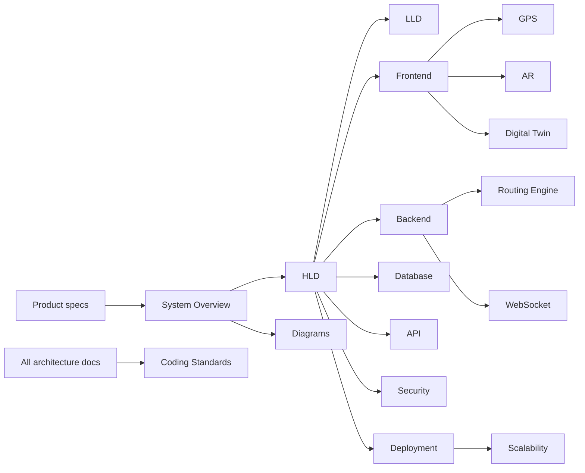

# CampusAR Architecture Documentation

This folder contains the **Phase 2 system architecture** for CampusAR. Product requirements in [`../product/`](../product/) are the source of truth for *what* to build. These documents define *how* the system is structured so engineering can implement without redesigning for V2–V5 (BLE, MQTT, ML, multi-campus).

**Rules of this pack**

- No application source code
- No SQL DDL / migrations
- No Express route implementations
- No React component implementations
- Extension points documented for future versions

---

## Document map

| # | Document | Audience | Purpose |
|---|----------|----------|---------|
| 1 | [README.md](./README.md) | Everyone | Index and reading order |
| 2 | [system-overview.md](./system-overview.md) | All eng | Goals, modules, stack, big picture |
| 3 | [hld.md](./hld.md) | Leads | High-level design of major planes |
| 4 | [lld.md](./lld.md) | Implementers | Subsystem contracts & failure modes |
| 5 | [technology-decisions.md](./technology-decisions.md) | Leads | ADRs / tech choices & alternatives |
| 6 | [frontend-architecture.md](./frontend-architecture.md) | FE | Client structure, state, performance |
| 7 | [backend-architecture.md](./backend-architecture.md) | BE | Clean Architecture layers |
| 8 | [database-design.md](./database-design.md) | BE / DBA | Conceptual schema (no SQL) |
| 9 | [api-architecture.md](./api-architecture.md) | BE / FE | REST conventions (no endpoints coded) |
| 10 | [routing-engine.md](./routing-engine.md) | BE / domain | Graph routing design |
| 11 | [gps-architecture.md](./gps-architecture.md) | FE / mobile | Positioning pipeline |
| 12 | [websocket-architecture.md](./websocket-architecture.md) | BE / FE | Real-time channel |
| 13 | [digital-twin-design.md](./digital-twin-design.md) | FE / ops | Twin rendering & data |
| 14 | [ar-architecture.md](./ar-architecture.md) | FE | Web AR + Unity future |
| 15 | [security-architecture.md](./security-architecture.md) | Security | AuthZ, threats, OWASP |
| 16 | [deployment-architecture.md](./deployment-architecture.md) | DevOps | Envs, Docker, CI/CD |
| 17 | [scalability-strategy.md](./scalability-strategy.md) | Cloud | 10 → 10k users |
| 18 | [diagrams.md](./diagrams.md) | Everyone | Consolidated Mermaid set |
| 19 | [coding-standards.md](./coding-standards.md) | All eng | Conventions & quality gates |

Product pack: [`../product/README.md`](../product/README.md)  
Design pack (Phase 3): [`../design/README.md`](../design/README.md)  
Legacy single-file notes (if present): [`../ARCHITECTURE.md`](../ARCHITECTURE.md) — prefer this folder when they diverge.

---

## How documents connect

---

## Recommended reading order

1. **New engineer** — `system-overview.md` → `hld.md` → role-specific docs → `coding-standards.md`
2. **Backend lead** — overview → backend → database → API → routing → websocket → security
3. **Frontend lead** — overview → frontend → gps → ar → digital-twin → api
4. **DevOps / Cloud** — overview → deployment → scalability → security (secrets)
5. **Security review** — security → api → deployment → websocket

---

## Architectural principles (summary)

| Principle | Application |
|-----------|-------------|
| Clean Architecture | Domain independent of frameworks; deps point inward |
| SOLID | Especially ISP/DIP for predictors, position providers, IoT ingest |
| DDD (pragmatic) | Bounded contexts: Identity, Campus Graph, Routing, Safety, Ops/Twin, Analytics |
| Extensibility | Ports for BLE, MQTT, ML predictors, multi-tenant config |
| Map-first guidance | AR is an enhancement; navigation must work without it |

---

## Document control

| Version | Date | Notes |
|---------|------|-------|
| 1.0 | 2026-07-30 | Initial architecture pack aligned to Product V1 |
