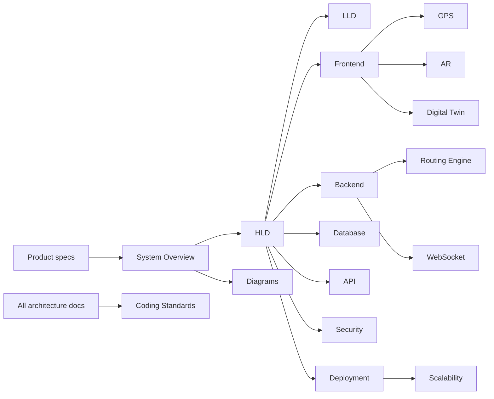

# CampusAR Architecture Documentation

This folder contains the **system architecture** for CampusAR: the Phase 2 modular monolith (reference tenant) plus the **multi-tenant NaaS** evolution. Product requirements in [`../product/`](../product/) are the source of truth for *what* to build. These documents define *how* the system is structured for V1 through platform scale (tenancy, editor, QR, branding, BLE, MQTT, ML).

**Rules of this pack**

- No application source code
- No SQL DDL / migrations
- No Express route implementations
- No React component implementations
- Extension points documented for future versions

---

## Document map

| # | Document | Audience | Purpose |
|---|----------|----------|---------|
| 1 | [README.md](./README.md) | Everyone | Index and reading order |
| 2 | [system-overview.md](./system-overview.md) | All eng | Goals, modules, stack, big picture |
| 3 | [hld.md](./hld.md) | Leads | High-level design of major planes |
| 4 | [lld.md](./lld.md) | Implementers | Subsystem contracts & failure modes |
| 5 | [technology-decisions.md](./technology-decisions.md) | Leads | ADRs / tech choices & alternatives |
| 6 | [frontend-architecture.md](./frontend-architecture.md) | FE | Client structure, state, performance |
| 7 | [backend-architecture.md](./backend-architecture.md) | BE | Clean Architecture layers |
| 8 | [database-design.md](./database-design.md) | BE / DBA | Conceptual schema (no SQL) |
| 9 | [api-architecture.md](./api-architecture.md) | BE / FE | REST conventions (no endpoints coded) |
| 10 | [routing-engine.md](./routing-engine.md) | BE / domain | Graph routing design |
| 11 | [gps-architecture.md](./gps-architecture.md) | FE / mobile | Client GPS pipeline (V1) |
| 12 | [gps-abstraction.md](./gps-abstraction.md) | FE / BE | **PositionProvider port** — GPS → BLE / Wi‑Fi / SLAM / UWB |
| 13 | [websocket-architecture.md](./websocket-architecture.md) | BE / FE | Real-time channel |
| 14 | [digital-twin-design.md](./digital-twin-design.md) | FE / ops | Twin rendering & data |
| 15 | [ar-architecture.md](./ar-architecture.md) | FE | Web AR + Unity future |
| 16 | [security-architecture.md](./security-architecture.md) | Security | AuthZ, threats, OWASP |
| 17 | [deployment-architecture.md](./deployment-architecture.md) | DevOps | Envs, Docker, CI/CD |
| 18 | [scalability-strategy.md](./scalability-strategy.md) | Cloud | 10 → 10k users |
| 19 | [diagrams.md](./diagrams.md) | Everyone | Consolidated Mermaid set |
| 20 | [coding-standards.md](./coding-standards.md) | All eng | Conventions & quality gates |
| 21 | [multi-tenant-architecture.md](./multi-tenant-architecture.md) | Leads | **NaaS tenancy**, isolation, API/DB deltas |
| 22 | [organization-domain.md](./organization-domain.md) | BE / domain | Org hierarchy & entities |
| 23 | [map-editor.md](./map-editor.md) | FE / BE | Interactive graph editor |
| 24 | [qr-navigation.md](./qr-navigation.md) | FE / BE | Slug + QR guest entry |
| 25 | [branding-system.md](./branding-system.md) | FE / BE | Per-org theme tokens |

Product pack: [`../product/README.md`](../product/README.md)  
Design pack (Phase 3): [`../design/README.md`](../design/README.md)  
Legacy single-file notes (if present): [`../ARCHITECTURE.md`](../ARCHITECTURE.md) — prefer this folder when they diverge.

---

## How documents connect

---

## Recommended reading order

1. **New engineer** — `system-overview.md` → `hld.md` → role-specific docs → `coding-standards.md`
2. **Backend lead** — overview → backend → database → API → routing → websocket → security
3. **Frontend lead** — overview → frontend → gps → ar → digital-twin → api
4. **DevOps / Cloud** — overview → deployment → scalability → security (secrets)
5. **Security review** — security → api → deployment → websocket
6. **NaaS / multi-tenant** — [`../product/multi-tenancy.md`](../product/multi-tenancy.md) → `multi-tenant-architecture.md` → `organization-domain.md` → `map-editor.md` → `qr-navigation.md` → `branding-system.md` → `gps-abstraction.md`

---

## Architectural principles (summary)

| Principle | Application |
|-----------|-------------|
| Clean Architecture | Domain independent of frameworks; deps point inward |
| SOLID | Especially ISP/DIP for predictors, position providers, IoT ingest |
| DDD (pragmatic) | Bounded contexts: Identity & Membership, Organization, Campus Graph, Routing, Safety, Ops/Twin, Analytics, Platform |
| Extensibility | Ports for BLE, MQTT, ML predictors; shared DB + `organizationId` tenancy |
| Tenant isolation | Every query/channel scoped; no cross-org reads |
| Map-first guidance | AR is an enhancement; navigation must work without it |
| Editor-as-source-of-truth | Visual graph editing replaces developer seed for customer orgs |

---

## Document control

| Version | Date | Notes |
|---------|------|-------|
| 1.0 | 2026-07-30 | Initial architecture pack aligned to Product V1 |
| 1.1 | 2026-07-31 | Multi-tenant NaaS architecture pack added |
