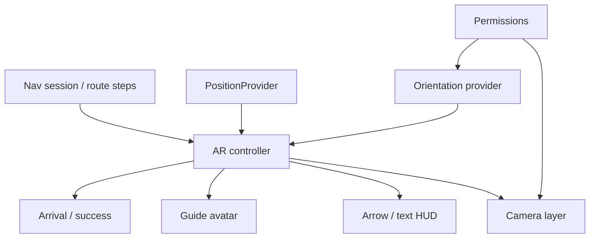
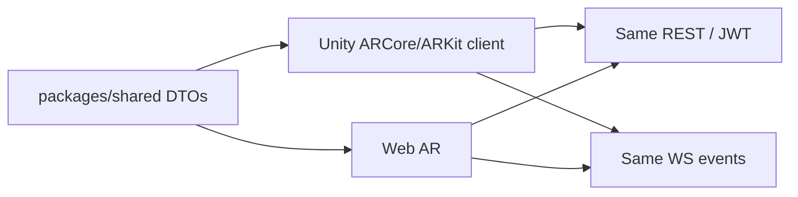

# 14. AR Architecture — CampusAR

## Purpose

Progressive enhancement over map navigation: camera-aligned directional guidance + guide character motions + arrival celebration. Product rule: **AR must not gate trip completion**.

---

## Logical components

---

## Camera

- `getUserMedia` video stream as full-bleed background
- Permission deny → immediate fallback CTA to `/navigate` map mode
- Pause track on route leave / tab hidden to save battery and privacy
- Do not record/upload video in V1

---

## Compass / orientation

- `DeviceOrientation` / absolute orientation when available
- Compute bearing to next waypoint vs device heading → rotate arrow cue
- iOS / Safari may require user gesture / permission — document support matrix
- If orientation unavailable: relative instruction mode (text + doll wave) without claiming absolute world alignment

Smoothing: low-pass heading; clamp spin rate for doll/arrow.

---

## Guide character

| State | When | Motion intent |
|-------|------|---------------|
| Walk | Straight / following | Loop walk |
| Wave | Approaching turn within threshold | Pre-turn nonverbal cue |
| Celebrate | Arrival | Success pose |
| Idle | Paused | Subtle idle |

- User preference: male/female presentation (prefs store)
- Respect `prefers-reduced-motion` → simplify or hide doll, keep HUD text
- Asset load failure → hide doll, keep arrow/text

Doll is **not** the accessibility-critical channel; text/TTS remain available.

---

## Route overlay

- Primary: world-relative arrow / chevron toward next node
- Secondary: distance + instruction text
- Optional: simplified path cue (avoid cluttering camera)
- Recalculate: update next waypoint targets; toast if path changed

---

## Scene updates

| Trigger | Update |
|---------|--------|
| New route / recalc | Reset step targets, exit celebrate |
| Step advance | Update instruction + doll state machine |
| Orientation event | Update arrow rotation |
| Pose update | Progress, off-route check, arrival check |
| Hazard WS | May trigger parent nav recalculate |

Render loop via `requestAnimationFrame`; do not setState on every orientation event — mutate refs / imperative Three objects.

---

## Arrival animation

1. `ArrivalDetector` fires (hysteresis)
2. Phase → `arrived`
3. Doll celebrate + success UI
4. Stop aggressive GPS/orientation if appropriate
5. CTA: done / new destination
6. Ensure single fire per journey

---

## Failure matrix

| Failure | Fallback |
|---------|----------|
| Camera deny | Map navigate |
| Orientation deny | Non-compass AR or map |
| WebGL fail | HUD-only or map |
| TTS fail | Silent |
| Mid-AR WS loss | Keep route; live chips stale |

---

## Future Unity integration

| Concern | Approach |
|---------|----------|
| Contracts | Identical route/recalculate/SOS DTOs |
| Pose | Unity XR providers implement same semantic `Pose` |
| Guide avatar | Native animation controllers; state enum shared |
| Feature flags | Server config which clients enabled |

Web remains the universal client; Unity is an additional guidance surface, not a fork of business logic.

---

## Security / privacy

- Camera local-only
- Clear media tracks on exit
- No AR session video analytics in V1
