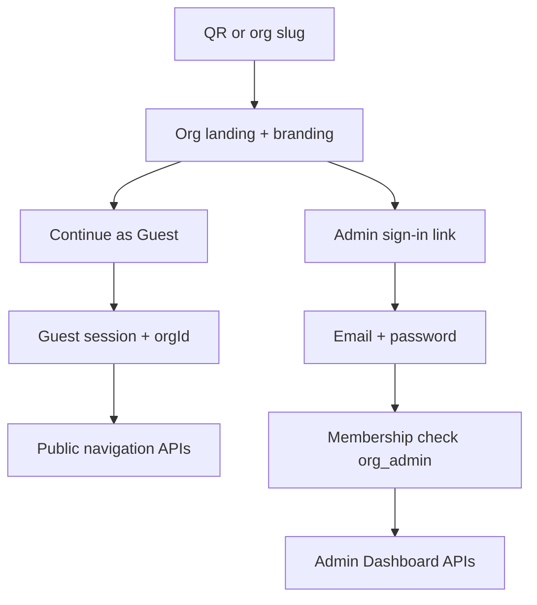

# Authentication & Authorization — NaaS

**Purpose:** Architecture contract for guest-first access and admin-only credential login.  
**Product sources:** [`../product/login-experience.md`](../product/login-experience.md), [`../product/role-permissions.md`](../product/role-permissions.md)  
**Preserves:** Clean Architecture; multi-tenant `organizationId` isolation ([`multi-tenant-architecture.md`](./multi-tenant-architecture.md)).

No implementation code in this document.

---

## 1. Dual-entry model



| Path | Principal | Credentials |
|------|-----------|-------------|
| Guest | `guest` + `organizationId` | None |
| Org Admin | `user` + memberships | Email + password (SSO later) |
| Super Admin (future) | `platform_admin` | Privileged auth + MFA policy |

**Product rule:** Email/password is **not** offered as a general visitor registration flow.

---

## 2. Authentication

### 2.1 Guest
- Created after org resolve + “Continue as Guest” (or auto-guest policy).  
- Issues a limited guest token/cookie: `{ typ: guest, organizationId, exp }`.  
- No password; cannot call admin routes.  
- Bound to one org; new QR/slug starts new org context.

### 2.2 Organization Admin
- Login use case validates credentials then loads `OrganizationMembership`.  
- Access token claims: `{ sub, role, organizationIds[] or activeOrgId }`.  
- Refresh tokens revoked on logout, password change, or membership removal.  
- Active org selected when user has multiple memberships.

### 2.3 Super Admin (future)
- Separate principal; not an org membership substitute for daily editing.  
- Impersonation / support access must write audit events.

### 2.4 Future providers
OIDC/SAML for enterprise **admins** plugs in as `AuthProvider` without changing guest flow or RBAC checks.

---

## 3. Authorization

Enforce in **application use cases**, not only UI.

```text
authorize(actor, action, resource):
  resource.organizationId must match actor.orgContext
  actor.role must allow action
```

| API class | Allowed principals |
|-----------|-------------------|
| Public org navigation | Guest, Admin (read), Super Admin (support) |
| Admin mutations | Org Admin (membership), Super Admin (audited) |
| Platform tenant lifecycle | Super Admin only |

Detailed matrix: [`../product/role-permissions.md`](../product/role-permissions.md).

---

## 4. URL & route gates

| Surface | Gate |
|---------|------|
| `/{orgSlug}` landing | Public; Guest CTA primary |
| `/{orgSlug}/map`, navigate, AR, safety | Guest or authenticated |
| `/admin/{orgSlug}/*` | Org Admin membership required |
| `/platform/*` | Super Admin (future) |

Guest hitting admin URLs → challenge login or redirect to guest map with “Administrators only.”

---

## 5. Clean Architecture placement

| Layer | Responsibility |
|-------|----------------|
| Domain | Roles, membership invariants, org isolation rules |
| Application | `ContinueAsGuest`, `AdminLogin`, `AuthorizeAdminAction` |
| Interface | HTTP middleware sets `RequestContext`; rejects forbidden |
| Infrastructure | Password hash, JWT/session store, membership repo |

Routing, map editor, and analytics use cases receive `RequestContext`; they never trust raw client `organizationId` alone.

---

## 6. Alignment with existing tenancy

- Shared DB + row-level `organization_id` unchanged.  
- Guest and admin queries always filter by org context.  
- WS rooms remain `org:{organizationId}`; guest joins public org channel only.

---

## 7. Security notes

- Rate-limit admin login and guest session creation.  
- Guest tokens must not include admin role claims.  
- Password reset only for admin accounts.  
- Audit: admin graph/branding/IAM/safety writes; super-admin access.

---

## 8. Related

- [`security-architecture.md`](./security-architecture.md) — transport, OWASP, secrets  
- [`qr-navigation.md`](./qr-navigation.md) — QR → guest  
- [`map-editor.md`](./map-editor.md) — admin-only editor  
