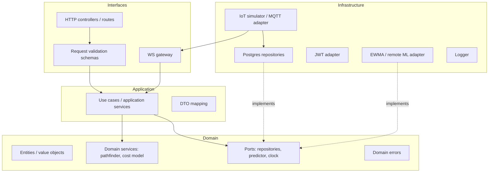

# 7. Backend Architecture — CampusAR

## Goals

- Clean Architecture with dependencies pointing inward
- Domain owns routing policies and invariants
- Infrastructure swappable (DB, IoT, predictor, notifier)
- Modular monolith ready to extract services later

---

## Layer overview



### Presentation / Interfaces
- Map HTTP/WS to use cases
- Auth middleware, rate limit, correlation id
- OpenAPI description (contract, not business logic)
- Translate domain errors → HTTP status + error envelope

### Application
- Orchestrate transactions (“calculate route”, “create hazard”, “SOS”)
- Authorize at use-case boundary (role checks)
- No SQL; no Express types leaking inward

### Domain
- Graph cost rules, accessibility constraints, hard-block policy order (see product AI routing)
- Pure pathfinding against in-memory graph snapshot
- Predictor **port** (interface), not algorithm details as product code lock-in

### Infrastructure
- Repository implementations, JWT, env config, IoT simulator, WS hub bridge, logging

---

## Suggested package layout

```text
apps/api/src/
  domain/
    routing/
    safety/
    campus/
    errors.ts
    ports/                 # interfaces
  application/
    authService.ts
    navigationService.ts
    safetyService.ts
    adminService.ts
    analyticsService.ts
  infrastructure/
    db/
    auth/
    iot/
    prediction/
    ws/
    config/
    logging/
  interfaces/
    http/
      routes/
      middleware/
      app.ts
    ws/
  server.ts                # composition root / DI wiring
```

---

## Repositories (ports)

| Port | Responsibility |
|------|----------------|
| UserRepository | Identity persistence |
| CampusRepository | Buildings, rooms, nodes, edges, places search |
| HazardRepository | Danger zones / construction |
| CrowdRepository | Edge crowd levels / readings |
| ConfigRepository | Route weights, feature flags |
| AnalyticsRepository | Event write + aggregate read |
| SosRepository | SOS alerts |

Implementations use PostGIS; domain receives plain objects / value types.

---

## Services

| Application service | Domain collaborators |
|---------------------|----------------------|
| AuthService | UserRepo, token issuer |
| NavigationService | CampusRepo, HazardRepo, CrowdRepo, ConfigRepo, Pathfinder, CrowdPredictor |
| SafetyService | HazardRepo, SosRepo, contacts |
| AdminService | Campus/Hazard/Config/Crowd repos + event bus |
| AnalyticsService | AnalyticsRepo |
| LiveOpsService | IoT control + broadcast |

---

## Controllers

Thin: parse → validate → call use case → map response.  
No pathfinding in controllers.

---

## Validation

- **Boundary:** Zod (or equivalent) for request bodies/queries.
- **Domain:** Invariants (e.g., weights ≥ 0, source ≠ impossible states).
- Prefer shared schemas in `packages/shared` for FE/BE alignment.

---

## Dependency injection

**Composition root** in `server.ts` (or `container.ts`):

1. Read env
2. Create pool / adapters
3. Bind ports → infrastructure
4. Construct application services
5. Wire HTTP/WS

V1 may use manual constructor injection (explicit, testable). Avoid service locator sprawl.

---

## Background jobs

| Job | V1 | Future |
|-----|----|--------|
| IoT simulator tick | `setInterval` in-process | MQTT worker |
| Hazard expiry sweeper | Periodic job | Same |
| Analytics rollup | On-read aggregate OK | Materialized job |
| Predictor training | — | Offline pipeline |

Jobs publish through the same domain events / WS bridge as request path mutations.

---

## WebSocket integration

- Hub lives in interfaces/infrastructure
- Application emits `CampusLiveEvent` after crowd/hazard updates
- Hub serializes and broadcasts
- Auth handshake on connect

Detail: [`websocket-architecture.md`](./websocket-architecture.md).

---

## Logging

| Field | Purpose |
|-------|---------|
| `requestId` / `correlationId` | Trace |
| `userId` / `role` | Audit (where appropriate) |
| `route` / `method` | HTTP |
| `event` | Domain actions (`route_computed`, `sos_created`) |
| `durationMs` | Performance |

Levels: debug/info/warn/error. No secrets/PII in logs (emails hashed or omitted in production).

---

## Error model

Domain errors (examples): `Unauthorized`, `Forbidden`, `NotFound`, `ValidationError`, `NoRouteError`, `Conflict`.

Interfaces map to HTTP (401/403/404/400/409/422/503).  
Clients consume stable `code` strings.

---

## Testing strategy (backend)

| Layer | Test |
|-------|------|
| Domain | Pathfinder fixtures, cost ordering, accessibility exclusions |
| Application | Use cases with in-memory fakes |
| HTTP | Smoke/integration with test DB |
| Contracts | OpenAPI lint optional |

---

## Extension points

| Port | V1 impl | Future impl |
|------|---------|-------------|
| CrowdPredictor | Schedule EWMA | LSTM remote |
| IoTIngest | Simulator | MQTT bridge |
| Notifier | No-op / log | SMS/email |
| AuditLogger | DB timestamps | Append-only audit store |
