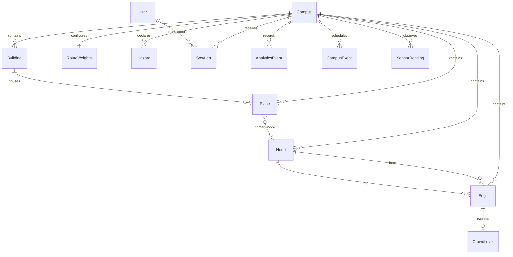

# 8. Database Design — CampusAR (Conceptual)

**No SQL in this document.** Physical migrations are an implementation concern. This describes entities, relationships, indexing intent, geospatial needs, and scale-out.

Aligned to product entities: users, campus graph, routing config, hazards, crowd/IoT, SOS, analytics.

---

## Design principles

1. **Graph + GIS together** — topology (nodes/edges) and geometry coexist.
2. **Live crowd is mutable state** — high churn; keep separate from static geometry.
3. **Hazards are first-class** — time-bounded, typed, geometrically queryable.
4. **Tenant key `organization_id`** — even if V1 runs one org, stamp every tenant-owned row; see [`organization-domain.md`](./organization-domain.md).
5. **Minimize PII** — analytics aggregates; SOS stores only what product requires.

> **NaaS note:** Prefer the name **Organization** over **Campus** as the root entity. Legacy docs may say `campus_id`; treat that as synonymous with `organization_id` during migration.

---

## Entity catalog

### Identity

| Entity | Description | Key attributes (conceptual) |
|--------|-------------|-----------------------------|
| **User** | Registered account | id, email, password hash, role, prefs JSON, timestamps |
| **Role** | Enum or table | student/faculty/security/admin (V1 may be enum on User) |

Guest may have no User row.

### Campus graph & places

| Entity | Description |
|--------|-------------|
| **Organization (Campus)** | Tenant root (id, slug, name, bounds polygon, timezone, status) |
| **Building** | Named structure, footprint geometry, metadata |
| **Place / Room** | Searchable destination; category; optional floor; link to node(s) |
| **Node** | Walkable graph vertex; point geometry; type (entrance, junction, indoor, exit) |
| **Edge** | Walkable link between nodes; linestring; length; flags (stairs, elevator, ramp, stepFree, indoor); base safety score; blocked flag |
| **EdgeAttributes** | Optional extension bag for lightingScore etc. (night mode later) |

### Routing config

| Entity | Description |
|--------|-------------|
| **RouteWeights** | Per-campus w_distance, w_safety, w_crowd; updated_by; updated_at |
| **RoutingPolicy** | Optional flags (allowElevatorsInEmergency, predictionDefault) |

### Safety

| Entity | Description |
|--------|-------------|
| **Hazard** | type (fire, construction, danger, …), severity, geometry (polygon/point+radius), active window, affectsRouting |
| **EmergencyContact** | label, phone, sort order |
| **EmergencyExit** | place/node reference, label |
| **SosAlert** | user id nullable, location point/node, timestamp, status (open/acked), payload |

### Live sensing

| Entity | Description |
|--------|-------------|
| **CrowdLevel** | per edge (or segment): occupancy score, updated_at, source (sim/mqtt/admin) |
| **SensorReading** | sensor id, type, value, location, timestamp |
| **CampusEvent** | time-bounded event; optional affectsRouting; crowd bias |

### Analytics

| Entity | Description |
|--------|-------------|
| **AnalyticsEvent** | type, user/guest id, payload JSON, created_at |
| **PopularDestination** (optional view/rollup) | place id, count, window |

---

## Relationships

---

## Indexing intent (not DDL)

| Area | Index purpose |
|------|----------------|
| Place search | Trigram/GIN or ILIKE-optimized indexes on name/code; category filter |
| Node/Edge geometry | Spatial indexes (GIST) on points/linestrings |
| Hazard geometry | Spatial index; composite on (campus_id, active window) |
| Edge endpoints | Indexes on from_node, to_node for graph load |
| CrowdLevel | PK/FK on edge_id; updated_at for freshness queries |
| AnalyticsEvent | (campus_id, type, created_at) for dashboards |
| User email | Unique |

---

## Geospatial support

| Operation | Design support |
|-----------|----------------|
| Nearest node snap | Spatial kNN / order by distance with max radius |
| Hazard intersection | Edges intersecting hazard geometry → block/penalize |
| Campus bounds check | Point in campus polygon |
| Route polyline | Reconstruct from edge linestrings or node sequence |
| Twin / map | Serve GeoJSON-like DTOs from geometry columns |

**SRID assumption:** WGS84 (EPSG:4326) for lat/lng consistency with browser GPS.

---

## Consistency & integrity

- Edges must reference existing nodes on same campus.
- Soft-delete vs hard-delete: prefer `active` flags for places/edges to preserve analytics history.
- Blocking: `edge.blocked` and/or hazard-derived effective block computed at read time — **Assumption:** persist admin blocks on edge; hazards applied at routing load.

---

## Future scalability

| Scale lever | Approach |
|-------------|----------|
| Multi-campus | Partition by `campus_id`; connection routing later |
| Large graphs | Per-campus graph cache in API memory; invalidate on admin mutation |
| Crowd write spikes | Buffer writes; update CrowdLevel upsert; consider time-series store later |
| Analytics volume | Partition events by month; rollup tables |
| Read replicas | Analytics + heavy search on replica; routing can use cached graph |
| Horizontal API | Stateless API; sticky WS or Redis pub/sub |

---

## Data retention (conceptual policy)

| Data | Guidance |
|------|----------|
| SOS | Retain per campus legal policy; restrict access |
| Analytics events | 90–180 days raw, then aggregate |
| Sensor readings | Downsample after 7–30 days |
| Users | Soft-delete on request |

Exact durations are policy decisions — document in ops runbooks at implementation time.

---

## What implementers must not do

- Embed ML models in DB
- Store raw passwords
- Store full continuous GPS polylines by default for analytics
- Fork a second “twin database” — twin reads the same campus + live tables
