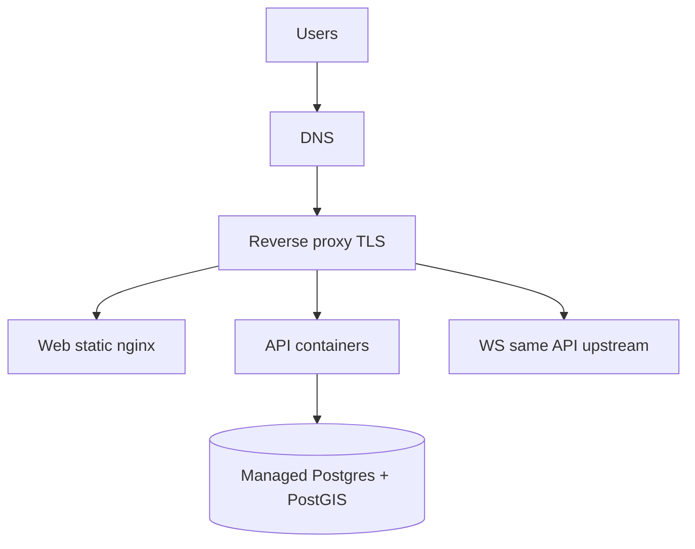

# 16. Deployment Architecture — CampusAR

## Environments

| Env             | Purpose      | Data                  | IoT sim                |
| --------------- | ------------ | --------------------- | ---------------------- |
| **Development** | Local eng    | Local PostGIS; seed   | On by default optional |
| **Staging**     | QA / demos   | Anonymized/seed clone | On                     |
| **Production**  | Pilot campus | Real campus graph     | Off or parallel MQTT   |

Promotion: main → staging deploy → prod approve.

---

## Logical deployment (V1)

**Assumption:** V1 co-locates HTTP and WS on the API service behind one proxy path prefix.

---

## Docker

| Image | Contains                                                 |
| ----- | -------------------------------------------------------- |
| `web` | Built SPA + nginx                                        |
| `api` | Node API                                                 |
| `db`  | Postgres+PostGIS (dev/stage compose; prod often managed) |

Compose for local: web nginx proxies `/api` and `/ws` to service `api:4000`; SPA is built with `VITE_API_URL=/api`.  
Prod: orchestrate containers (Compose on VM, ECS, or K8s later) without changing app contracts. Same-origin `/api` and `/ws` remain the browser-facing paths.

---

## Reverse proxy

Responsibilities:

- TLS termination
- Route `/` → web; `/api` → api; `/ws` → api with Upgrade headers
- Security headers
- Optional basic rate limit / WAF
- Gzip/brotli for static

---

## HTTPS

- Staging/prod: real certificates (ACM, Let’s Encrypt, campus PKI)
- Dev: localhost HTTP acceptable
- HSTS on prod

---

## Environment variables (categories)

| Category      | Examples (names only)                                                  |
| ------------- | ---------------------------------------------------------------------- |
| Server        | `PORT`, `NODE_ENV`                                                     |
| DB            | `DATABASE_URL`                                                         |
| Auth          | `JWT_ACCESS_SECRET`, `JWT_REFRESH_SECRET`, `ACCESS_TTL`, `REFRESH_TTL` |
| CORS          | `WEB_ORIGIN`                                                           |
| Features      | `IOT_SIMULATOR`, `PREDICTION_DEFAULT`                                  |
| Observability | `LOG_LEVEL`                                                            |

Secrets never committed. Document in `.env.example`.

---

## CI/CD

CI jobs (conceptual):

1. Install workspaces
2. Lint + typecheck
3. Unit tests (domain routing fixtures critical)
4. Build web + api
5. Optional Docker image build/push on main

CD: deploy images/artifacts; run migrations as explicit release step (ops-owned); seed only non-prod.

---

## Health & readiness

| Probe           | Meaning      |
| --------------- | ------------ |
| `/health/live`  | Process up   |
| `/health/ready` | DB reachable |

Orchestrators use ready before sending traffic.

---

## Migrations & seed

- Migrations versioned and applied in release pipeline
- Seed campus for demos — not automatic in production
- Rollback plan: backward-compatible migrations preferred

(This pack does not include SQL.)

---

## Observability (deploy)

- Centralized logs (stdout JSON)
- Metrics later: request rate, route latency, WS connections
- Uptime check on public health endpoint

---

## Backup & DR (prod)

- Managed Postgres automated backups
- RPO/RTO agreed with campus IT
- Document restore drill annually

---

## Environment parity checklist

- [ ] Same container images promoted across stage/prod
- [ ] Feature flags differ (sim on stage, off prod)
- [ ] CORS origins correct per env
- [ ] Secrets rotated independently
