# 18. Architecture Diagrams — CampusAR

Consolidated Mermaid diagrams. Detail lives in topic docs; this file is the gallery.

---

## 18.1 System context

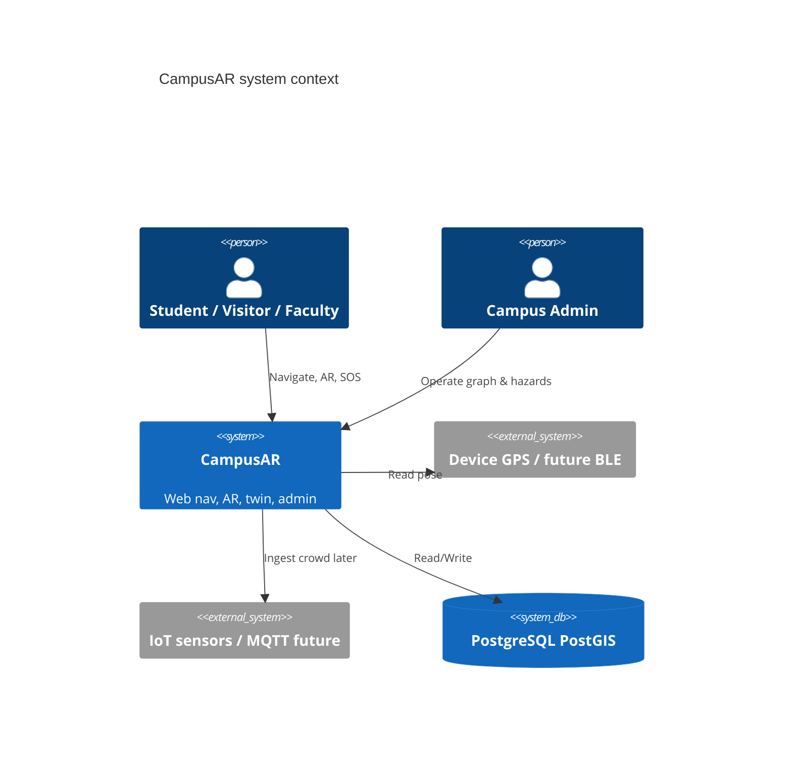

If C4 rendering is unavailable in a viewer, use:

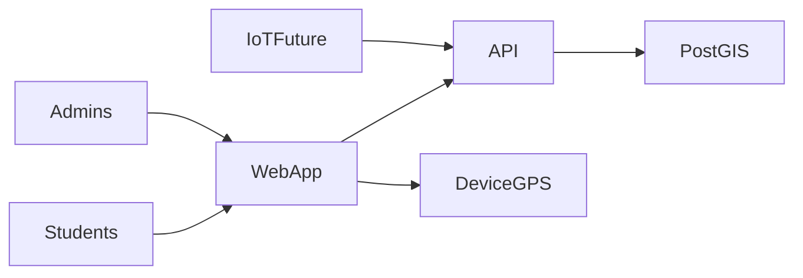

---

## 18.2 Sequence — login and route

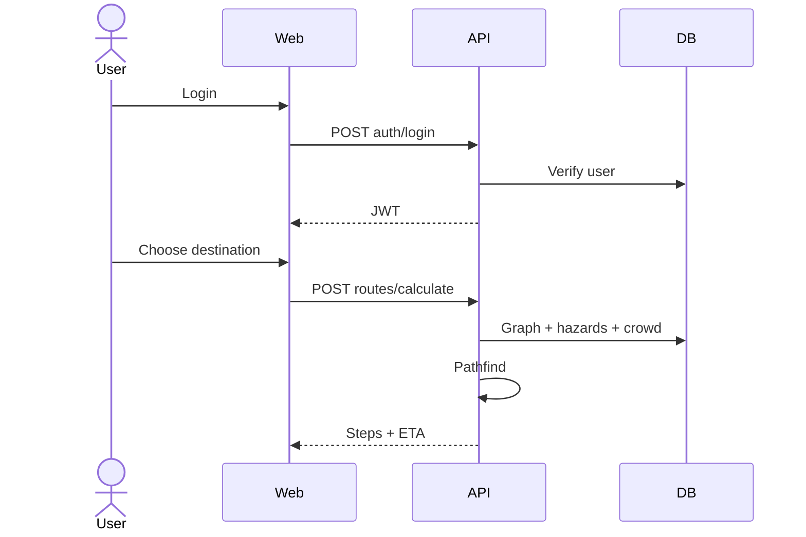

---

## 18.3 Component — modular monolith

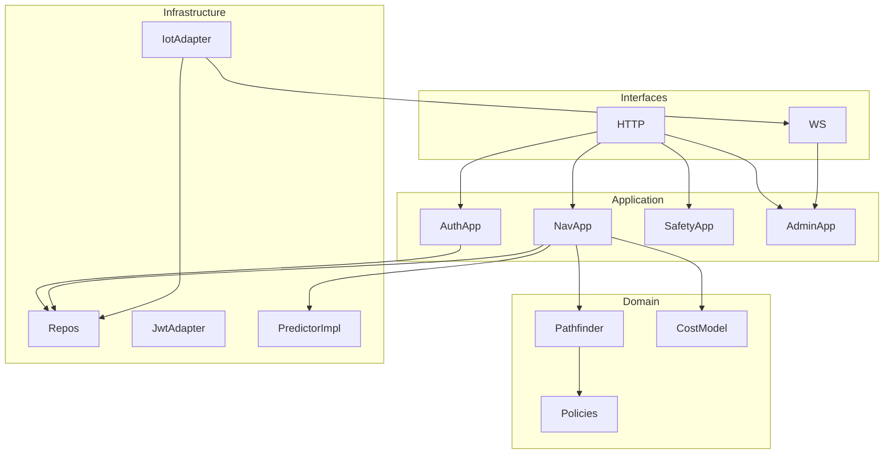

---

## 18.4 Deployment

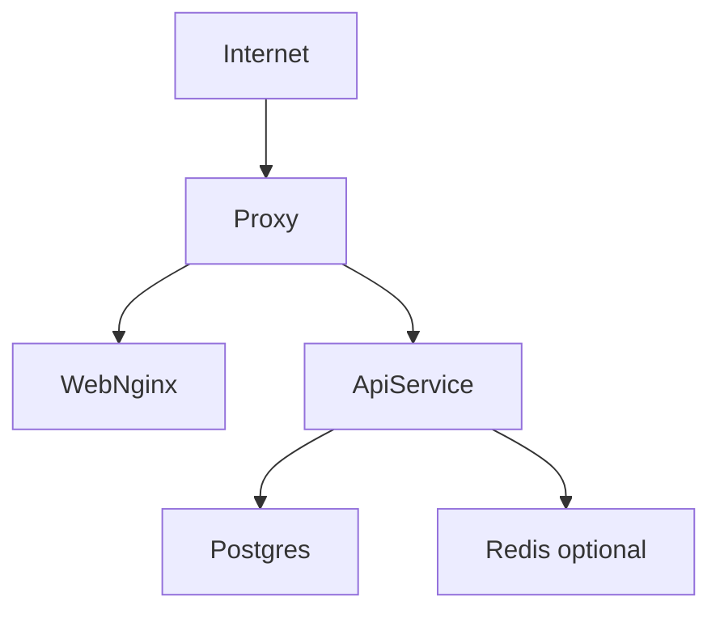

---

## 18.5 Authentication

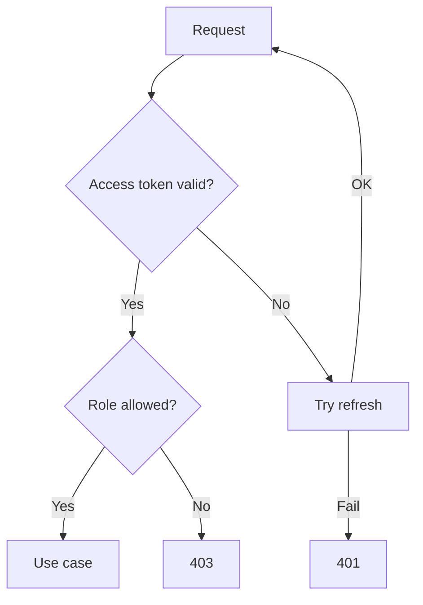

---

## 18.6 Navigation

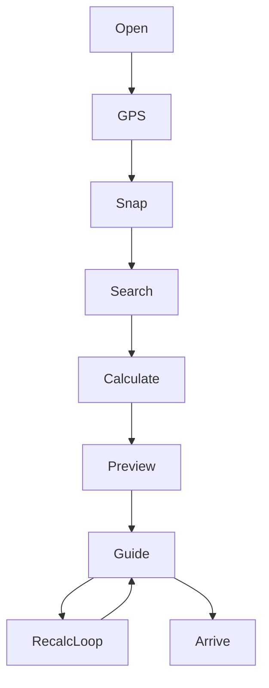

---

## 18.7 GPS flow

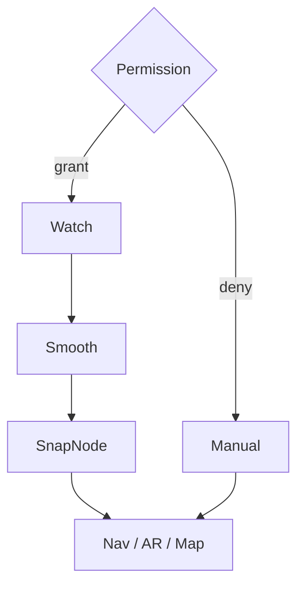

---

## 18.8 AR flow

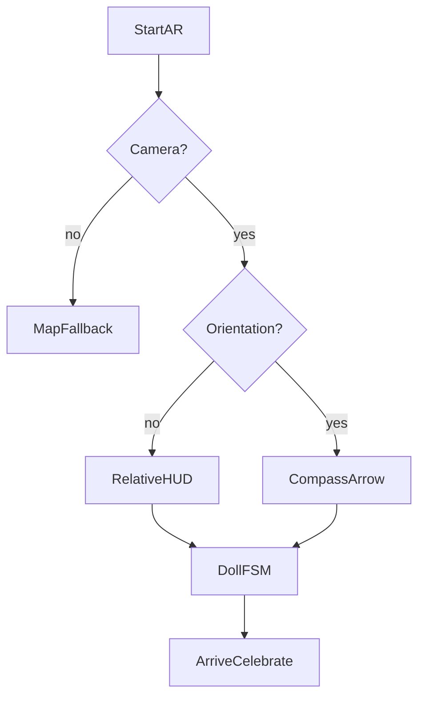

---

## 18.9 Admin flow

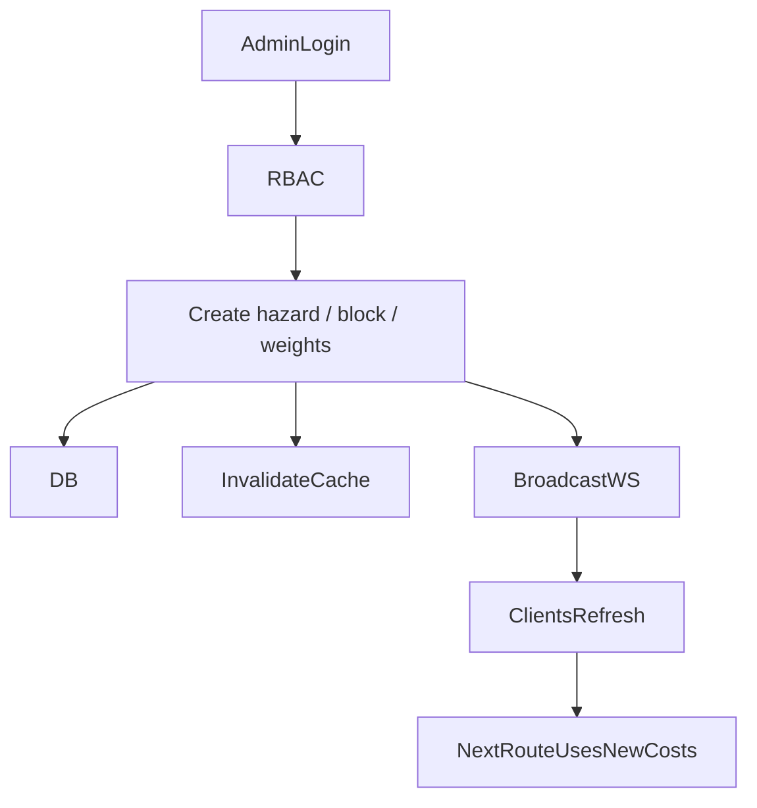

---

## 18.10 Clean Architecture dependency rule

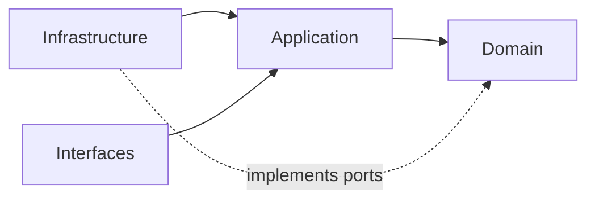

Dependencies point **inward** toward Domain.
