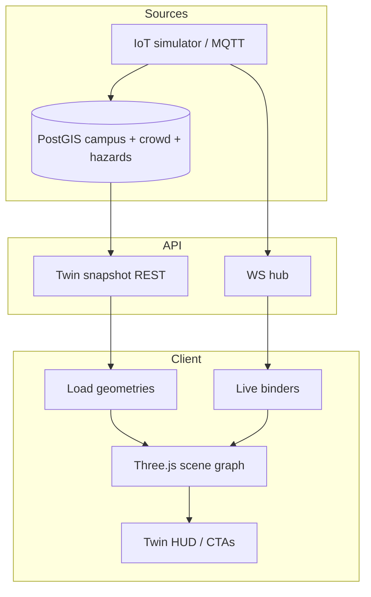

# 13. Digital Twin Design — CampusAR

## Purpose

Provide a **live operational 3D view** of campus movement and hazards. Twin is a **visualization projection** of the same campus + live data plane as the 2D map — not a separate system of record.

---

## System architecture

---

## Data flow

1. **Initial:** Client fetches snapshot — buildings (extrusion footprints or meshes), path network, active hazards, crowd scores, campus bounds.
2. **Subscribe:** WS `crowd` / `hazard` / `iot_status`.
3. **Bind:** Map edge ids → mesh materials/colors; hazard overlays → markers/volumes.
4. **Interact:** Orbit/pan/zoom; CTA → navigate with selected context (optional).
5. **Degrade:** On WS loss, keep last state + banner; refresh snapshot on reconnect.

---

## 3D rendering

| Layer | Content |
|-------|---------|
| Ground / basemap plane | Optional simple plane or terrain |
| Buildings | Extruded polygons or low-poly meshes |
| Path network | Tubes/lines keyed by edge id |
| Hazards | Translucent volumes / pins by type |
| Camera | Perspective; damping controls |
| Lighting | Simple hemispheric + directional (readable, not cinematic excess) |

**Performance:** Target interactive FPS on mid laptop; LOD — hide labels until zoom; merge path geometries where possible; avoid per-frame full graph rebuild (update materials only on events).

**Failure:** WebGL unavailable → message + link to 2D map.

---

## Heat maps (crowd)

| Occupancy band | Visual encoding |
|----------------|-----------------|
| Low | Cool / muted path color |
| Medium | Mid accent |
| High | Warm / alert path color |

Same thresholds as 2D map for cognitive consistency. Updates on WS tick (e.g. ~10s), not every animation frame from noise.

---

## Hazards

- Render active hazards with type styling (fire critical vs construction warning).
- On `hazard` event: add/update/remove without full scene reload.
- Twin does not compute routing; it only displays.

---

## Live users (V1 vs future)

| Version | Behaviour |
|---------|-----------|
| V1 | **Do not** broadcast arbitrary user GPS to twin (privacy) |
| Future opt-in | Aggregated density hexes or anonymized counts — never precise identifiable trails by default |

Admin “live users” in twin should prefer **crowd edge heat** from sensors/sim over stalking individuals.

---

## Future sensors

| Sensor | Twin encoding |
|--------|----------------|
| Air quality | Building tint / badge |
| Door open/closed | Portal icons |
| Camera people count | Feed crowd heat (via MQTT → crowd store) |
| Parking occupancy | Lot meshes (V4+) |

All sensors enter through IoT ingest → stores → same WS types or new event types clients ignore until supported.

---

## Security & access

- **Assumption (product):** authenticated users may view twin in V1; mutations remain admin HTTP.
- Do not expose admin-only raw device credentials via twin APIs.

---

## Testing / QA themes

- Snapshot loads offline-of-WS
- Crowd color changes within one tick when sim runs
- Hazard create in admin appears in twin
- WebGL fail path works
