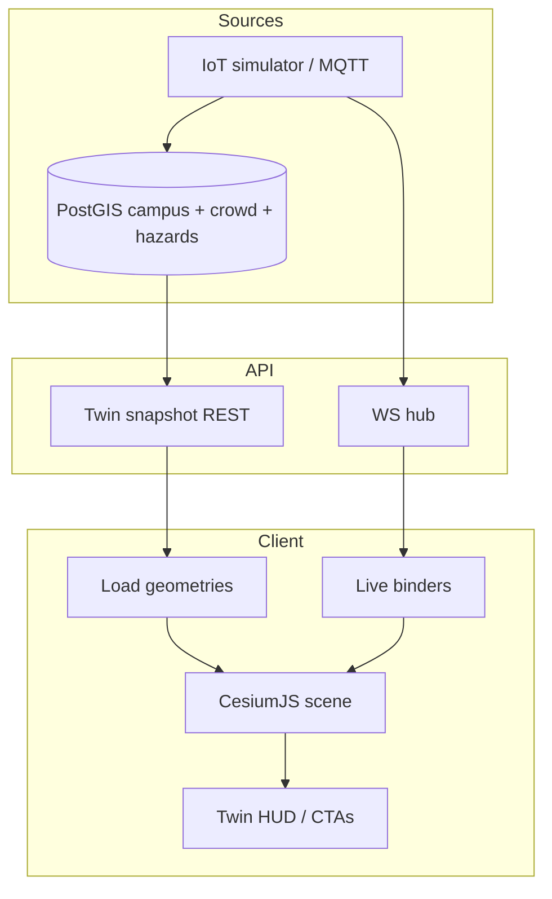

# 13. Digital Twin Design — CampusAR

## Purpose

Provide a **live operational 3D view** of campus movement and hazards. Twin is a **visualization projection** of the same campus + live data plane as the 2D map — not a separate system of record.

---

## System architecture

---

## Data flow

1. **Initial:** Client fetches snapshot — buildings (extrusion footprints or meshes), path network, active hazards, crowd scores, campus bounds.
2. **Subscribe:** WS `crowd` / `hazard` / `iot_status`.
3. **Bind:** Map edge ids → mesh materials/colors; hazard overlays → markers/volumes.
4. **Interact:** Orbit/pan/zoom; CTA → navigate with selected context (optional).
5. **Degrade:** On WS loss, keep last state + banner; refresh snapshot on reconnect.

---

## 3D rendering

| Layer                  | Content                                                                                                            |
| ---------------------- | ------------------------------------------------------------------------------------------------------------------ |
| Ground / basemap plane | Optional simple plane or terrain                                                                                   |
| Buildings              | Footprint extrusion, measured rectangle, or 28×22 m box. Optional GLB via `BUILDING_MODEL_URLS`. |
| Path network           | Subtle polylines from existing `nodes`/`edges`. Active A* route is a separate prominent overlay. |
| Entrances / POIs       | Point markers from real graph nodes and safety contacts — not invented.                          |
| Hazards                | Translucent volumes / pins by type                                                                                 |
| Camera                 | Perspective; damping controls                                                                                      |
| Lighting               | Simple hemispheric + directional (readable, not cinematic excess)                                                  |

**Performance:** Target interactive FPS on mid laptop; LOD — hide labels until zoom; merge path geometries where possible; avoid per-frame full graph rebuild (update materials only on events).

**Failure:** WebGL unavailable → message + link to 2D map.

---

## Heat maps (crowd)

| Occupancy band | Visual encoding         |
| -------------- | ----------------------- |
| Low            | Cool / muted path color |
| Medium         | Mid accent              |
| High           | Warm / alert path color |

Same thresholds as 2D map for cognitive consistency. Updates on WS tick (e.g. ~10s), not every animation frame from noise.

---

## Hazards

- Render active hazards with type styling (fire critical vs construction warning).
- On `hazard` event: add/update/remove without full scene reload.
- Twin does not compute routing; it only displays.

---

## Live users (V1 vs future)

| Version       | Behaviour                                                                                    |
| ------------- | -------------------------------------------------------------------------------------------- |
| V1            | **Do not** broadcast arbitrary user GPS to twin (privacy)                                    |
| Future opt-in | Aggregated density hexes or anonymized counts — never precise identifiable trails by default |

Admin “live users” in twin should prefer **crowd edge heat** from sensors/sim over stalking individuals.

---

## Future sensors

| Sensor              | Twin encoding                            |
| ------------------- | ---------------------------------------- |
| Air quality         | Building tint / badge                    |
| Door open/closed    | Portal icons                             |
| Camera people count | Feed crowd heat (via MQTT → crowd store) |
| Parking occupancy   | Lot meshes (V4+)                         |

All sensors enter through IoT ingest → stores → same WS types or new event types clients ignore until supported.

---

## Security & access

- **Assumption (product):** authenticated users may view twin in V1; mutations remain admin HTTP.
- Do not expose admin-only raw device credentials via twin APIs.

---

## Testing / QA themes

- Snapshot loads offline-of-WS
- Crowd color changes within one tick when sim runs
- Hazard create in admin appears in twin
- WebGL fail path works

---

## Current implementation (code)

- Route: `/digital-twin` (legacy `/twin` redirects). Available to any logged-in user.
- Renderer: **CesiumJS** (not Three.js). OSM raster, no Cesium Ion token.
- Live: existing `useCampusLive` WebSocket (`crowd`, `hazard`, `iot_status`). Production uses same-origin `/api` and `/ws` (F-002).
- Navigation route overlay: existing `POST /api/navigation/route` when nav store has source+destination. A* is not duplicated.
- Models: none shipped. See `apps/web/public/models/buildings/README.md`.
- Not included: indoor 3D, 3D Tiles, occupancy %, emergency dispatch, invented footprints/vegetation.

### Phase 2 campus layers

Independent Cesium `CustomDataSource` layers. Toggles set `.show` only — the Viewer is not recreated.

| Layer | Data source | Real data today? |
| ----- | ----------- | ---------------- |
| Buildings | `GET /api/campus/buildings` (WGS84 point + `floorsCount`) | Yes — fallback boxes (no surveyed footprints in the DB) |
| Walkways | `GET /api/campus/nodes` + `/edges` | Yes — same outdoor graph as Map/Navigate |
| Active route | `POST /api/navigation/route` | Yes — overlays walkways; start / optional named waypoints / destination |
| POIs | Named outdoor nodes without `buildingId`, plus emergency exits/contacts with coordinates | Yes — e.g. Main Gate, Entry Plaza, junctions, Campus Medical |
| Entrances | Graph nodes `kind = entrance` | Yes — seed entrance nodes with `building_id` |
| Parking | Building code `PARK` / name containing parking | Yes as a **point**. No lot polygon and no stall counts |
| Open areas | Ground A/B and Basketball Court buildings | Yes as **markers**. No garden/field polygons |
| Hazards | `GET /api/safety/zones` + WS | Yes — point + `radius_m` |
| Live data | WS crowd + user GPS pin | Crowd is edge intensity 0–1, not occupancy % |
| Campus boundary | `CAMPUS_BOUNDARY` in `buildingGeometry.ts` | **Prepared only** — no polygon in the repository |

### Building geometry hierarchy (frontend adapter)

1. Real footprint ring (`BUILDING_FOOTPRINTS` or future API field) → extruded Cesium polygon.
2. Measured width/depth (`BUILDING_DIMENSIONS`) → axis-aligned rectangle extrusion.
3. Center only → existing **28 m × 22 m × floorsCount×3.5 m** box.

Do not change the backend schema until surveyed polygons exist. Buildings are never dropped when detailed geometry is missing.

### How to add real geometry later

| Feature | Where |
| ------- | ----- |
| Building footprint | `apps/web/src/features/digitalTwin/models/buildingGeometry.ts` → `BUILDING_FOOTPRINTS[buildingId] = [{latitude, longitude}, ...]` |
| Building dimensions | same file → `BUILDING_DIMENSIONS[buildingId] = { width, depth }` (meters) |
| Entrance | Insert a `nodes` row with `kind = 'entrance'`, WGS84 lat/lng, and `building_id`. Optional name tokens `side` / `accessible` set the role. |
| POI | Named outdoor node (`building_id` null) or emergency contact/exit with coordinates |
| Parking area | Parking building already exists. Add a ring to `PARKING_POLYGONS` for a lot outline. **Do not** invent `availableSpaces`. |
| Campus boundary | `CAMPUS_BOUNDARY` ring in `buildingGeometry.ts` |
| GLB model | `/models/buildings/<uuid>.glb` + `BUILDING_MODEL_URLS` in `buildingModels.ts` |

### Coordinates

CampusAR stores **WGS84 latitude, longitude**. Cesium `fromDegrees` / `fromDegreesArray` take **longitude, latitude**. Adapters in `features/digitalTwin/adapters/coordinates.ts` perform that conversion. Do not apply undocumented offsets.
