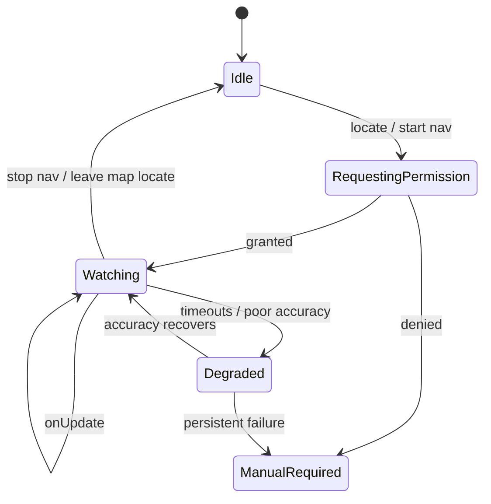
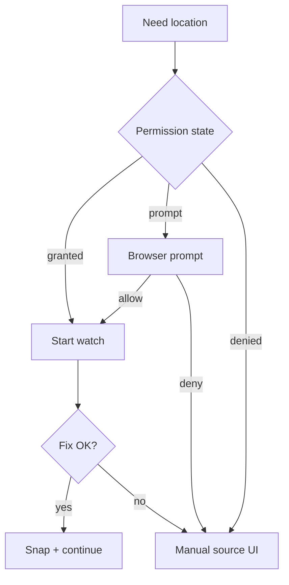
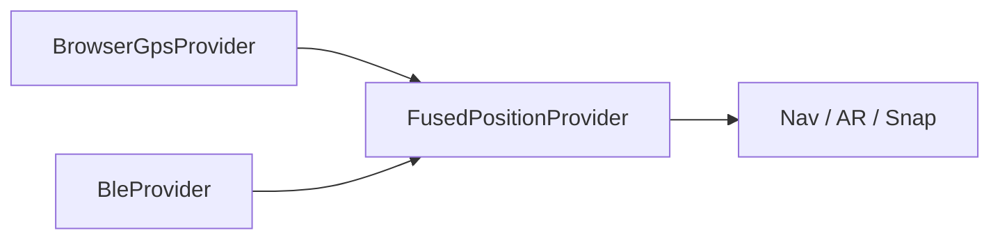

# 11. GPS Architecture — CampusAR

Client-centric positioning pipeline with a provider port for future BLE/fusion.

---

## Goals

- Reliable outdoor pose for snap + progress + AR bearing context
- Explicit permission and failure UX (product navigation workflow)
- Battery-conscious watching
- Clean handoff to indoor/BLE later

---

## Browser GPS

Use Geolocation API:

- `getCurrentPosition` for initial fix
- `watchPosition` during active navigation / map locate mode

Options (conceptual): `enableHighAccuracy: true` while navigating; relax when idle on map browse.

---

## watchPosition lifecycle



---

## Accuracy handling

| Accuracy | Behaviour |
|----------|-----------|
| ≤ 20 m | Normal snap confidence |
| 20–50 m | Warn; snap with low confidence |
| > 50 m | Prefer manual confirmation for source |
| null / unknown | Treat as poor |

Surface accuracy to UI sparingly (banner, not constant noise).

---

## Coordinate smoothing

Goals: reduce jitter for step advancement and AR.

Techniques (choose in impl, document chosen):

- Ignore fixes older than threshold
- Discard outliers (speed impossible for walking)
- Simple moving average or 1€ filter on lat/lng
- Separate heading smoother for AR

**Do not** over-smooth such that arrival lags badly — tune with hysteresis on arrival radius.

---

## Nearest node detection

1. Take smoothed pose
2. Query candidate nodes (client spatial index of downloaded nodes **or** server snap API)
3. Filter by max snap radius and walkable types
4. Pick nearest; attach `snapDistance`

**Assumption:** V1 may snap client-side from graph payload for latency; server snap available for consistency checks.

---

## Position interpolation

Between sparse fixes:

- Interpolate along route polyline for UI “you are here” (display only)
- Authoritative step index still based on snap + distance-along-route thresholds
- Do not invent off-graph shortcuts

---

## Battery optimization

| Mode | GPS behaviour |
|------|----------------|
| Map browse | Single shot or low-frequency watch |
| Active navigation | Higher frequency / high accuracy |
| Background tab | Pause or heavily throttle watch |
| Arrived / idle | Stop watch |

Prefer stopping watches whenever leaving Navigate/AR.

---

## Permission flow



Copy must explain why location is needed (navigation), per platform norms.

---

## Failure cases

| Failure | User outcome |
|---------|--------------|
| Permission denied | Manual node selection |
| Timeout | Retry + manual |
| Outside campus | Warn; allow manual |
| Mock GPS | Ignore anti-spoof V1 (product assumption) |
| Jump discontinuity | Outlier reject / debounce off-route |
| Indoor GPS drift | Prompt floor/manual; future BLE |

---

## Indoor transition

V1: no automatic indoor engine.

Design hook:

```text
if pose.accuracy poor AND near indoor-capable building
  → suggest manual floor/node OR enable BleProvider when available
```

Keep `Pose.source` stamped (`gps` | `manual` | `ble` | `fused`) for analytics and AR confidence.

---

## Future BLE handoff



Fusion policy examples:

- Outdoor: prefer GPS
- Inside instrumented wing: prefer BLE when beacon RSSI confidence high
- Conflict: choose higher confidence; never block routing if either provides a snap

Server may store beacon → node maps later; routing engine remains node-based.

---

## Security / privacy notes

- Do not upload high-frequency trails by default
- SOS sends point-in-time location only
- Clear watches on logout
