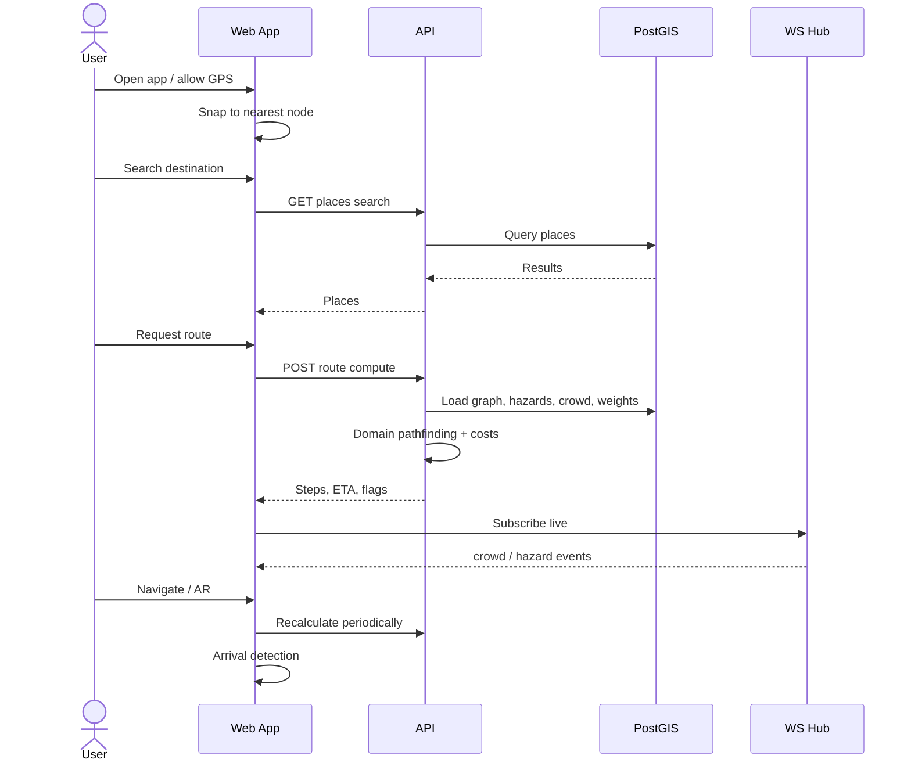
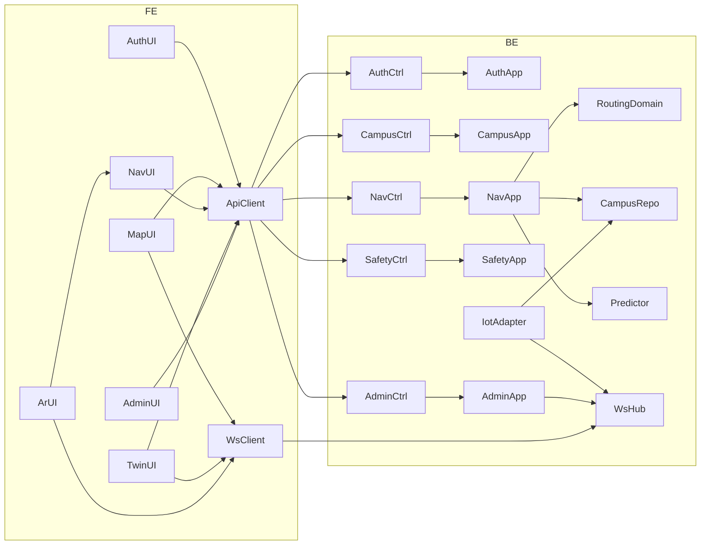

# 3. High Level Design (HLD) — CampusAR

## 1. Frontend

**Role:** Progressive Web App for discovery, navigation, AR, twin, safety, admin, analytics.

**Structure:** Feature-sliced UI (`map`, `navigate`, `ar`, `twin`, `safety`, `admin`, `analytics`, `auth`) over shared shell, API client, and stores.

**Key capabilities:**
- Auth / guest session
- MapLibre campus map + selection
- Navigate turn-by-turn + optional TTS
- Web AR camera + compass + guide character
- Digital Twin Three.js view
- Live overlays via WebSocket
- Admin forms calling protected APIs

**Dependency rule:** Features depend on `lib/api`, stores, and shared types — not on each other’s internals.

Detail: [`frontend-architecture.md`](./frontend-architecture.md).

---

## 2. Backend

**Role:** Authoritative business logic, persistence, realtime fan-out.

**Style:** Modular monolith with Clean Architecture layers:

```text
Interfaces (HTTP, WS, validation)
    → Application (use cases)
        → Domain (routing, policies, errors)
            ← Infrastructure (DB, JWT, IoT, predictor impls)
```

**Key capabilities:** Auth, campus CRUD/search, route compute/recalculate, safety/SOS, admin config, analytics queries, IoT sim control, WS publish.

Detail: [`backend-architecture.md`](./backend-architecture.md).

---

## 3. Database

**Role:** System of record for users, graph, hazards, crowd, events, analytics facts.

**Engine:** PostgreSQL + PostGIS for geometry and spatial queries (snap, intersects, distance).

**Design stance:** Conceptual entities and relationships only in this pack; physical SQL is an implementation concern.

Detail: [`database-design.md`](./database-design.md).

---

## 4. Digital Twin

**Role:** Operational 3D visualization — not a second source of truth.

**Data flow:** REST snapshot (buildings, paths, hazards, crowd) + WebSocket deltas → Three.js scene.

**Consumers:** Admins, demos, optionally authenticated users (per product assumption).

Detail: [`digital-twin-design.md`](./digital-twin-design.md).

---

## 5. GPS / positioning

**Role:** Provide outdoor pose; snap to graph; feed navigation progress and AR bearing context.

**V1:** Browser `watchPosition` → smooth → nearest node.

**Future:** BLE / hybrid provider swapped behind the same client `PositionProvider` port.

Detail: [`gps-architecture.md`](./gps-architecture.md).

---

## 6. AR

**Role:** Enhance guidance with camera-aligned cues and avatar motions; never block completion of navigation.

**Inputs:** Active route steps, device orientation, position progress.

**Outputs:** Overlay HUD, doll states (walk / wave / celebrate), arrival success.

Detail: [`ar-architecture.md`](./ar-architecture.md).

---

## 7. WebSocket

**Role:** Push live campus state: crowd, sensors, hazards, IoT status.

**V1:** Same API process hosts WS hub; clients subscribe after connect; server broadcasts on tick / admin mutation.

Detail: [`websocket-architecture.md`](./websocket-architecture.md).

---

## 8. Admin

**Role:** Operate digital campus: entities, weights, hazards, crowd, events, simulator, analytics entry.

**Access:** RBAC admin role; all mutations validated and attributable.

**Effect path:** Mutation → DB → optional WS event → clients refresh overlays; next route uses new costs.

---

## 9. Analytics

**Role:** Aggregate product and campus metrics for admins (searches, routes, popular destinations, SOS counts).

**V1:** Write events on critical actions; read aggregated queries. No full GPS trail storage by default (product assumption).

---

## 10. Authentication

**Flows:** Register / login → access JWT (+ refresh) → Authorization header on REST; WS may accept token on connect query/header.

**Guest:** Client-only or lightweight anonymous session id for analytics correlation — **Assumption:** guest can call public navigation APIs without user row, or with ephemeral guest principal.

Detail: [`security-architecture.md`](./security-architecture.md).

---

## Communication flow (happy path navigate)



---

## Component relationships



---

## Cross-cutting concerns

| Concern | HLD approach |
|---------|--------------|
| Validation | Zod at HTTP boundary; domain invariants inside |
| Errors | Typed domain errors → stable API error envelope |
| Logging | Correlation id per request / WS session |
| Config | Env-based; never commit secrets |
| Feature flags | Env / config table for prediction default, sim on/off |

---

## Evolution without redesign

| Future need | HLD extension |
|-------------|----------------|
| BLE | New `PositionProvider`; same snap/route APIs |
| MQTT | New ingest adapter writing crowd/sensor; same WS events |
| LSTM | New `CrowdPredictor` implementation or remote client |
| Unity | Same REST/WS contracts; shared DTOs |
| Multi-campus | `campus_id` on entities + tenant middleware |
| Split services | Extract Routing or Realtime first along context boundaries |
