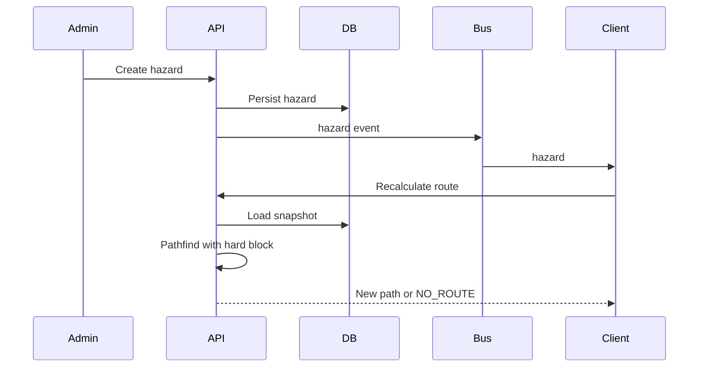

# 4. Low Level Design (LLD) — CampusAR Subsystems

Each subsystem: responsibilities, I/O, interfaces, dependencies, failure handling, extension points.  
No source code — contracts only.

---

## 4.1 Identity & Auth

| | |
|--|--|
| **Responsibilities** | Register/login; issue/validate JWT; refresh; role claims; password hashing |
| **Inputs** | Email, password, refresh token |
| **Outputs** | Access/refresh tokens, user profile, errors |
| **Interfaces** | `AuthService`, `TokenIssuer`, `UserRepository`, `PasswordHasher` |
| **Dependencies** | DB, clock, env secrets |
| **Failure handling** | Invalid credentials → 401 without user enumeration detail beyond “invalid”; lockout via rate limit |
| **Extension points** | OIDC/SAML IdP adapter; MFA challenge port |

---

## 4.2 Campus catalog & search

| | |
|--|--|
| **Responsibilities** | List/search places; category filter; serve map-ready DTOs |
| **Inputs** | Query string, category, campus id |
| **Outputs** | Place summaries (id, name, code, category, node ref, coords) |
| **Interfaces** | `CampusRepository.searchPlaces`, `listBuildings` |
| **Dependencies** | PostGIS, optional analytics event writer |
| **Failure handling** | Empty list ≠ error; DB failure → 503 |
| **Extension points** | Synonym dictionary; “near me” ranker using pose |

---

## 4.3 Graph load & cache

| | |
|--|--|
| **Responsibilities** | Load nodes/edges/weights/hazards/crowd into routing snapshot; invalidate on admin change |
| **Inputs** | Campus id |
| **Outputs** | Immutable `GraphSnapshot` for pathfinder |
| **Interfaces** | `GraphSnapshotProvider` |
| **Dependencies** | Campus/Hazard/Crowd/Config repos |
| **Failure handling** | Partial crowd miss → neutral crowd; never fail load solely on predictor |
| **Extension points** | Redis-backed shared cache for multi-instance |

---

## 4.4 Routing engine

| | |
|--|--|
| **Responsibilities** | Apply constraints & costs; pathfind; emit steps/ETA/flags |
| **Inputs** | Source node, dest node, prefs (accessibility, usePrediction), snapshot |
| **Outputs** | Path, instructions, distance, ETA, explainability flags / `NO_ROUTE` |
| **Interfaces** | `Pathfinder`, `CostModel`, `CrowdPredictor`, `InstructionBuilder` |
| **Dependencies** | Graph snapshot, policy order from product safety/AI docs |
| **Failure handling** | No path → `NO_ROUTE`; predictor fail → live-only; timeout → 503 |
| **Extension points** | Alternate algorithms; multi-stop; outdoor modes |

Detail: [`routing-engine.md`](./routing-engine.md).

---

## 4.5 Navigation session (client-centric)

| | |
|--|--|
| **Responsibilities** | Hold active route; advance steps; trigger recalc; detect arrival |
| **Inputs** | Route DTO, pose updates, user commands |
| **Outputs** | Current instruction, phase (navigating/arrived), recalc requests |
| **Interfaces** | `NavSessionStore`, `ArrivalDetector`, `OffRouteDetector` |
| **Dependencies** | PositionProvider, Navigation API, TTS optional |
| **Failure handling** | Recalc fail → keep last path + warn; GPS loss → manual continue |
| **Extension points** | Server-side session for shared monitoring (future) |

---

## 4.6 GPS / positioning

| | |
|--|--|
| **Responsibilities** | Acquire pose; smooth; snap; expose to nav/AR |
| **Inputs** | Browser geolocation events; manual node picks |
| **Outputs** | `Pose` stream |
| **Interfaces** | `PositionProvider`, `SnapToGraph` (client and/or API) |
| **Dependencies** | Permissions, campus bounds, node index |
| **Failure handling** | Deny/timeout → manual; poor accuracy → warn |
| **Extension points** | BLE, fused providers |

Detail: [`gps-architecture.md`](./gps-architecture.md).

---

## 4.7 WebSocket live bus

| | |
|--|--|
| **Responsibilities** | Authenticate connect; broadcast crowd/sensors/hazard/iot_status; heartbeat |
| **Inputs** | Internal events from IoT/admin |
| **Outputs** | Client messages |
| **Interfaces** | `LiveEventBus`, `WsGateway` |
| **Dependencies** | Auth, serializer |
| **Failure handling** | Client reconnect + snapshot resync; hub backpressure drop-oldest non-critical |
| **Extension points** | Redis pub/sub; room-per-campus |

Detail: [`websocket-architecture.md`](./websocket-architecture.md).

---

## 4.8 IoT ingest

| | |
|--|--|
| **Responsibilities** | Produce crowd/sensor updates; admin start/stop (sim) |
| **Inputs** | Timer tick / MQTT messages / admin overrides |
| **Outputs** | DB upserts + live events |
| **Interfaces** | `IoTIngestAdapter`, `CrowdRepository` |
| **Dependencies** | Clock, config `IOT_SIMULATOR` |
| **Failure handling** | Tick errors logged; last values retained |
| **Extension points** | MQTT bridge; device registry |

---

## 4.9 Safety & SOS

| | |
|--|--|
| **Responsibilities** | Hazard CRUD effects; list contacts/exits; create SOS |
| **Inputs** | Hazard DTOs; SOS location |
| **Outputs** | Persisted entities; WS hazard events; user confirmation DTO |
| **Interfaces** | `SafetyService`, `SosRepository`, `HazardRepository` |
| **Dependencies** | Authz, optional Notifier port (no-op V1) |
| **Failure handling** | SOS without GPS → require manual node; notifier fail ≠ SOS fail |
| **Extension points** | SMS/CAD notifier; security ack console |

---

## 4.10 Digital Twin

| | |
|--|--|
| **Responsibilities** | Render 3D campus; apply live heat/hazards |
| **Inputs** | Twin snapshot REST + WS |
| **Outputs** | Interactive scene |
| **Interfaces** | `TwinSceneController`, `HeatmapMaterialBinder` |
| **Dependencies** | WebGL, same live contracts as map |
| **Failure handling** | No WebGL → CTA to map; WS down → stale banner |
| **Extension points** | Floors, what-if layers, BIM |

Detail: [`digital-twin-design.md`](./digital-twin-design.md).

---

## 4.11 AR guidance

| | |
|--|--|
| **Responsibilities** | Camera + orientation cue + doll states + arrival celebrate |
| **Inputs** | Nav session, pose, permissions |
| **Outputs** | Visual/audible guidance |
| **Interfaces** | `ArScene`, `GuideAvatarController`, `BearingCalculator` |
| **Dependencies** | getUserMedia, DeviceOrientation, Three |
| **Failure handling** | Permission deny → map mode; sensor noise → smoothing |
| **Extension points** | Unity client; VPS anchors |

Detail: [`ar-architecture.md`](./ar-architecture.md).

---

## 4.12 Admin & analytics

| | |
|--|--|
| **Responsibilities** | Mutate campus config; view aggregates |
| **Inputs** | Admin DTOs; date range for analytics |
| **Outputs** | Persisted config; summary metrics |
| **Interfaces** | `AdminService`, `AnalyticsService` |
| **Dependencies** | RBAC, audit fields, cache invalidation, WS emit |
| **Failure handling** | Validation errors; conflict on concurrent edits (optimistic version optional) |
| **Extension points** | Fine-grained RBAC; CSV export; BI pipeline |

---

## 4.13 API gateway / reverse proxy (ops)

| | |
|--|--|
| **Responsibilities** | TLS termination, routing to web/api, rate limit, headers |
| **Inputs** | External HTTP/WS |
| **Outputs** | Proxied traffic |
| **Interfaces** | nginx/Caddy/Traefik config contracts |
| **Dependencies** | Certs, env upstreams |
| **Failure handling** | Upstream health checks; 502 pages |
| **Extension points** | WAF, canary routing |

---

## Cross-subsystem sequence: hazard affects active nav

