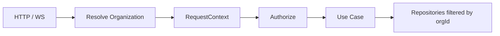

# Multi-Tenant Architecture — CampusAR NaaS

**Purpose:** Evolve the current single-campus modular monolith into a **multi-tenant Navigation-as-a-Service** platform without rewriting Clean Architecture layers.  
**No implementation code / SQL / routes in this document.**

Product source: [`../product/multi-tenancy.md`](../product/multi-tenancy.md).

---

## 1. Goals

1. One deployable application serves unlimited organizations.  
2. Strict **logical isolation** of all tenant data.  
3. Org resolved at the edge of every request (HTTP, WS, jobs).  
4. Self-serve graph + branding without redeploys.  
5. Preserve routing, safety, AR, twin as **tenant-scoped capabilities**.  
6. Keep complexity proportional: prefer **shared DB + `organization_id`** over microservices until scale demands.

---

## 2. What must change from current architecture

| Area | Today (V1) | NaaS target |
|------|------------|-------------|
| Root entity | Implicit single campus | **Organization** |
| Data scope | Global tables | All domain rows carry `organizationId` |
| Auth | Roles on user | Org membership + role + platform role |
| URLs | `/map`, `/admin` | `/{orgSlug}/…` (+ optional custom domain later) |
| Graph authoring | Seed / admin forms | **Visual map editor** |
| Branding | App-wide theme | Per-org theme tokens |
| Analytics | Campus aggregates | Per-org + platform rollups |
| WebSocket | Single campus room | Room per `organizationId` |
| Search | Global places | Org-filtered search index |
| Config | Env feature flags | Org settings + platform flags |

**Non-change:** Domain routing cost model, PositionProvider port, Clean Architecture dependency rule, modular monorepo shape.

---

## 3. Tenancy strategy (decision)

**Chosen:** Shared application + **shared database**, row-level tenant key (`organization_id` on every tenant-owned table).

| Alternative | Why not (yet) |
|-------------|----------------|
| DB-per-tenant | Ops heavy; overkill before 100s of orgs |
| Schema-per-tenant | Migration pain |
| Process-per-tenant | Cost/latency |

**Hard rules:**

- Every repository query includes org filter (enforced in application layer + DB constraints).  
- Never trust client-sent `organizationId` alone — derive from auth membership or public slug resolution.  
- Platform admin actions are audited.

---

## 4. Request context model

**Resolve organization from (priority):**

1. Path slug: `/{orgSlug}/...`  
2. QR token → slug (if opaque codes used)  
3. Host subdomain: `{slug}.campusar.com` (phase 2)  
4. Authenticated user’s **active org** (admin console)  
5. Explicit header only for service-to-service (internal)

**RequestContext** (conceptual): `{ organizationId, slug, actor, roles[], locale, brandRevision }`.

---

## 5. Bounded contexts (updated)

| Context | Tenant-scoped? | Notes |
|---------|----------------|-------|
| Identity & Membership | Partial | Users global; memberships per org |
| Organization & Branding | Yes | Profile, theme, QR, slug |
| Campus Graph & Editor | Yes | Buildings, floors, nodes, edges |
| Routing | Yes | Snapshot per org |
| Safety | Yes | Hazards, SOS, exits |
| Live / IoT | Yes | Channels per org |
| Analytics | Yes (+ platform) | Events tagged with org |
| Billing / Entitlements | Platform | Plans, limits (nodes, admins, AR) |
| Platform Ops | Platform | Super-admin |

---

## 6. Authentication & authorization

**Canonical detail:** [`authentication-authorization.md`](./authentication-authorization.md) · product [`../product/role-permissions.md`](../product/role-permissions.md).

### Authn (guest-first)
- **Guests (majority):** “Continue as Guest” → anonymous session **bound to org**; no account.  
- **Organization admins only:** email + password (SSO later); must have `OrganizationMembership`.  
- **Super Admin (future):** platform principal; MFA policy; audited tenant access.  
- Visitor self-registration is **out of the primary product path**.

### Authz (RBAC)

| Role | Scope | Capabilities |
|------|-------|----------------|
| `guest` | Org public | Navigation features only (map, search, route, AR, SOS use, report issue) |
| `org_admin` | Own org | Full Admin Dashboard (editor, branding, safety, QR, analytics, users, content) |
| `platform_admin` | Global | Tenant CRUD, suspend, support access (future) |
| `org_operator` | Own org | Optional future: hazards/SOS without full admin |

**Authorization rule:** `actor can action resource iff resource.organizationId matches actor org context AND role permits action`.

---

## 7. API architecture changes

- Prefix public and admin APIs with org resolution:  
  - Public: `/api/v1/o/{orgSlug}/...`  
  - Admin: `/api/v1/admin/o/{orgSlug}/...` (membership required)  
  - Platform: `/api/v1/platform/...`  
- Keep versioning (`/api/v1`).  
- Error codes unchanged; add `ORG_NOT_FOUND`, `ORG_SUSPENDED`, `FORBIDDEN_ORG`.  
- Rate limits: per IP **and** per `organizationId`.  
- Idempotency keys for editor writes (optional).

OpenAPI documents org path parameter as required for tenant routes.

---

## 8. Database design changes (conceptual)

Add **Organization** and **OrganizationMembership**.  
Stamp `organization_id` on: buildings, floors, nodes, edges, rooms/places, hazards, contacts, exits, events, crowd, sensors, analytics events, SOS, route weights, notifications, QR campaigns.

**Indexes:** `(organization_id, …)` leading composite indexes for search, graph load, analytics.

**Uniqueness:** `slug` unique globally; `node` names unique per org (or per building—product choice: **unique per org** for search clarity).

**Soft delete:** prefer `archived_at` for nodes/edges so analytics history survives.

No SQL in this pack — see [`organization-domain.md`](./organization-domain.md).

---

## 9. Frontend architecture changes

| Concern | Approach |
|---------|----------|
| Routing | React Router: `/:orgSlug/*` public app; `/admin/:orgSlug/*` admin; `/platform` |
| Org bootstrap | Fetch org public profile + branding before map |
| Theme | CSS variables injected from brand tokens |
| Editor | Dedicated feature module `features/editor` (admin only) |
| Guest | No global landing required; slug/QR lands on org map |
| Shared shell | One AppShell; brand logo/colors swap per org |

---

## 10. WebSocket / live

- Subscribe: `org:{organizationId}`  
- Simulator / MQTT ingest writes only to that org’s crowd tables  
- No broadcast across tenants  

---

## 11. Search changes

- All search queries require `organizationId`.  
- Keywords field on nodes for synonyms (“CSE”, “computer science”).  
- Categories org-configurable (defaults provided by template).  
- Future: per-org search boost / popular destinations.

---

## 12. Analytics changes

- Event envelope: `{ organizationId, actorType, eventType, payload, ts }`  
- Org admin dashboards filter to own org.  
- Platform dashboard: aggregated anonymized KPIs (arrivals, active orgs), never raw cross-tenant PII.

---

## 13. Isolation & security controls

1. Middleware sets org context before controllers.  
2. Repository base requires `orgId` argument (no default global).  
3. Automated tests: tenant A cannot read tenant B (matrix tests).  
4. WS auth includes org claim.  
5. Object storage paths: `orgs/{orgId}/branding/...`  
6. Export/import graph tools never omit org filter.

---

## 14. Migration path from single campus

1. Introduce `organizations` row for current campus (e.g. slug `rnsit`).  
2. Backfill `organization_id` on all existing rows.  
3. Add slug routing; keep temporary redirect from `/map` → `/{slug}/map`.  
4. Ship map editor behind org_admin.  
5. Enable QR generation.  
6. Onboard second org on same deploy to prove isolation.

---

## 15. Complexity guardrails (5–10 year maintainability)

- Do **not** fork the app per customer.  
- Do **not** invent a second routing engine per industry—use categories + graph templates.  
- Industry packs (hospital, mall) = **seed templates + category presets**, not code forks.  
- Extract billing/realtime only when operational pain is measured.  

---

## 16. Related documents

- [`organization-domain.md`](./organization-domain.md)  
- [`map-editor.md`](./map-editor.md)  
- [`qr-navigation.md`](./qr-navigation.md)  
- [`branding-system.md`](./branding-system.md)  
- [`gps-abstraction.md`](./gps-abstraction.md)  
- Existing: [`backend-architecture.md`](./backend-architecture.md), [`security-architecture.md`](./security-architecture.md), [`database-design.md`](./database-design.md)  
