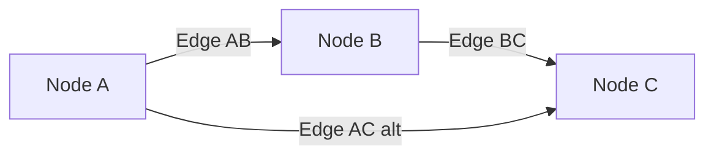
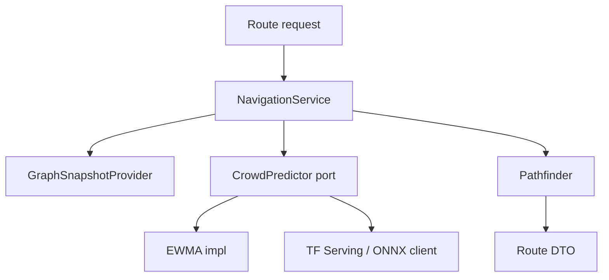

# 10. Routing Engine Design — CampusAR

Behavioural design only. Product rules: [`../product/ai-routing-logic.md`](../product/ai-routing-logic.md), [`../product/safety-workflow.md`](../product/safety-workflow.md).

**Do not treat this as algorithm source code.**

---

## Responsibilities

- Build a routable graph snapshot for a campus
- Apply hard constraints then soft costs
- Compute path source → destination
- Emit turn instructions, distance, ETA, explainability metadata
- Support recalculation with stability hysteresis

---

## Graph model

| Concept | Meaning |
|---------|---------|
| **Graph** | Directed or bidirectional walkable network for one campus |
| **Snapshot** | Immutable in-memory copy used for one calculate call (or short TTL cache) |
| **Effective edge** | Edge after blocks, hazards, crowd, prediction, accessibility filters |



---

## Node model

| Field (conceptual) | Purpose |
|--------------------|---------|
| id | Stable identifier |
| coordinate | Lat/lng (and optional altitude) |
| type | entrance, junction, indoor, exit, elevator lobby, … |
| floor / buildingId | Indoor readiness |
| tags | search/snap hints |

Nodes are **routing anchors**; Places reference one or more nodes (entrances).

---

## Edge model

| Field (conceptual) | Purpose |
|--------------------|---------|
| id | Stable identifier |
| fromNode / toNode | Topology |
| geometry | Linestring for map/twin |
| lengthMeters | Base distance |
| bidirectional | If false, one-way walk |
| flags | stairs, elevator, ramp, stepFree, indoor |
| baseSafety | Static safety prior |
| blocked | Admin hard close |
| liveCrowd | Joined from CrowdLevel |
| predictedCrowd | From predictor port |

---

## Weights & cost layers

Admin weights: `w_distance`, `w_safety`, `w_crowd` (normalized).

**Application order (mandatory):**

1. Hard block (admin block, fire/emergency, impassable construction)
2. Emergency policy (e.g. elevators disallowed)
3. Accessibility exclusions (if requested)
4. Soft safety penalties
5. Crowd / prediction soft costs
6. Distance / time

Conceptual soft cost:

```text
cost = w_d * distanceCost + w_s * safetyCost + w_c * crowdCost
crowdCost = α * live + (1-α) * predicted   // prediction off ⇒ α = 1
```

Defaults for α and hysteresis: product assumptions (e.g. α=0.6, recalc improve ≥10%).

---

## GPS snapping (engine-adjacent)

| Step | Behaviour |
|------|-----------|
| Input | Pose (lat, lng, accuracy) |
| Process | Nearest node within max snap radius; prefer walkable nodes |
| Output | `nodeId` + snap distance + confidence |
| Fail | Outside radius → require manual selection |

May run client-side for UX and/or server-side for authoritative snap.

---

## Deviation detection

Client (primarily) compares pose to current path corridor:

| Signal | Behaviour |
|--------|-----------|
| Distance to polyline / next nodes > threshold | Mark off-route |
| Debounce N fixes | Avoid GPS jitter false positives |
| Action | Trigger recalculate from nearest node |

---

## Re-routing

**Triggers:** interval, off-route, hazard/crowd material change, user manual.

**Stability:** Keep previous path unless infeasible or new path cost improves beyond threshold OR hard constraint demands change.

**Output:** Same DTO shape as initial calculate; UI toasts “Route updated”.

---

## Instruction builder

From node sequence + edge geometries:

- Turn type (left/right/straight/arrive/enter building)
- Distance to next maneuver
- Optional landmark/place name
- Bearing hints for AR

ETA from walking speed constant (campus-configurable) × length, optionally crowd-adjusted (**Assumption:** V1 ETA from distance only unless crowd factor added).

---

## Prediction interface

```text
port CrowdPredictor {
  predict(snapshot, context: { timestamp, horizonMinutes })
    → Map<edgeId, predictedOccupancy>
}
```

| Requirement | Rule |
|-------------|------|
| Cold start | Neutral or live copy — must not fail route |
| Disable flag | Skip port; live-only |
| Transparency | `predictionMethod`, `predictionUsed` in result meta |
| Swap | EWMA → remote LSTM without changing Pathfinder |

---

## Future AI integration



Training pipelines are **offline** and never imported by domain pathfinder.

---

## Failure matrix

| Case | Result |
|------|--------|
| Disconnected graph | `NO_ROUTE` |
| Accessibility eliminates all paths | `NO_ROUTE` + reason |
| Predictor timeout | Continue live-only |
| Empty graph | `SERVICE_UNAVAILABLE` / config error |
| Source = dest | Zero-length success or friendly no-op per product |

---

## Test fixtures (design requirement)

Provide synthetic graphs where:

- Shortest ≠ crowd-optimal
- Fire closes corridor → diversion
- Stairs-only vs ramp alternative
- Prediction changes path when enabled

These fixtures lock behaviour for CI without prescribing code structure beyond ports.
