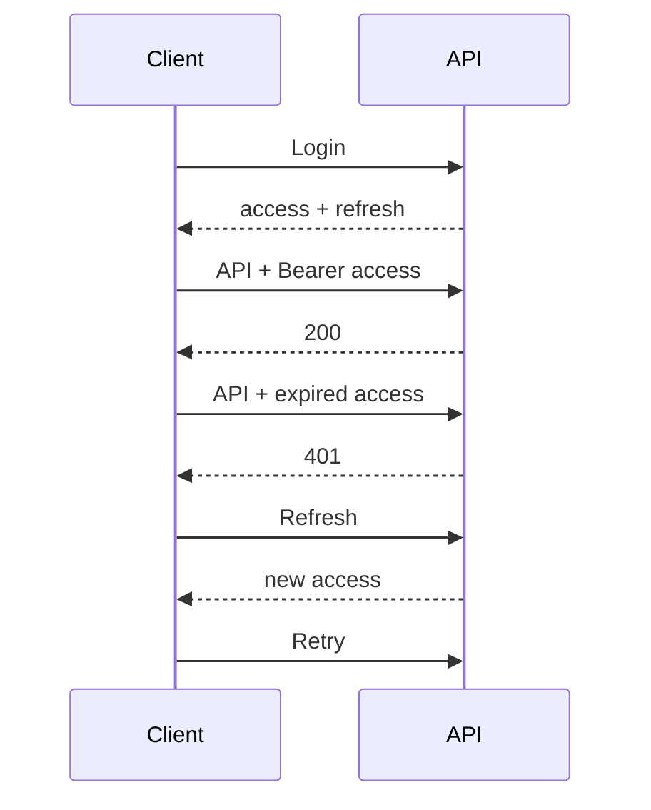

# 15. Security Architecture — CampusAR

## Goals

- Protect campus operational data and admin controls
- Minimize PII and location trail retention
- Honest safety UX (no fake dispatch guarantees)
- Align with OWASP ASVS-inspired practices for a campus web app

---

## Authentication

NaaS dual-entry model (see [`authentication-authorization.md`](./authentication-authorization.md)):

| Mechanism | Use |
|-----------|-----|
| **Continue as Guest** | Primary path; org-bound guest session; no account |
| Email + password | **Organization administrators only** |
| Password hashing | Modern KDF (e.g. bcrypt/argon2) — impl detail |
| Access JWT | Short-lived; carries `sub`, `role`, `organizationId` / memberships |
| Refresh token | Admin sessions; rotatable; revoke on logout / membership removal |
| Guest token | Limited principal; navigation APIs only; never admin |

**Future:** Enterprise SSO (OIDC/SAML) for **admins** as additional `AuthProvider` without changing guest flow or RBAC checks.

---

## Authorization (RBAC)

| Role | Capabilities |
|------|----------------|
| Guest | Navigation-only: search, route, navigate, AR, safety read, SOS create, share, report issue |
| Organization Admin | All org mutations: editor, branding, safety, QR, analytics, users, content |
| Super Admin (future) | Platform tenant lifecycle; audited support access |
| Org operator (optional future) | Hazards / SOS console without full admin |

Enforce on **server use cases**, not only UI hides.  
Permission matrix: [`../product/role-permissions.md`](../product/role-permissions.md).

---

## JWT & refresh

Recommendations:

- Access TTL minutes; refresh hours/days
- Prefer refresh in httpOnly Secure Secure cookie for web; native may use secure storage
- Admin token compromise plan: password reset + refresh revocation list / version field on user

---

## Input validation

- Schema validation all inputs
- Limit string lengths; sanitize displayed HTML (avoid `dangerouslySetInnerHTML`)
- Geospatial: reject non-finite coords; constrain to campus where needed
- File uploads: not in V1 core; if added later — type/size scanning

---

## Rate limiting

See API architecture. Especially: auth, SOS, route spam, admin writes.

---

## Secrets management

| Secret | Handling |
|--------|----------|
| JWT signing key | Env / secret manager; rotate with dual-key if needed |
| DB credentials | Env; never in git |
| Tile API keys | Env; restrict referrer if provider supports |
| MQTT creds (future) | Secret manager; bridge-only network |

`.env.example` documents names only. CI uses repository secrets.

---

## Transport & browser security

- HTTPS everywhere in staging/production
- HSTS at proxy
- Secure cookies (`Secure`, `HttpOnly`, `SameSite`)
- CORS allowlist exact web origins
- CSP tailored for MapLibre/Three/camera (document exceptions carefully)
- Clickjacking: `X-Frame-Options` / `frame-ancestors`

---

## WebSocket security

- Auth on connect
- No sensitive PII in broadcasts
- Campus room isolation when multi-tenant
- Disconnect abusive clients

---

## Data protection

| Data | Control |
|------|---------|
| Passwords | Hash only |
| SOS | Access restricted to admin/security; retention policy |
| Analytics | Aggregates; no default full GPS polylines |
| Crowd | Aggregate occupancy, not identities |

---

## OWASP considerations (mapped)

| OWASP risk | CampusAR control |
|------------|------------------|
| Broken access control | RBAC on use cases; deny by default admin |
| Cryptographic failures | TLS; hashed passwords; strong JWT secrets |
| Injection | Parameterized DB access; schema validation |
| Insecure design | SOS non-SLA; safety order documented |
| Security misconfiguration | Hardened proxy headers; no debug in prod |
| Vulnerable components | Dependabot/CI audit |
| Auth failures | Rate limit; secure session refresh |
| Integrity failures | Admin audit fields; signed packages in CI |
| Logging failures | Correlation ids; no secrets in logs |
| SSRF | No user-controlled internal URL fetch in V1 |

---

## Threat sketches

| Threat | Mitigation |
|--------|------------|
| Student calls admin API | 403 role check |
| Token theft XSS | CSP; minimize localStorage secrets; httpOnly refresh |
| Graph vandalism | Admin only; authn; audit |
| SOS spam | Rate limit + coalesce |
| Live stalk users | Don’t broadcast user GPS on twin |
| Sim mistaken for real emergency | Label simulated IoT in UI |

---

## Security testing

- Authz tests for each admin route
- JWT expiry/refresh tests
- Basic ZAP/opscan on staging before pilot
- Dependency scanning in CI
