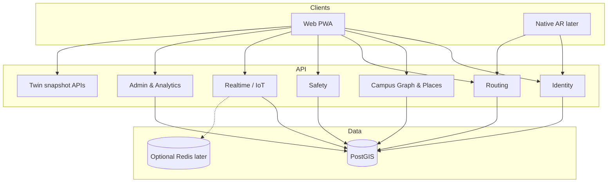
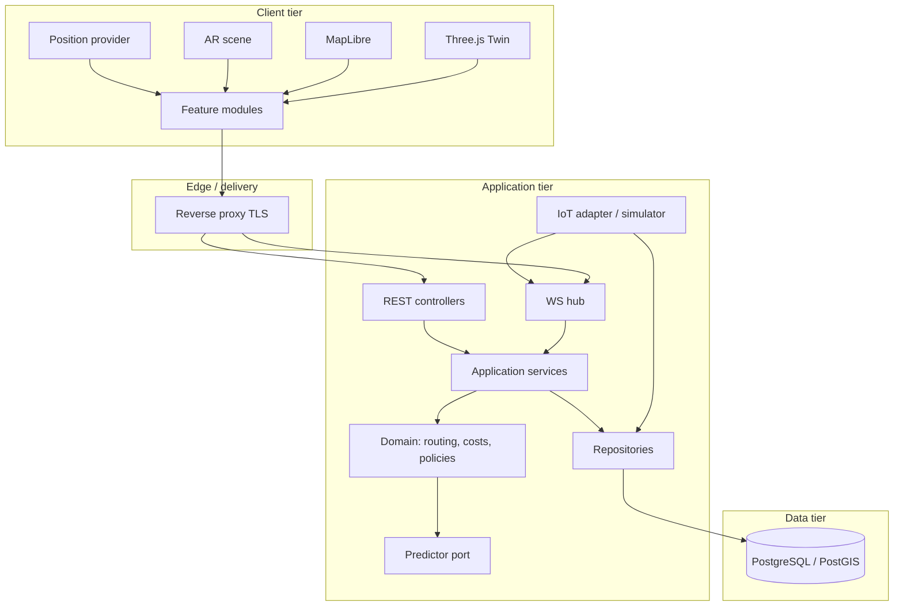

# 2. System Overview — CampusAR

## System goals

1. Deliver reliable **campus walking navigation** (search → route → guide → arrive).
2. Apply **multi-criteria routing** (distance, crowd, safety, accessibility) with explainable outcomes.
3. Support **map and Web AR** guidance without making AR a hard dependency.
4. Provide **operator visibility** (admin, hazards, twin, analytics) on the same data plane as end users.
5. Remain **extensible** for BLE positioning, MQTT IoT, ML predictors, native AR, and multi-campus tenancy **without rewriting core domains**.

Product source of truth: [`../product/prd.md`](../product/prd.md).

---

## Architectural style

| Style | Use |
|-------|-----|
| Modular monorepo | `apps/web`, `apps/api`, `packages/shared`, future `apps/mobile` / ML workers |
| Clean Architecture (API) | Domain → Application → Interfaces → Infrastructure |
| BFF-less SPA | Browser talks REST + WebSocket directly to API (V1) |
| Event projection (light) | IoT/sim writes state; WS fan-out notifies clients |
| Ports & adapters | Predictors, position providers, IoT ingest behind interfaces |

**Assumption (V1):** Single campus tenant; multi-tenant isolation arrives in V5 via config + row-level `campus_id` prepared early.

---

## Core modules (bounded contexts)

| Context | Responsibility | Owns |
|---------|----------------|------|
| **Identity** | Register, login, guest, JWT, roles | Users, sessions/tokens |
| **Campus Graph** | Buildings, rooms, nodes, edges, places search | Spatial + topological model |
| **Routing** | Pathfinding, costs, recalculation, instructions | Route results (ephemeral + analytics events) |
| **Safety** | Hazards, blocks, SOS, contacts, exits | Safety entities & alerts |
| **Realtime / IoT** | Crowd/sensor ingest, simulator, WS broadcast | Live overlays & edge crowd scores |
| **Ops / Admin** | Weights, CRUD, simulator control | Configuration |
| **Analytics** | Aggregates from events | Metrics projections |
| **Guidance UX** (client) | Map, Navigate, AR, Twin rendering | Client-only presentation state |

---

## Major services (logical)

| Service | V1 deployment | Notes |
|---------|---------------|-------|
| **API process** | Single Node service | HTTP + WS on same process initially |
| **Web static** | CDN / nginx | SPA assets |
| **Postgres + PostGIS** | Primary store | Source of truth |
| **IoT simulator job** | In-process timer | Replaceable by MQTT worker |
| **Crowd predictor** | In-process port | Swap EWMA → TensorFlow/LSTM worker later |
| **Future: MQTT bridge** | Separate worker | Writes same tables / publishes same events |
| **Future: ML inference** | Sidecar or service | Implements `CrowdPredictor` port |

---

## External dependencies

| Dependency | Role | Failure mode |
|------------|------|--------------|
| Browser Geolocation | Outdoor pose | Manual node selection |
| Browser Camera / Orientation | AR | Map turn-by-turn fallback |
| Browser SpeechSynthesis | Voice | Silent UI |
| Map tile provider (if used) | Basemap | Campus-only vector overlay still works |
| Email (optional later) | Verify / reset | Out of V1 critical path |
| MQTT broker (future) | Sensor bus | Simulator continues |
| BLE OS APIs (future) | Indoor pose | GPS/manual fallback |
| SMS / CAD (future) | Emergency SLA | SOS remains log-only until integrated |

---

## Technology stack (V1 target)

| Layer | Choice |
|-------|--------|
| Frontend | React + TypeScript + Vite + Tailwind + MapLibre + Three.js |
| State | Zustand (client) |
| Backend | Node.js + TypeScript + Express (or Fastify-equivalent adapter) |
| Validation | Zod (shared schemas where practical) |
| DB | PostgreSQL + PostGIS |
| Auth | JWT access + refresh |
| Realtime | WebSocket |
| Containers | Docker Compose (dev/stage), container orchestration later |
| CI | GitHub Actions (lint, typecheck, test, build) |
| Shared | `packages/shared` DTOs / enums / validators |

Rationale detail: [`technology-decisions.md`](./technology-decisions.md).

---

## Overall architecture (logical)

---

## Four capability planes (product-aligned)

Aligned to research/product vision without coupling implementations:

| Plane | V1 realization | Future |
|-------|----------------|--------|
| **L1 Sensing** | IoT simulator → crowd/sensors tables + WS | MQTT devices |
| **L2 Intelligence** | Composite-cost A* + schedule EWMA predictor | LSTM / TF serving |
| **L3 Twin** | Three.js + same live feeds | BIM, floors, what-if |
| **L4 AR** | Web AR + guide avatar | Unity / ARCore / ARKit |

---

## Quality attributes

| Attribute | Target approach |
|-----------|-----------------|
| Availability | Stateless API replicas behind proxy; DB HA later |
| Latency | Route p95 budget per product metrics; graph cache in process |
| Security | JWT + RBAC + validation + rate limits + secrets management |
| Observability | Structured logs, request ids, health/ready probes |
| Maintainability | Clean layers, feature modules, shared contracts |
| Extensibility | Ports for pose, ingest, predict, notify |

---

## Non-goals of this architecture pack

- Changing product MoSCoW or PRD scope
- Prescribing exact SQL or route handler code
- Mandating microservices for V1 (modular monolith preferred until scale demands split)
