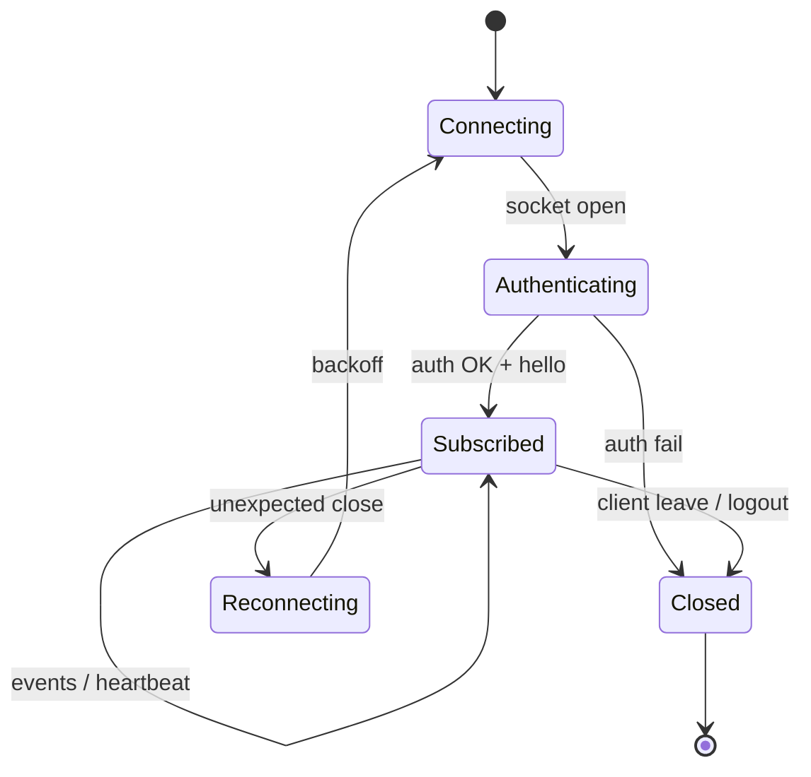
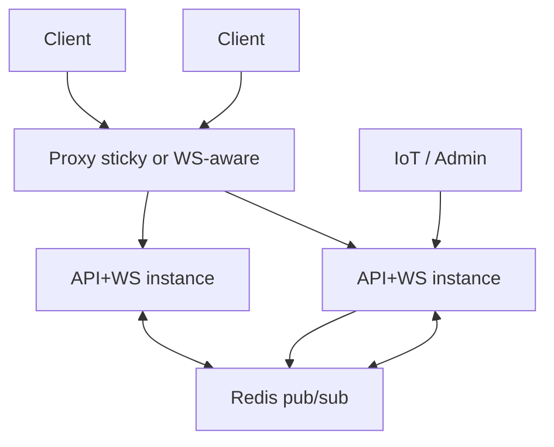

# 12. WebSocket Architecture — CampusAR

## Purpose

Push near-real-time campus overlays (crowd, sensors, hazards, IoT status) to map, twin, and AR clients without polling.

---

## Connection lifecycle

1. Client opens WS to gateway path (e.g. `/ws`)
2. Server authenticates token (optional for public live read — **Assumption: allow authenticated + guest read of aggregate live; admin control remains HTTP**)
3. Server sends `hello` with `protocolVersion` + optional snapshot cursor
4. Client may send `subscribe` with campus/channels
5. Server sends events; both sides heartbeat
6. On close, client reconnects with exponential backoff + jitter

---

## Events (logical types)

| Type | Direction | Payload intent |
|------|-----------|----------------|
| `hello` | S→C | version, server time |
| `subscribe` | C→S | channels / campusId |
| `crowd` | S→C | edge id → occupancy (diff or batch) |
| `sensors` | S→C | latest readings summary |
| `hazard` | S→C | created/updated/expired hazard summary |
| `iot_status` | S→C | simulator/bridge running state |
| `ping` / `pong` | both | heartbeat |
| `error` | S→C | auth/rate/protocol |

**Compatibility:** Clients ignore unknown event types.

---

## Subscriptions

V1 may broadcast all campus live events to all connected clients (single campus).

Phase 2.5A tags `crowd` / `sensors` / `hazard` with `siteId`. Clients filter to the active site. See [`site-tenancy.md`](./site-tenancy.md).

Future:

- Rooms: `campus:{id}`
- Channels: `crowd`, `hazards`, `sensors`
- Role-gated channels (raw sensors admin-only)

---

## Reconnection

| Rule | Value guidance |
|------|----------------|
| Backoff | 1s → 30s exponential + jitter |
| After reconnect | Request HTTP snapshot **or** server `snapshot` event before diffs |
| Auth expiry | Refresh token then reconnect; else continue guest public |

UI: “Live updates paused” when disconnected during nav/twin.

---

## Heartbeats

- Server ping every 30s (example); client pong
- If missed N heartbeats → close and reconnect
- Helps proxies not kill idle connections

---

## Failure handling

| Failure | Handling |
|---------|----------|
| Server restart | Clients reconnect; resync snapshot |
| Malformed message | Log; drop message; don’t kill socket unless abusive |
| Slow consumer | Disconnect or skip non-critical crowd frames |
| Broadcast storm | Coalesce crowd updates per tick (simulator already 10s) |

REST remains available if WS down (degraded freshness).

---

## Scalability

| Scale | Approach |
|-------|----------|
| Single instance | In-memory hub |
| Multi instance | Redis (or NATS) pub/sub; each WS node fans out locally |
| Sticky sessions | Optional at proxy if needed |
| Large campuses | Per-campus topics; binary/compact payloads later |

Do not put pathfinding on the WS thread; only serialize and emit.

---

## Security

- Validate token on connect
- Rate-limit message spam from clients (clients mostly receive)
- No PII in crowd broadcasts
- Separate admin HTTP for simulator start/stop; status may be public/aggregated

---

## Client integration pattern

Single shared hook/module (`useCampusLive`) used by map, twin, AR — one socket per tab, multiplexed subscribers.
