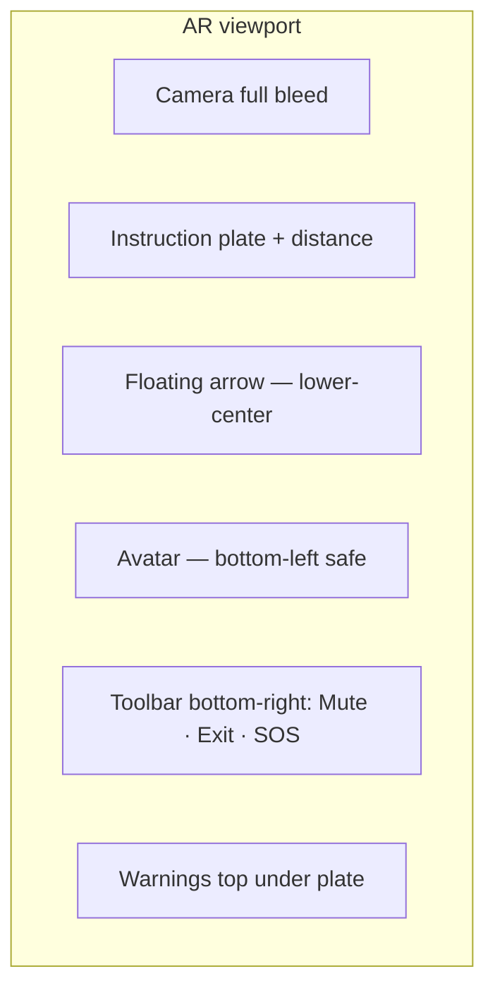

# 13. AR Experience — CampusAR

Design specification for Web AR guidance UI. Product: camera optional; compass optional; avatar enhances.

---

## Layout (portrait)

---

## Camera UI

- Full-bleed, no faux viewfinder stickers  
- Slight bottom gradient scrim behind toolbar for contrast  
- Privacy: no record button in V1  
- Pause camera when app backgrounded  

---

## Compass / bearing arrow

- Large chevron/arrow points to next waypoint relative to device heading  
- White fill + dark/primary outline for any scenery  
- When orientation missing: hide absolute arrow; show “Turn left in 20 m” plate only + doll wave on turn approach  
- Calibration tip (once): “Move phone in a figure-8” if browser requires — dismissible  

---

## Floating arrows

- One primary arrow only (no stacked arrows)  
- Soft float unless reduced motion  
- On “straight”: arrow upright; on turn: rotate metaphor matching turn  

---

## Distance indicator

- Pill near plate: `24 m` · `Then left`  
- Units: meters (campus); switch ft only if campus config (V1 meters)  
- Update throttled (~2–3 Hz) to avoid flicker  

---

## Turn indicator

- Badge: Straight / Left / Right / Arrive / Use lift  
- Icon + text  
- Advances with nav session step  

---

## Guide avatar

| Choice | Male / Female presentation toggle (Settings + first-run sheet) |
| States | Walk · Wave · Celebrate · Idle |
| Placement | Bottom-left, ~28–34% viewport height max; never cover SOS |
| First-run | One-time sheet: pick presentation → Continue |
| Reduced motion | Static pose per state or hide with “Show avatar” off |

Wave timing: enter wave when distance-to-turn &lt; threshold (e.g. 25 m) or next instruction is turn.

---

## Arrival celebration

- Full overlay: checkmark + “You’ve arrived” + destination name  
- Avatar celebrate once  
- Actions: Done (Map), Navigate somewhere else  
- No confetti cannons; keep institutional trust  

---

## Lost tracking / sensors

| Condition | UI |
|-----------|-----|
| Orientation unreliable | Banner: “Compass unavailable — follow text steps” |
| GPS poor | Accuracy warning (below) |
| Off route | Banner + Recalculate button |
| Camera paused | Dim + Resume |

---

## GPS accuracy warning

- Chip/banner: “Location accuracy low — steps may lag”  
- Does not block AR  
- Suggests moving outdoors / wait for fix  

---

## Permissions gate (before camera)

1. Explain value in one sentence  
2. Enable camera CTA  
3. Skip to Map navigation  
4. Motion permission as second step if required  

Never dark-pattern force.

---

## Live / safety chips (AR)

- Crowded corridor ahead (if known)  
- Emergency / hazard avoided  
- `Simulated` when applicable  
- Keep to one row max; overflow to sheet  

---

## Voice in AR

- Mute toggle on toolbar  
- Visual state clear (icon + aria)  
- Speaking current plate text  

---

## Exit patterns

- Exit → Navigate with same session  
- End route → confirm if mid-trip optional; V1 soft confirm only if &gt;30s into nav  

---

## Do / Don’t

| Do | Don’t |
|----|-------|
| Keep text instructions | Cover camera with opaque cards |
| One clear arrow | Gamified streaks |
| Honest sensor limits | Fake “AR locked” centimeter claims |
| SOS reachable | Hide exit |
