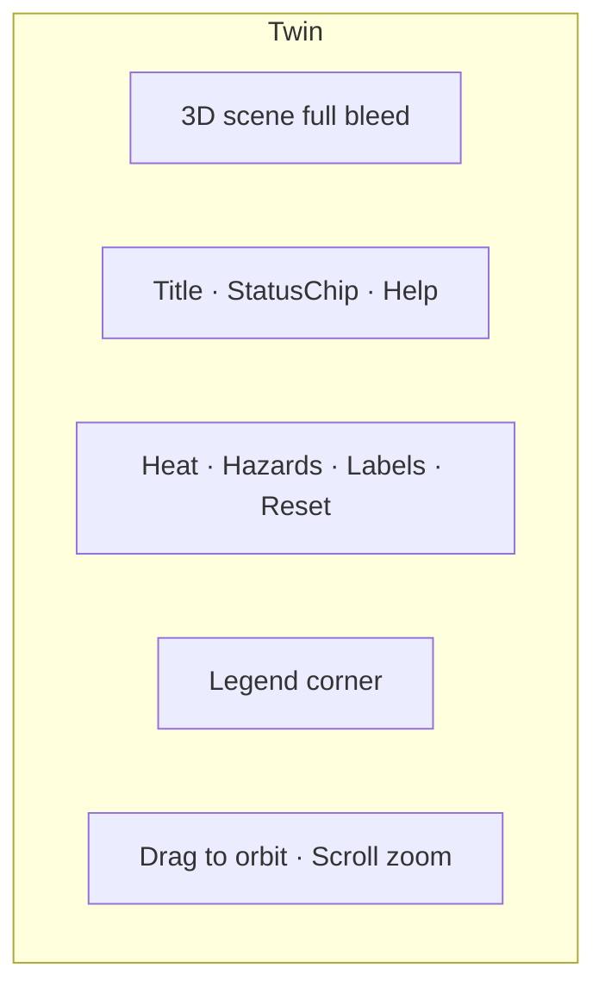

# 14. Digital Twin Experience — CampusAR

---

## Purpose (UX)

Operators and stakeholders **see** live campus pressure and hazards in 3D. Not a video game; not a second admin form surface.

---

## Layout

---

## Heatmaps

- Path network colored by crowd bands (same as map legend)  
- Transition 300ms on WS tick  
- Toggle “Heat” off → neutral paths  
- Building fills stay neutral (unless future sensor building tint)  

---

## Live users

**V1:** Do **not** show individual user dots (privacy).  
Crowd heat **is** the live people signal.  
UI copy: “Crowd heat” not “Live users” unless aggregate hexes ship later.

---

## Hazards

- Volumes/pins by type colors  
- Selecting pin opens small callout: type, until time, “Affects routing”  
- Toggle Hazards layer  
- Emergency types pulse subtly (disable if reduced motion)  

---

## Crowd

- Depends on WS + snapshot  
- StatusChip: Live / Live·Simulated / Offline  
- If sim: persistent subtle banner “Showing simulated sensors”  

---

## Filters

V1 minimal:

- Heat on/off  
- Hazards on/off  
- Building labels on/off  

Future: floor filter, category, time scrubber — don’t clutter V1 toolbar.

---

## Controls

| Control | Behaviour |
|---------|-----------|
| Reset camera | Default overview |
| Help | One-paragraph tips sheet |
| Navigate | Optional: closes twin context → Map with campus center |
| Fullscreen | Browser fullscreen optional |

Orbit: left drag; pan: right/two-finger; zoom: wheel/pinch.

---

## Analytics overlays

V1: **none** on twin (analytics has its own page).  
Avoid duplicating charts in 3D.

Future: toggle “Popular destinations” pins — keep off by default.

---

## Empty / error

- WebGL unsupported → illustration + Open Map  
- No geometry → Admin CTA if admin else “Campus model unavailable”  
- Offline → last snapshot + reconnecting  

---

## Performance UX

If FPS low: toast once “Simplified twin mode” and reduce shadows/labels — transparent to data truth.

---

## Trust & professionalism

- No skybox fantasy / neon grid floor  
- Daylight neutral lighting  
- Campus footprint recognizable  
- Same legend language as Map  
