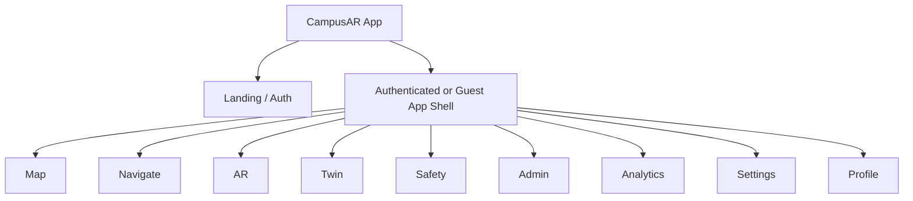
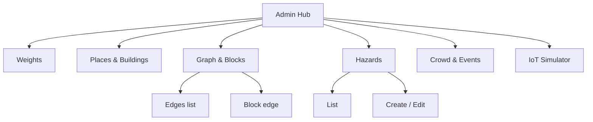

# 6. Information Architecture — CampusAR

## Primary navigation hierarchy



### Visibility by role

| Node | Guest | User | Admin |
|------|-------|------|-------|
| Map | ✓ | ✓ | ✓ |
| Navigate | ✓ | ✓ | ✓ |
| AR | ✓ | ✓ | ✓ |
| Twin | ✓* | ✓ | ✓ |
| Safety | ✓ | ✓ | ✓ |
| Admin | — | — | ✓ |
| Analytics | — | — | ✓ |
| Settings / Profile | limited | ✓ | ✓ |

\*Product assumption: twin readable when authenticated; guests may open twin read-only if flag on — **Design default:** Twin available to guests in demo mode with Simulated chip; hide mutation controls always.

---

## Menu structure

### Desktop left rail (top → bottom)

1. Map  
2. Navigate  
3. AR  
4. Twin  
5. Safety  
6. — divider —  
7. Admin (role)  
8. Analytics (role)  
9. — footer —  
10. Settings  
11. Account  

### Mobile bottom tabs (max 5 + More)

1. Map  
2. Navigate  
3. AR  
4. Safety  
5. More → Twin, Admin*, Analytics*, Settings, Account  

---

## Page hierarchy

```text
/                       Landing (logged-out) OR redirect Map
/login                  Login
/register               Register
/map                    Discovery map
/navigate               Active or setup navigation
/ar                     Web AR guidance
/twin                   Digital twin
/safety                 Hazards, contacts, SOS
/admin                  Admin hub
/admin/weights          Routing weights
/admin/places           Places / buildings
/admin/graph            Nodes / edges / blocks
/admin/hazards          Hazards
/admin/crowd            Crowd / events
/admin/iot              Simulator controls
/analytics              Analytics overview
/settings               Preferences (a11y, voice, theme, doll, prediction default)
/profile                Account basics / logout
```

Deep links: `/navigate?from={node}&to={node}`, `/map?place={id}`.

---

## Admin hierarchy



Admin hub shows task cards (not marketing): Weights, Hazards, Graph, Crowd, IoT — each one purpose sentence + Enter.

---

## Search hierarchy

1. **Global place search** (Map) — name, code, category  
2. **Category browse** — chips under search (Lab, Library, Cafeteria, Admin, Exit)  
3. **Recent** (registered) — last 5 destinations  
4. **Map tap** — select node/building as OD  
5. **Admin search** — entity tables filter (separate, not mixed with place search)

Search results panel order: Exact code → Name starts with → Name contains → Category match.

---

## Cognitive model (user-facing)

| I want to… | Go to… |
|------------|--------|
| Find a building | Map |
| Follow a route | Navigate (or AR) |
| See live campus ops | Twin |
| Get help / SOS | Safety |
| Change how routes work | Settings (prefs) or Admin (policy) |
| See usage | Analytics |

---

## Cross-links (non-nav)

- Map → “Start” opens Navigate with OD filled  
- Navigate → “Open AR” keeps same route session  
- Twin → “Navigate here” optional CTA sets destination  
- Safety → contacts always; SOS from Safety and Navigate/AR chrome  
- Arrival → Map or new search  
