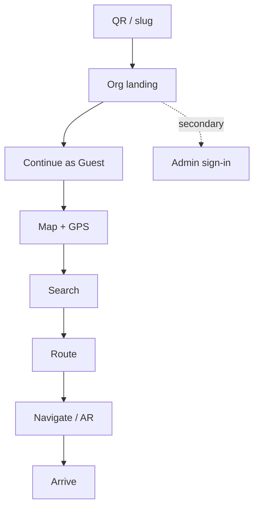
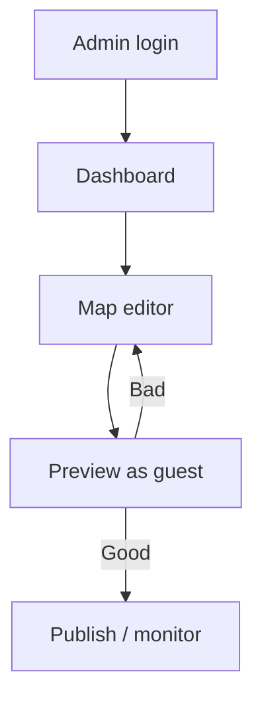

# 8. User Flows — CampusAR (UX)

Aligned to product journeys; adds alternative and failure branches for UI design.

---

## Visitor / Guest (primary)

### Normal
QR or org slug → Org landing → **Continue as Guest** (primary CTA) → Allow location → Map → Search/nearby → Route preview → Navigate or AR → Arrive

Admin sign-in is a secondary text link only—never required for this flow.

### Alternative
- Destination QR preselects place after Guest continue  
- Category browse instead of search  
- Enable step-free before start  
- Switch Map ↔ AR mid-trip  
- Share location / report map issue  

### Failure
| Failure | UI path |
|---------|---------|
| GPS deny | Manual source / snap pick |
| No route | Error + edit OD / relax access |
| Camera deny | Stay on Navigate |
| Hits `/admin` as guest | Redirect map + “Administrators only” |

Full capability list: [`../product/guest-experience.md`](../product/guest-experience.md).

---

## Student / Faculty (navigating)

Same as Guest. Preferences may live in local storage. No mandatory account for navigation.

### Alternative
- Accessibility prefs before route  
- Emergency mode / exits  

### Failure
Same as Guest GPS/route failures.

---

## Administrator

### Normal
Secondary **Administrator Login** → Email + Password → Dashboard → Visual map editor / branding / hazards / QR / analytics → Preview as Guest to verify

### Alternative
- Invite another admin  
- Regenerate QR for reception  
- Publish emergency alert  

### Failure
| Failure | UI path |
|---------|---------|
| Bad credentials | Inline error |
| 403 wrong org | Error page |
| Validation on node save | Inspector errors |

Feature catalog: [`../product/admin-dashboard-features.md`](../product/admin-dashboard-features.md).

---

## Emergency

### Normal (operator / admin)
Admin marks hazard or emergency alert → WS updates → Active navigators toast → Guests follow new path or exits → Twin/map reflect state

### Normal (individual SOS)
Guest taps SOS → Confirm → Success with contacts → Admin sees log

### Alternative
- User already in hazard → “Leave area” + exits  
- Prediction ignored under fire hard-block  

### Failure
| Failure | UI path |
|---------|---------|
| SOS offline | Hard error — phone contacts still listed |
| NO_ROUTE campus-wide | Exits + contacts full screen |
| User thinks SMS sent | Copy: “Alert recorded. Contact security.” — never “dispatch notified” |

---

## Cross-cutting UX rules in flows

1. Never dead-end without CTA  
2. Guest CTA dominates org landing; admin login is secondary  
3. Confirm before SOS and destructive admin deletes  
4. Label Simulated whenever sim data is shown  
5. Preserve route session when hopping Navigate ↔ AR  
6. Guests never see admin chrome  
