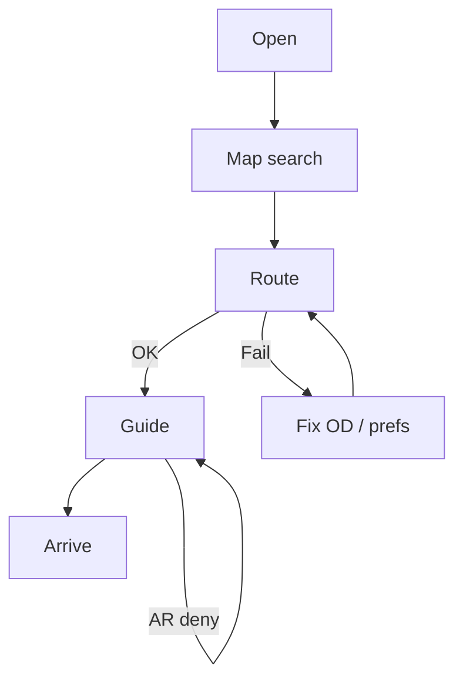
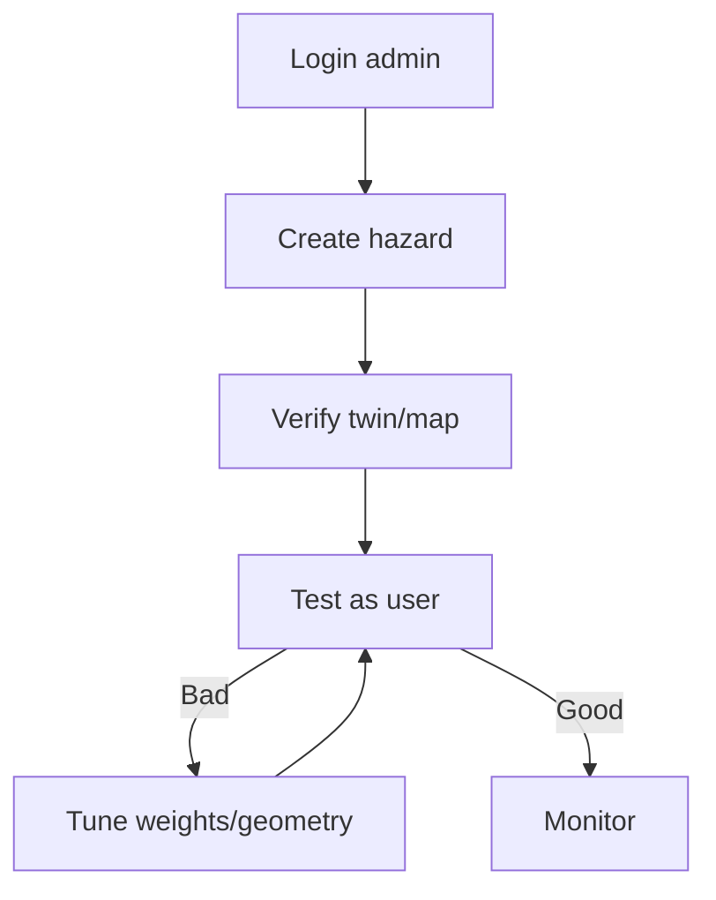

# 8. User Flows — CampusAR (UX)

Aligned to product journeys; adds alternative and failure branches for UI design.

---

## Student

### Normal
Open → (login optional) → Map → Search class → Set OD → Route preview → Navigate or AR → Recalc as needed → Arrive → Done

### Alternative
- Use category browse instead of search  
- Enable step-free in Settings first  
- Switch Map ↔ AR mid-trip  
- Prediction toggle on for busy hour  

### Failure
| Failure | UI path |
|---------|---------|
| GPS deny | Manual source sheet |
| No route | Error + edit OD / relax access |
| Camera deny | Stay on Navigate |
| Off route | Toast + auto/manual recalc |

---

## Visitor (Guest)

### Normal
Landing → Continue as guest → Map → Category/Admissions → Source=Main Gate → Preview (note construction) → Navigate + optional voice → Arrive → Soft register CTA

### Alternative
- Shared deep link to place  
- Safety tab for contacts after arrival  

### Failure
| Failure | UI path |
|---------|---------|
| Account wall absent | Never block nav |
| Lost in AR | Exit to Map instructions |
| Network drop | Offline banner; keep last route if mid-nav |

---

## Faculty

### Normal
Login → Settings: avoid stairs → Map → Lecture hall → Verify accessible badge on preview → Navigate → Arrive

### Alternative
- Lift outage hazard → Recalc prompt → New path  
- Twin glance between meetings (optional)  

### Failure
| Failure | UI path |
|---------|---------|
| NO_ROUTE with access on | Explain + offer relax prefs + facilities contact |
| Session expired mid-admin | N/A; if prefs save fails, toast + reauth |

---

## Administrator

### Normal
Login → Admin → Create construction hazard → Save → Twin/Map verify overlay → Incognito/guest test route diversion → Adjust weights if needed → Analytics check → Expire hazard later

### Alternative
- Block edge directly in Graph  
- Start IoT sim for demo day  

### Failure
| Failure | UI path |
|---------|---------|
| Validation geometry | Inline form errors |
| 403 | Unexpected role — error page |
| Clients not updating | StatusChip reconnect; refresh snapshot |

---

## Emergency

### Normal (operator)
Admin marks fire hazard → WS updates → Active navigators toast “Route updated” / emergency styling → Users follow new path or Safety exits → Twin shows cleared corridor heat shift

### Normal (individual SOS)
Tap SOS → Confirm dialog → Success state with contacts → (Admin sees log)

### Alternative
- User already in hazard → UI prioritizes “Leave area” + exits  
- Prediction ignored under fire hard-block  

### Failure
| Failure | UI path |
|---------|---------|
| SOS offline | Hard error — try phone contacts still listed |
| NO_ROUTE campus-wide | Exits + contacts full screen |
| User thinks SMS sent | Copy: “Alert recorded. Contact security.” — never “dispatch notified” |

---

## Guest (explicit)

Guest is a **mode**, overlapping Visitor.

### Normal
Same as Visitor; prefs in local storage (doll, voice).

### Alternative
Register from Profile banner → merge local prefs when product supports (V1 may reset — disclose).

### Failure
Attempt Admin URL → redirect Map + toast “Admin only”.

---

## Cross-cutting UX rules in flows

1. Never dead-end without CTA  
2. Confirm before SOS and destructive admin deletes  
3. Label Simulated whenever sim data is shown  
4. Preserve route session when hopping Navigate ↔ AR  
