# 7. Wireframes — CampusAR (Low-Fidelity)

Mermaid block diagrams represent regions, not pixels. Chrome = UI; Canvas = map/AR/3D.

---

## Landing

```mermaid
flowchart TB
  subgraph L["Landing — full viewport"]
    BRAND[CampusAR wordmark — hero]
    LINE[One headline]
    SUB[One supporting sentence]
    CTA[Primary: Continue as guest | Secondary: Sign in]
    VIS[Full-bleed campus path visual / map atmosphere]
  end
  BRAND --> LINE --> SUB --> CTA
  VIS
```

No stats, no card grid, no promo chips on first viewport.

---

## Login

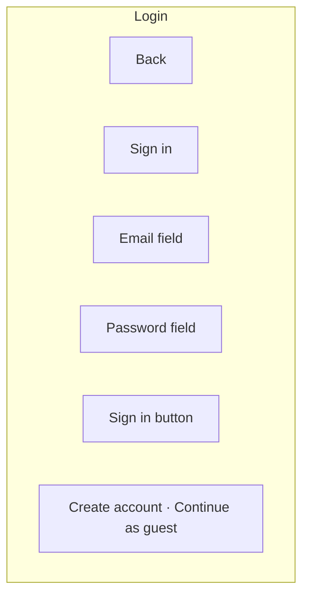

---

## Register

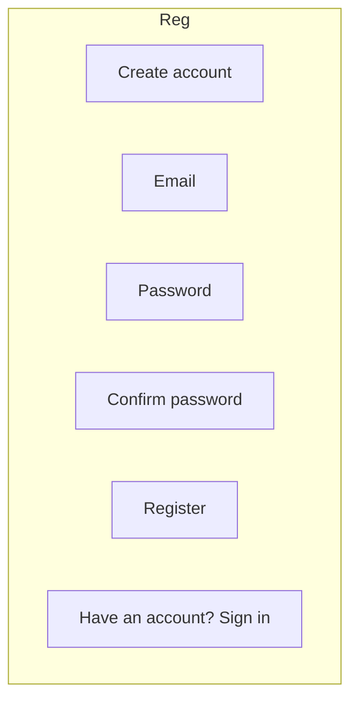

---

## Dashboard (post-login home)

**Decision:** V1 has **no separate dashboard**. Successful auth → **Map**.  
Admin sees same Map with Admin/Analytics in rail.

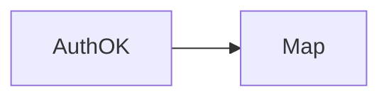

---

## Map

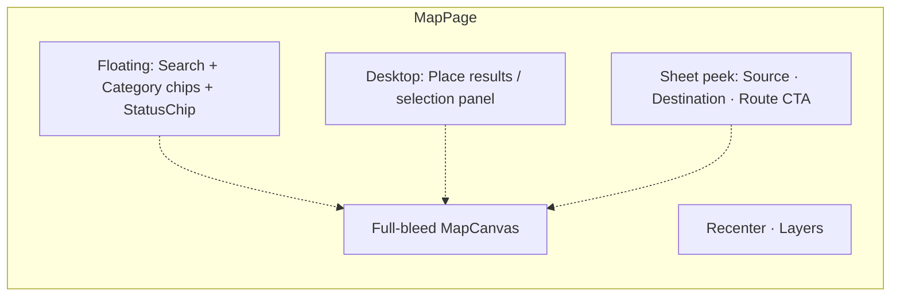

---

## Navigation

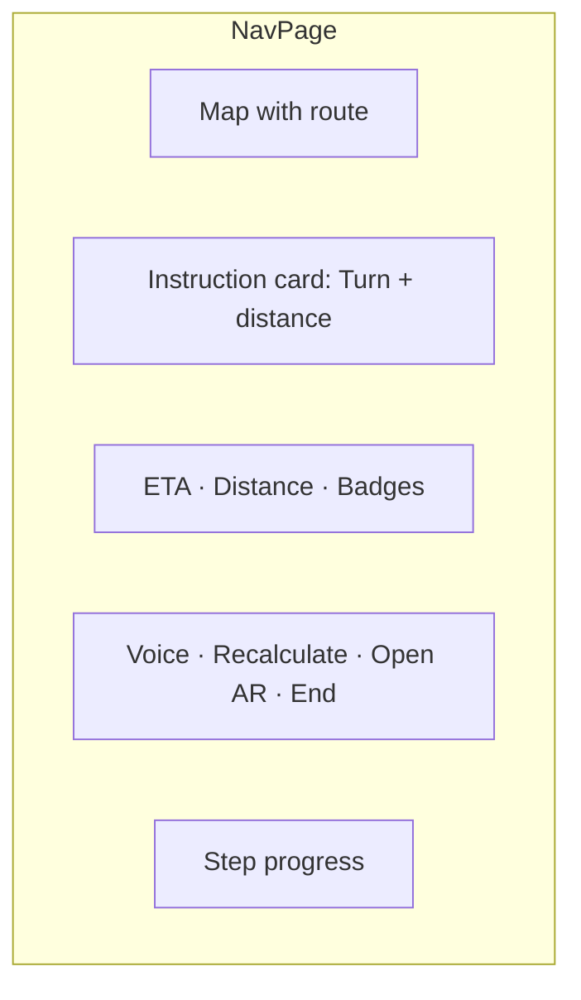

---

## AR

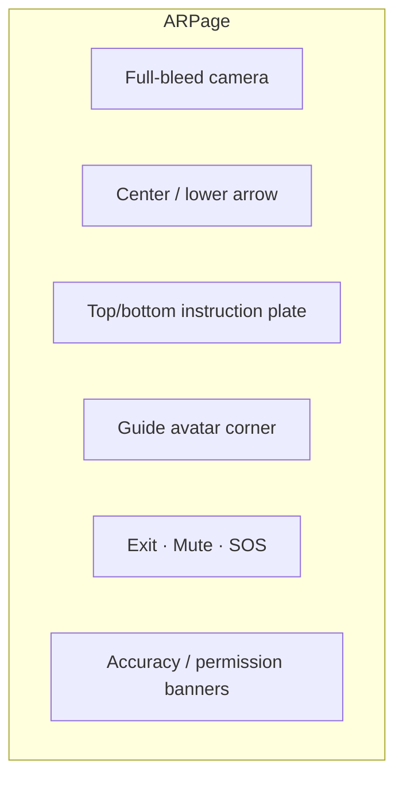

---

## Digital Twin

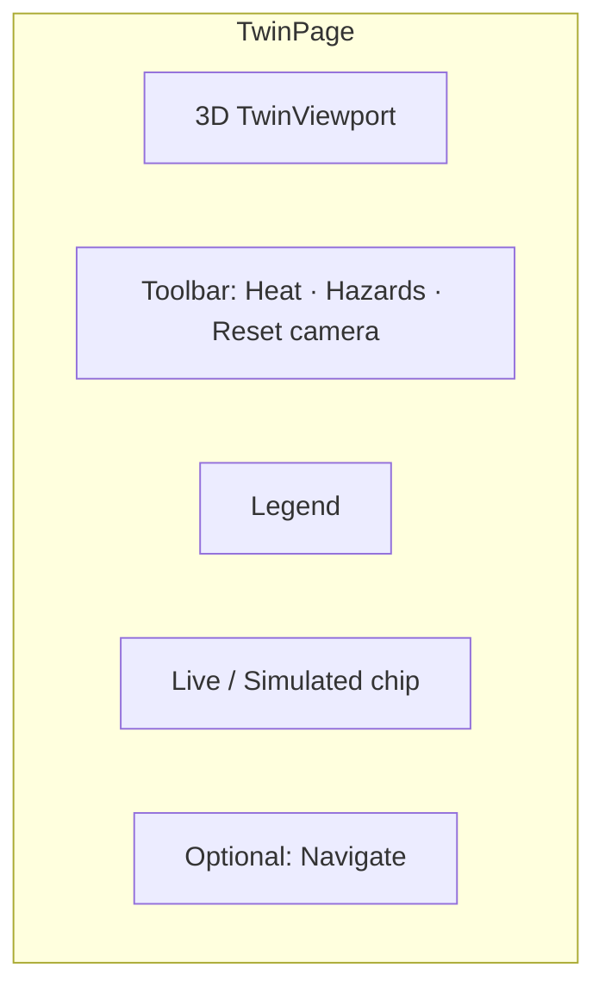

---

## Analytics

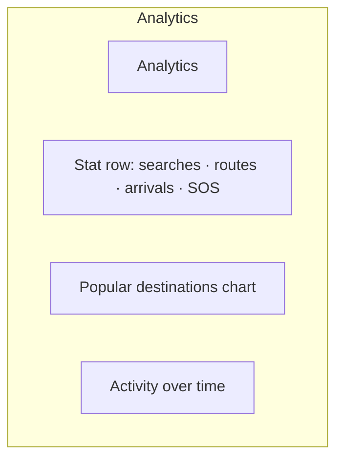

---

## Admin hub

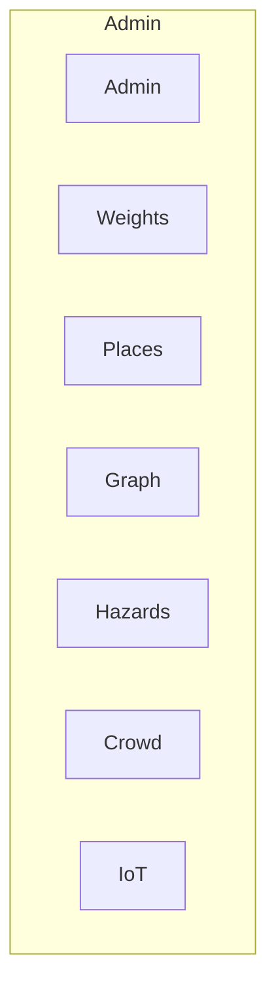

---

## Admin — Weights (example detail)

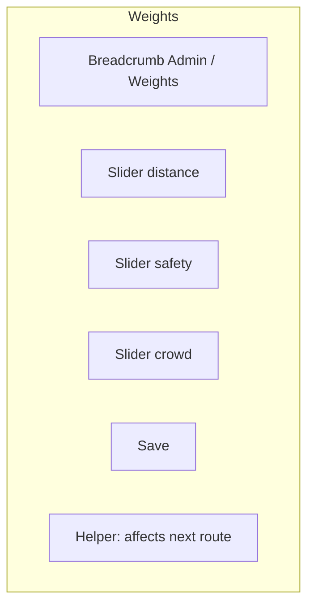

---

## Safety

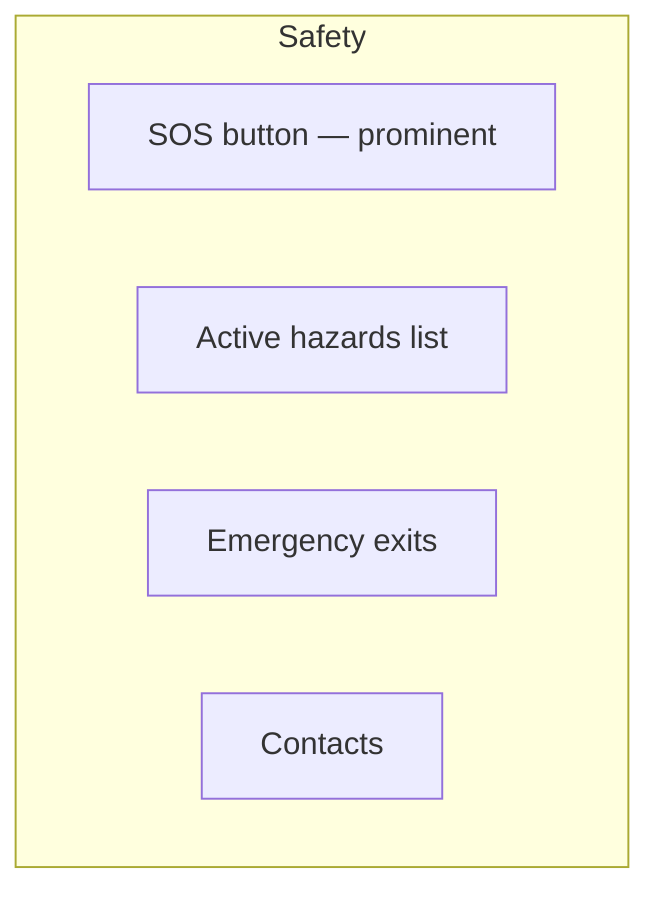

---

## Settings

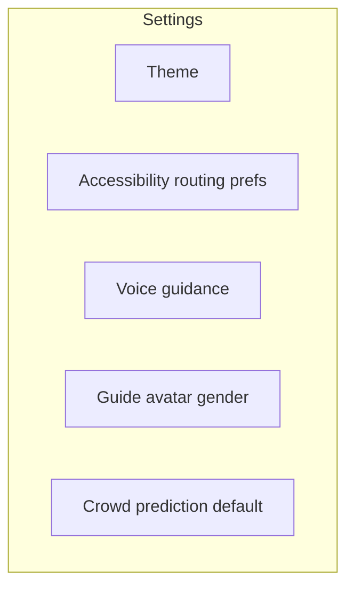

---

## Profile

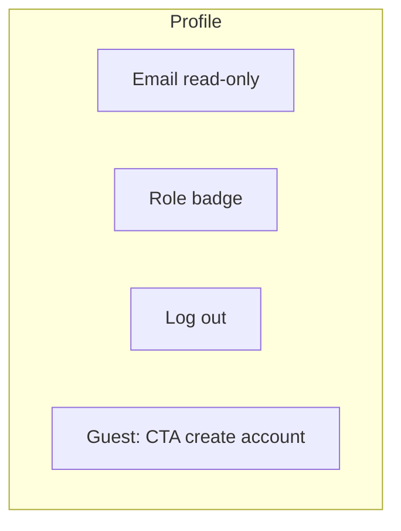

---

## Wireframe notes for engineers

- Landing = brand-first composition  
- Map/Navigate/AR/Twin = immersive canvas + overlays  
- Admin/Analytics/Settings = AppShell + content width  
- Always design **loading / empty / error** companions (see dedicated docs)  
