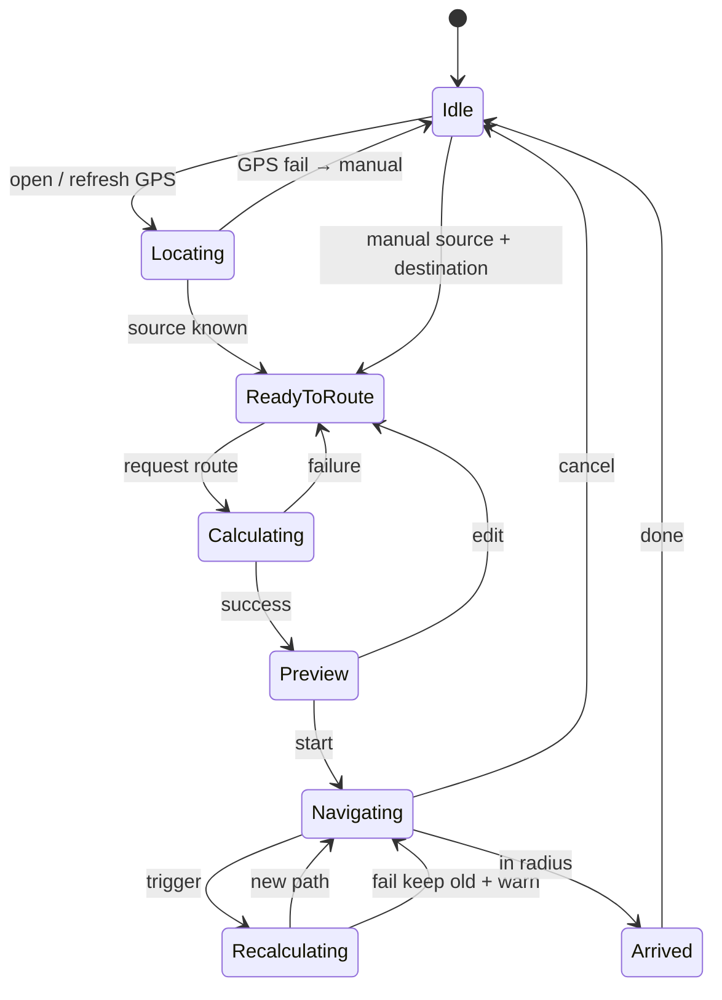

# 8. Navigation Workflow — CampusAR V1

End-to-end lifecycle from app open to arrival, including failure cases.

---

## Happy path

```text
Open App
    ↓
Allow GPS (or continue with manual location)
    ↓
Resolve Current Location → nearest graph node
    ↓
Destination Search / Map pick
    ↓
Set preferences (accessibility, prediction, AR vs map)
    ↓
Route Calculation
    ↓
Preview route (distance, ETA, warnings)
    ↓
Start Navigation
    ↓
Guidance loop (map and/or AR + optional voice + doll)
    ↓
Live Re-routing (timer, off-route, hazard/crowd events)
    ↓
Arrival detection
    ↓
Success / End session
```

---

## Stage details

### 1. Open App
- Load shell, theme, auth state (guest/session).
- Fetch campus bootstrap (bounds, feature flags).
- **Failures:** network down → offline message; retry. Wrong tenant config → fatal with support contact.

### 2. Allow GPS
- Prompt for geolocation.
- **Allow:** watch position with accuracy filter.
- **Deny / unavailable:** banner “Select your location on the map”; block Start until source set.
- **Failures:** timeout → same as deny; mock location detected → **Assumption: ignore in V1** (no anti-spoof).

### 3. Current Location
- Snap lat/lng to nearest walkable node within max snap distance.
- **Failures:** outside campus geofence → warn “Outside campus”; allow manual node. No nodes in range → force manual pick. Poor accuracy (>50 m) → show accuracy warning; still snap with low confidence flag.

### 4. Destination Search
- Query places; or tap building/node.
- **Failures:** empty results → empty state. API 5xx → retry + cached recent destinations if any. Selecting closed building → allow but warn if all entrances blocked.

### 5. Route Calculation
- POST/GET route with source, destination, prefs.
- Server applies graph + weights + hazards + crowd + prediction.
- **Failures:**
  | Code / case | User messaging | Recovery |
  |-------------|----------------|----------|
  | NO_ROUTE | No walkable path | Change OD, relax accessibility, check hazards |
  | INVALID_NODE | Location not on network | Re-pick source/destination |
  | TIMEOUT | Taking too long | Retry; simplify graph opside |
  | 401 | Session expired | Re-auth; guest continue |
  | 429 | Too many requests | Backoff |
  | Predictor fail | (silent fallback) | Route without prediction |

### 6. Preview
- Show polyline, steps, ETA, badges (crowd-aware, accessible, hazard-avoiding).
- User confirms Start or edits prefs and recalculates.

### 7. Navigation
- Map mode: list + progressing step + optional TTS.
- AR mode: camera + bearing cue + doll states.
- **Failures:** camera deny → map mode. orientation deny → non-compass AR or map. WebGL fail → hide doll. TTS fail → silent UI.

### 8. Live Re-routing
Triggers:
- Interval (e.g. 10 s) while navigating.
- User off-route beyond threshold.
- Hazard created/updated affecting current path.
- Edge blocked / crowd spike beyond threshold.
- Manual Recalculate.

Behaviour:
- Recompute from current node to same destination.
- If new path differs materially, update UI (optional confirm for large detours — **Assumption: auto-apply in V1 with toast “Route updated”**).
- **Failures:** recalculate NO_ROUTE → keep last path + urgent warning, or switch to Safety exits. WS disconnect → continue on last route; show “Live updates paused”.

### 9. Arrival
- Enter destination radius with hysteresis.
- Stop GPS watch aggressiveness; show success; celebrate doll; clear active route.
- **Failures:** false arrival from GPS jump → hysteresis + require N consecutive fixes. User skips past destination → allow manual “I’ve arrived”.

---

## State machine (logical)



---

## Client / server responsibilities

| Concern | Client | Server |
|---------|--------|--------|
| GPS | Acquire, filter, snap request | Optional snap API |
| Search | UX | Query places |
| Route | Display | Authoritative path |
| AR sensors | DeviceOrientation, camera | — |
| Crowd live | Subscribe WS | Simulate/publish |
| Arrival | Geofence logic | Optional analytics event |

---

## QA checklist (navigation)

- [ ] Deny GPS → complete trip via manual nodes.
- [ ] Block sole corridor → NO_ROUTE with clarity.
- [ ] Mid-trip hazard → route updates.
- [ ] Arrive once (no flicker).
- [ ] Cancel mid-route → clean Idle.
- [ ] Guest full loop without login.
