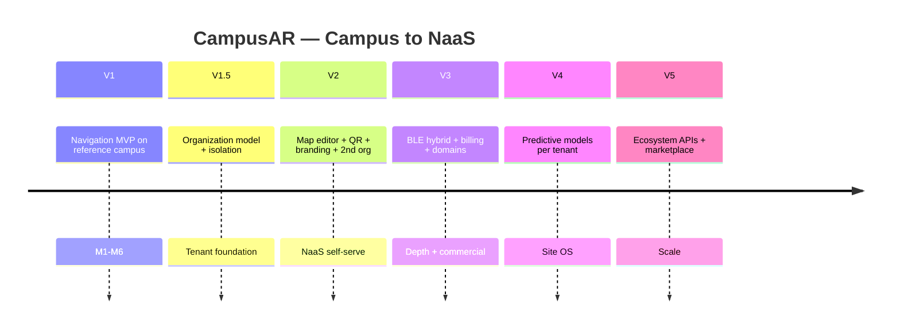

# 11. Product Roadmap — CampusAR (Campus → NaaS Platform)

Milestones are outcome-based. Dates are relative to program start (**Assumption: T0 = kickoff**).

**Strategic shift:** CampusAR evolves from a **single-campus product** into a **multi-tenant Navigation-as-a-Service (NaaS)** platform. V1 remains the reference tenant and navigation core; platform tenancy, map editor, QR entry, and branding become explicit delivery tracks—not a distant V5 afterthought.

Product direction: [`multi-tenancy.md`](./multi-tenancy.md)  
Architecture: [`../architecture/multi-tenant-architecture.md`](../architecture/multi-tenant-architecture.md)

---

## Dual-track model

| Track | Focus |
|-------|--------|
| **A — Navigation excellence** | Routing quality, safety, AR, indoor, positioning, twin |
| **B — Platform (NaaS)** | Organizations, isolation, editor, QR, branding, onboarding, billing |

Tracks run in parallel after V1 foundations exist. Platform Track B is required before selling to a second organization.

---

## Version 1 — Smart Campus Navigation MVP (T0 → ~3 months)

**Theme:** Complete outdoor navigation loop + operable admin + demoable intelligence on **one reference campus** (first tenant).

### Milestones
| Milestone | Outcome |
|-----------|---------|
| M1 Foundation | Auth, campus seed, map, search, A* route API |
| M2 Navigate | Turn-by-turn, recalculate, arrival, accessibility prefs |
| M3 Safety ops | Hazards, blocks, SOS log, contacts/exits |
| M4 Differentiation | Web AR + guide doll, crowd sim + WS, prediction toggle |
| M5 Twin & admin | Digital Twin view, weights, analytics, IoT sim controls |
| M6 Hardening | CI, load smoke, docs, pilot-ready demo script |

### Exit criteria
Pilot users complete discover → route → arrive without engineer help; admin can close a path and see diversion.

**NaaS prep (non-blocking):** Document org domain; avoid hardcoding campus name in APIs where cheap to parameterize.

---

## Version 1.5 — Tenant foundation (~alongside late V1 / immediately after)

**Theme:** Introduce Organization as root without breaking the pilot campus.

### Milestones
- `Organization` + membership model; backfill reference campus (`slug` e.g. `rnsit`)  
- All domain rows scoped by `organizationId`  
- Public routes `/{orgSlug}/…` with redirect from legacy paths  
- Guest session bound to org  
- Isolation test matrix (tenant A ↛ tenant B)  
- Platform super-admin (minimal): activate / suspend org  

### Exit criteria
Same UX for reference campus; architecture is multi-tenant-ready; second org can be created in staging with empty graph.

---

## Version 2 — NaaS self-serve + pilot hardening (~3–9 months after V1)

**Theme:** Admins own their graph; visitors enter via QR; product sells beyond one campus.

### Platform milestones (Track B)
| Milestone | Outcome |
|-----------|---------|
| P1 Map editor | Click-to-create nodes/paths; org_admin only |
| P2 Branding | Logo, colors, welcome/splash per org |
| P3 QR navigation | Root + campaign QR; scan analytics |
| P4 Org admin console | Buildings, floors, categories, users, safety, analytics (org-scoped) |
| P5 Onboarding | Industry templates (university, corporate, hospital, mall, generic) |
| P6 Second tenant | Live non-reference org on shared deploy |

### Navigation milestones (Track A)
- Floor-aware graph & UI switcher (per org)  
- Security role + SOS console (ack/resolve)  
- Night-mode routing with lighting attributes  
- MQTT ingest adapter (parallel to simulator)  
- Favorites, share destination links, multilingual strings  
- Performance SLO dashboards  

### Exit criteria
Org admin builds a navigable outdoor graph without engineering; visitors complete QR → navigate guest flow; **two organizations** isolated on one platform.

---

## Version 3 — Positioning depth & entitlements (~9–15 months)

**Theme:** Indoor accuracy options; commercial packaging.

### Milestones
- BLE beacon pilot zone (org-scoped calibration)  
- Hybrid GPS + BLE via PositionProvider port  
- Native companion app or enhanced PWA  
- Voice assistant (“take me to the library”)  
- Richer Digital Twin (floors, what-if closures)  
- Billing / plan tiers (node limits, AR, indoor packs)  
- Optional custom domain / subdomain per org  

### Exit criteria
Indoor position error within agreed threshold in instrumented wing; paid plan can be assigned per org.

---

## Version 4 — Predictive site OS (~15–21 months)

**Theme:** Real ML and planning tools—still tenant-scoped.

### Milestones
- LSTM/sequence occupancy models per org (shared training platform)  
- Predictive navigation defaults  
- Smart parking / lot occupancy module  
- Facilities integration (work orders → auto hazards)  
- Advanced analytics & exports for org planners  
- Platform rollup analytics (anonymized)  

### Exit criteria
Measurable reduction in time-in-congestion vs baseline on instrumented paths for opted-in orgs.

---

## Version 5 — Ecosystem & scale (~21–30 months)

**Theme:** Marketplace, partners, open APIs—not “discover multi-tenancy.”

### Milestones
- Partner sensor marketplace  
- SLA-backed emergency notification integrations  
- Open APIs for SIS/LMS / corporate directory deep links  
- Graph import/export & survey toolkit  
- Multi-region / data residency options if required  
- Digital twin / 3D packs as add-ons  

### Exit criteria
Third-party integration live for ≥1 paying org; platform meets agreed tenancy & uptime SLOs at target org count.

---

## Roadmap diagram

---

## Implementation sequencing (architecture guidance)

Preferred order for Track B (minimize rewrite):

1. Tenant key + membership + slug resolution  
2. Org-scoped APIs / WS rooms / search / analytics  
3. Public guest shell + branding tokens  
4. QR issue/resolve  
5. Visual map editor + graph snapshot invalidation  
6. Templates + second-org onboarding  
7. Billing / entitlements  

Details: [`../architecture/multi-tenant-architecture.md`](../architecture/multi-tenant-architecture.md) § Migration path.

---

## Dependency notes

- BLE and LSTM **depend on** clean telemetry and graph quality **per org**.  
- Second commercial org **depends on** V1.5 isolation + V2 editor (not on BLE).  
- Map editor **depends on** org-scoped graph APIs.  
- QR **depends on** slug routing + guest mode.  
- Emergency SMS SLA is a **vendor + legal** track parallel to engineering.  
- Industry expansion (hospitals, airports) = **templates + categories**, not code forks.
