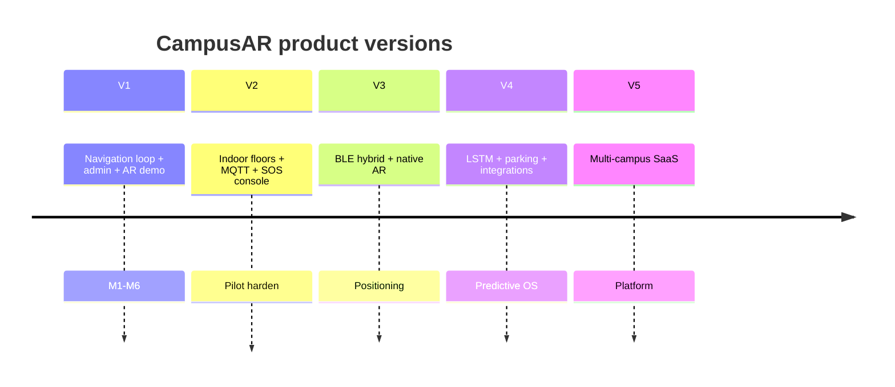

# 11. Product Roadmap — CampusAR

Milestones are outcome-based. Dates are relative to program start (**Assumption: T0 = kickoff**).

---

## Version 1 — Smart Campus Navigation MVP (T0 → ~3 months)

**Theme:** Complete outdoor/campus-graph navigation loop + operable admin + demoable “intelligence”.

### Milestones
| Milestone | Outcome |
|-----------|---------|
| M1 Foundation | Auth, campus seed, map, search, A* route API |
| M2 Navigate | Turn-by-turn, recalculate, arrival, accessibility prefs |
| M3 Safety ops | Hazards, blocks, SOS log, contacts/exits |
| M4 Differentiation | Web AR + guide doll, crowd sim + WS, prediction toggle |
| M5 Twin & admin | Digital Twin view, weights, analytics, IoT sim controls |
| M6 Hardening | CI, load smoke, docs, pilot-ready demo script |

### Exit criteria
Pilot users complete discover → route → arrive without engineer help; admin can close a path and see diversion.

---

## Version 2 — Pilot hardening & indoor readiness (~3–6 months after V1)

**Theme:** Reliability, indoor floors, better safety ops, real sensor path.

### Milestones
- Floor-aware graph & UI switcher  
- Security role + SOS console (ack/resolve)  
- Night-mode routing with lighting attributes  
- MQTT ingest adapter (parallel to simulator)  
- Favorites, share destination links, multilingual strings  
- Performance SLO dashboards  

### Exit criteria
One building indoor paths in production pilot; security staff uses SOS queue daily.

---

## Version 3 — Positioning & native experiences (~6–12 months)

**Theme:** Reduce GPS error indoors; stronger AR.

### Milestones
- BLE beacon pilot zone (calibration toolkit)  
- Hybrid GPS + BLE positioning API  
- Native companion app (ARKit/ARCore) or enhanced PWA  
- Voice assistant (“take me to the library”)  
- Richer Digital Twin (floors, what-if closure simulation)  

### Exit criteria
Indoor position error within agreed pilot threshold in instrumented wing.

---

## Version 4 — Predictive campus OS (~12–18 months)

**Theme:** Real ML and planning tools.

### Milestones
- LSTM/sequence occupancy models trained on live data  
- Predictive navigation defaults campus-wide  
- Smart parking / lot occupancy module  
- Facilities integration (work orders → auto hazards)  
- Advanced analytics & exports for planners  

### Exit criteria
Measurable reduction in time-in-congestion vs V1 baseline on instrumented paths.

---

## Version 5 — Multi-campus platform (~18–24 months)

**Theme:** Productize as SaaS for multiple institutions.

### Milestones
- Multi-tenant architecture & billing  
- Campus onboarding toolkit (survey → graph)  
- Marketplace of sensors/partners  
- SLA-backed emergency notification integrations  
- Open APIs for university SIS/LMS deep links  

### Exit criteria
Second campus live on shared platform with tenant isolation.

---

## Roadmap diagram

---

## Dependency notes

- BLE and LSTM **depend on** clean V1 telemetry and graph quality.  
- Multi-campus **depends on** tenant-ready auth and config.  
- Emergency SMS SLA is a **vendor + legal** track parallel to engineering.
