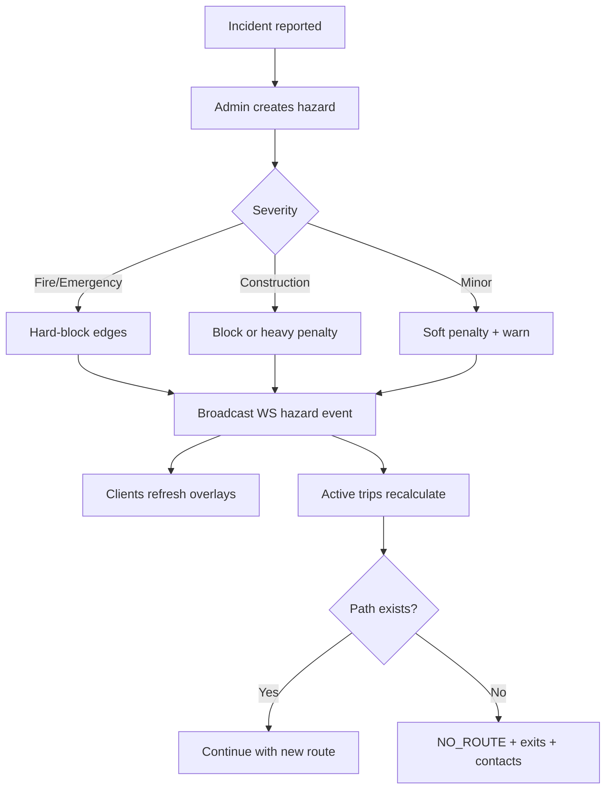

# 9. Safety Workflow — CampusAR V1

Safety features exist to **reduce harm and confusion**, not to replace campus security services. V1 prioritizes **routing impact + visibility + SOS logging**.

---

## Principles

1. **Safety beats shortest path** when severity is high.
2. **Show what you enforce** — if routing avoids a zone, the map must show why.
3. **Degrade gracefully** — if dispatch isn’t integrated, never imply that it is.
4. **Accessibility is safety** — unusable routes are a safety failure for some users.

---

## Emergency routing

### Purpose
Move users away from acute danger (fire, major incident) toward safe paths and exits.

### Behaviour
- Admin/security publishes hazard type `fire` / `emergency` with geometry and active flag.
- Router treats affected edges as **impassable** (or extreme cost equivalent to impassable).
- Active navigation sessions **recalculate**; UI uses emergency styling.
- Safety surface highlights **emergency exits** and assembly points.

### Business rules
- Emergency cost overrides crowd prediction and distance preference.
- If no safe path to original destination → offer paths to nearest exit / safe node instead (**Assumption: V1 offers NO_ROUTE + exits list; auto-reroute-to-exit is V1.1 if time**).

### Edge cases
- User inside blaze radius → prioritize route to nearest safe edge out of polygon.
- Entire campus partitioned → show contacts + static exit maps.

---

## SOS

### Purpose
Let an individual signal distress with location context.

### Flow
1. User taps SOS (always reachable from Safety and during Navigate/AR).
2. Confirm step (**Assumption: single tap with undo window 3 s OR confirm dialog — prefer confirm to reduce false alarms**).
3. Capture: timestamp, lat/lng or node id, user id if any, route id if navigating.
4. Persist alert; return id.
5. UI: “Alert recorded. Contact campus security.” + clickable contacts.
6. Admin sees alert in ops/analytics log.

### Non-goals (V1)
- Guaranteed SMS/phone to security.
- Silent duress PIN.
- Live location sharing stream.

### Failures
- Offline → clear error (queue if implemented).
- No location → submit with manual building picker required.

---

## Hazards

### Types (V1)
| Type | Routing effect | Map |
|------|----------------|-----|
| Fire / emergency | Hard block | Critical style |
| Construction | Hard block or strong penalty | Warning |
| Danger / incident | Strong penalty or block by severity | Warning |
| Flooding / other | Configurable; default strong penalty | Warning |

### Lifecycle
Draft/create → Active → Expired/cleared.

### Permissions
Mutate: admin. Read: everyone.

---

## Construction & blocked paths

### Purpose
Reflect physical reality of campus works and closures.

### Behaviour
- Admin blocks edge or places construction hazard.
- Blocked edges omitted from graph expansion.
- Optional public message: “North Quad path closed until Fri”.

### Edge cases
- Soft-closure (pedestrians OK, vehicles not) — out of scope (walking-only).
- Scheduled future closure — show upcoming on map; enforce only when active.

---

## Night mode

### Purpose
Prefer routes that feel safer after dark.

### V1 stance
- **Could Have:** if edges have `lightingScore` or similar, after local sunset increase weight on poorly lit edges.
- Without data, do **not** fake night mode.
- UX may still offer darker **visual theme**; that is not safety routing.

### Future
Integrate lighting surveys, CCTV density proxies, timed streetlight feeds.

---

## Accessibility

### Purpose
Ensure people who cannot use stairs (or need step-free paths) get viable routes.

### Behaviour
- Preference: avoid stairs / wheelchair mode.
- Graph tags: `stairs`, `elevator`, `ramp`, `stepFree`.
- Router excludes non-compliant edges when alternatives exist.

### Failures
- Only stair path exists → NO_ROUTE with explanation + facility contact suggestion.
- Elevator marked out-of-service via hazard → recalculate.

### Relation to safety
In evacuation, elevator use policies may **forbid** lifts during fire — **Assumption: V1 emergency mode prefers outdoor/safe corridors and labeled emergency stairs per campus policy configuration; product must allow policy flag `allowElevatorsInEmergency` default false.**

---

## Combined safety decision order

When scoring/blocking edges, apply in order:

1. Hard blocks (admin block, fire, impassable construction)
2. Emergency policy constraints (e.g. elevators)
3. Accessibility hard constraints (if user opted in)
4. Soft safety penalties (incident severity, poor lighting if enabled)
5. Crowd / prediction soft costs
6. Base distance / time

---

## Mermaid — safety incident

---

## Acceptance themes

- [ ] Fire zone never appears on recommended walking path when alternate exists.
- [ ] SOS creates durable record and honest user copy.
- [ ] Accessibility preference is honored or fails explicitly.
- [ ] Marketing/docs never claim live emergency dispatch for V1.
