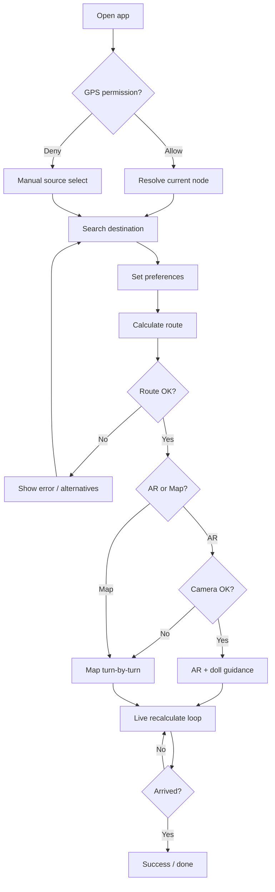
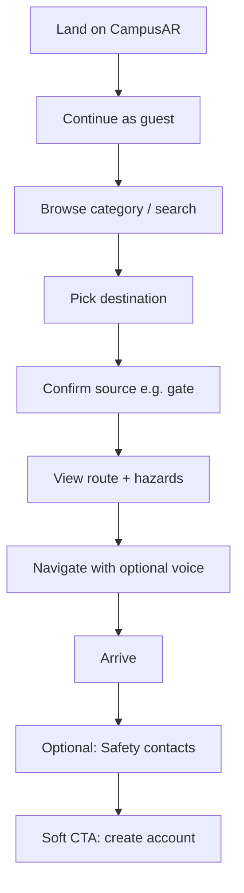
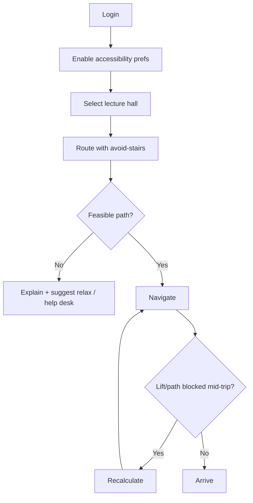
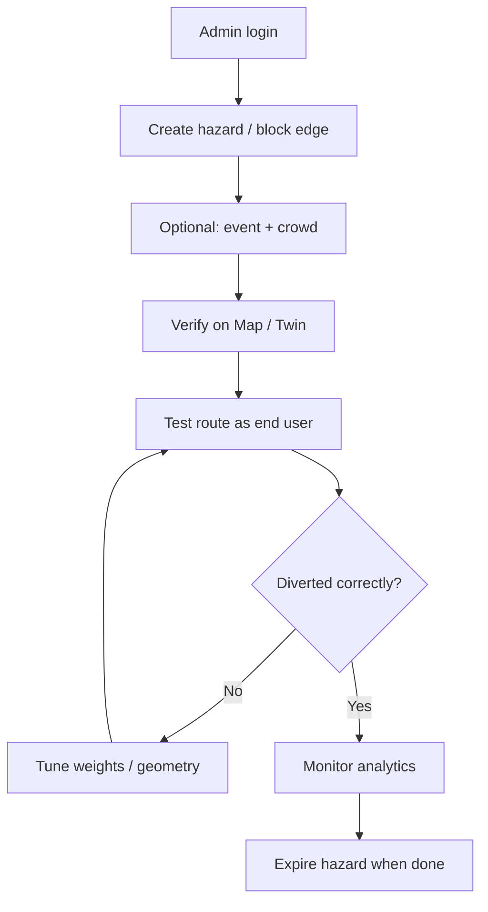
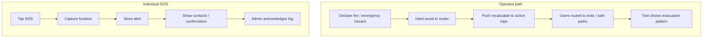

# 7. User Journeys — CampusAR V1

Each journey includes a step-by-step flow and a Mermaid diagram.  
**Assumption:** Demo campus graph is seeded; GPS available unless noted.

---

## 7.1 Student — class change navigation

### Goals
Get from current location to a classroom before the hour, avoiding crowds if possible.

### Step-by-step
1. Open CampusAR (PWA/web) on phone.
2. Land on map or resume session (guest or logged-in student).
3. Allow GPS when prompted (or pick nearest building if denied).
4. Search “CS-201” / building name; select destination.
5. Optionally enable accessibility / prediction preferences.
6. Tap **Route** → review path, ETA, crowd coloring.
7. Choose **Navigate** (map) or **AR**.
8. If AR: allow camera (+ motion); pick guide doll if first time.
9. Follow cues; system recalculates if hazard/crowd spike.
10. Arrive → success state → dismiss → optional next search.

### Failure / recovery highlights
- GPS deny → manual source.
- No route → show reason; suggest alternate entrance or relax prefs.
- Camera deny → switch to map turn-by-turn.

### Mermaid

---

## 7.2 Visitor — first-time campus visit

### Goals
Find Admissions / Library with minimal account friction.

### Step-by-step
1. Open shared link or campus Wi-Fi portal → CampusAR.
2. Tap **Continue as guest**.
3. Browse categories (Administration, Library) or search.
4. Set destination; accept default source suggestion or tap “I’m at Main Gate”.
5. Preview route on map; notice construction overlay if any.
6. Start navigation; use voice if walking while carrying bags.
7. On arrival, view Safety tab for contacts “just in case”.
8. Optional: register to save favorites (Could Have) — V1 may only prompt soft CTA.

### Mermaid

---

## 7.3 Faculty — accessible path to lecture hall

### Goals
Reach hall without stairs; reliable ETA between meetings.

### Step-by-step
1. Login (preferences persist).
2. Enable **wheelchair / avoid stairs**.
3. Search lecture hall; route.
4. Verify path uses lifts/ramps; if NO_ROUTE, contact facilities or relax constraint with warning.
5. Navigate indoors between buildings using map (AR optional).
6. If lift outage published as hazard/block, recalculate automatically or on prompt.
7. Arrive; quick-start next destination from recent (if available) or search.

### Mermaid

---

## 7.4 Administrator — publish construction & verify routes

### Goals
Close a walkway safely and confirm students are diverted.

### Step-by-step
1. Login as admin.
2. Open Admin → Hazards / Edges.
3. Create construction hazard (polygon/radius, time window) or block edge.
4. Optionally raise crowd on adjacent paths for event.
5. Open Twin or Map as student persona (or incognito guest).
6. Route across the closed corridor → confirm diversion.
7. Adjust distance/safety/crowd weights if policy requires “prefer safer even if longer”.
8. Check Analytics for search spikes near the event.
9. At end of window, expire/remove hazard; verify old path returns.

### Mermaid

---

## 7.5 Emergency — fire / SOS

### Goals
Move people away from danger; allow individual SOS.

### Step-by-step — campus emergency (operator-driven)
1. Security/admin marks **fire** hazard or emergency mode on affected zone.
2. System hard-avoids zone in routing; map/twin show emergency styling.
3. Active navigators get recalculate prompt or auto-recalculate.
4. Users seeking exits see emergency exits / assembly points (Safety).
5. Admin monitors twin crowd shift away from zone.

### Step-by-step — individual SOS
1. User taps **SOS** (nav or Safety).
2. App captures location + timestamp (+ identity if logged in).
3. Alert persisted; user sees confirmation + call contacts.
4. Admin reviews SOS log (V1); dispatch integration later.

### Mermaid

---

## Cross-journey principles

1. **Never dead-end silently** — every failure has a next action.
2. **AR is enhancement, not gate** — map nav always works.
3. **Safety overrides convenience** — fire > prediction > shortest distance.
4. **Guest path is first-class** — visitors are a primary persona.
